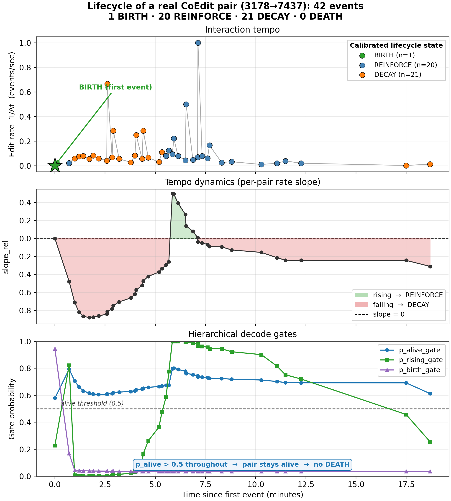
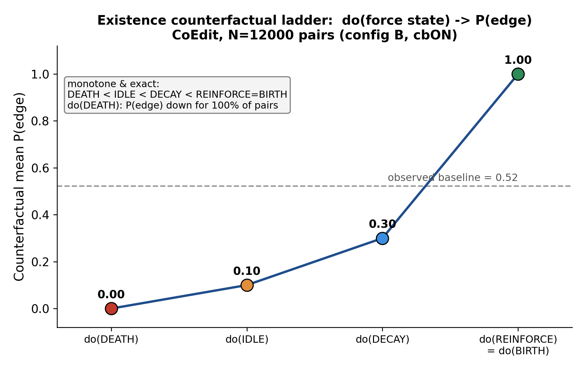
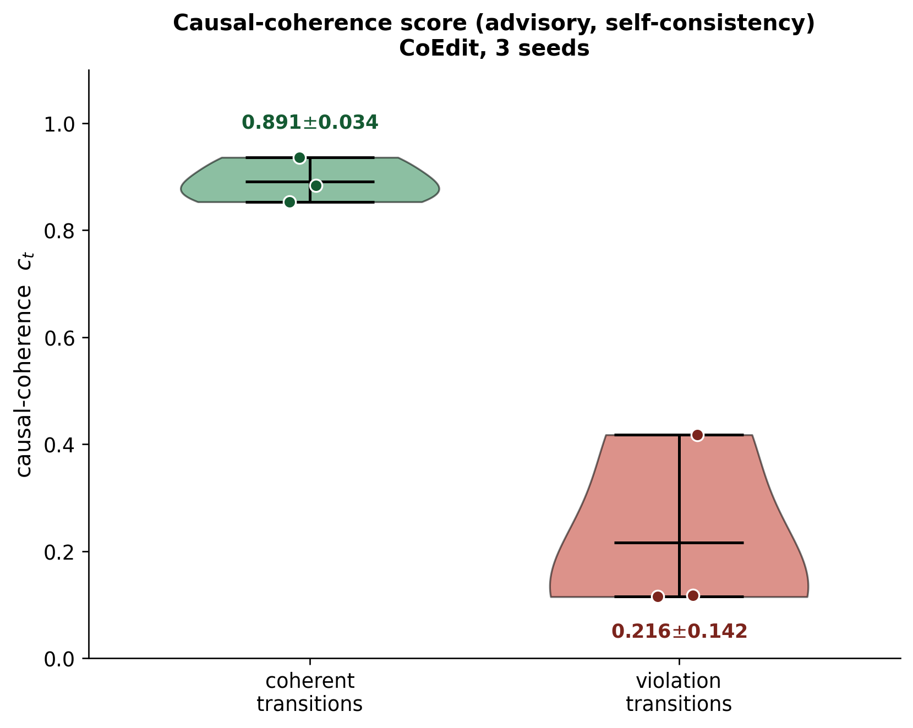
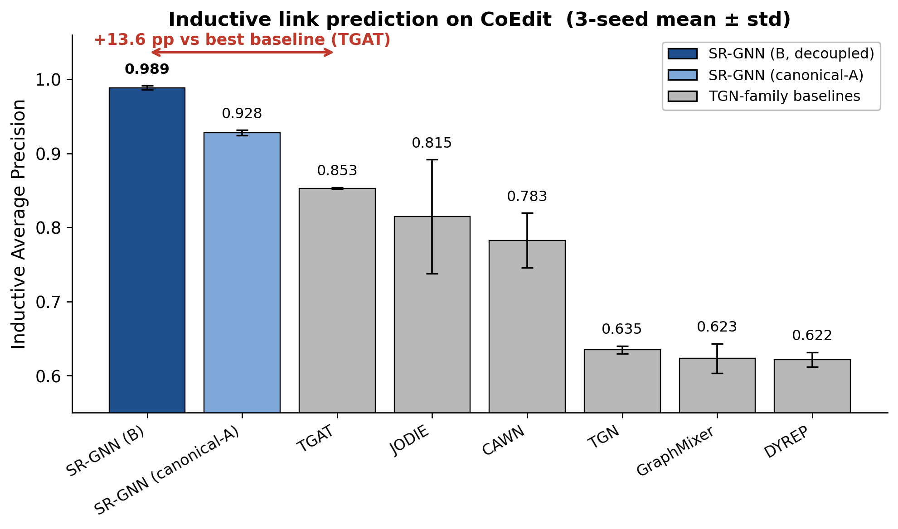
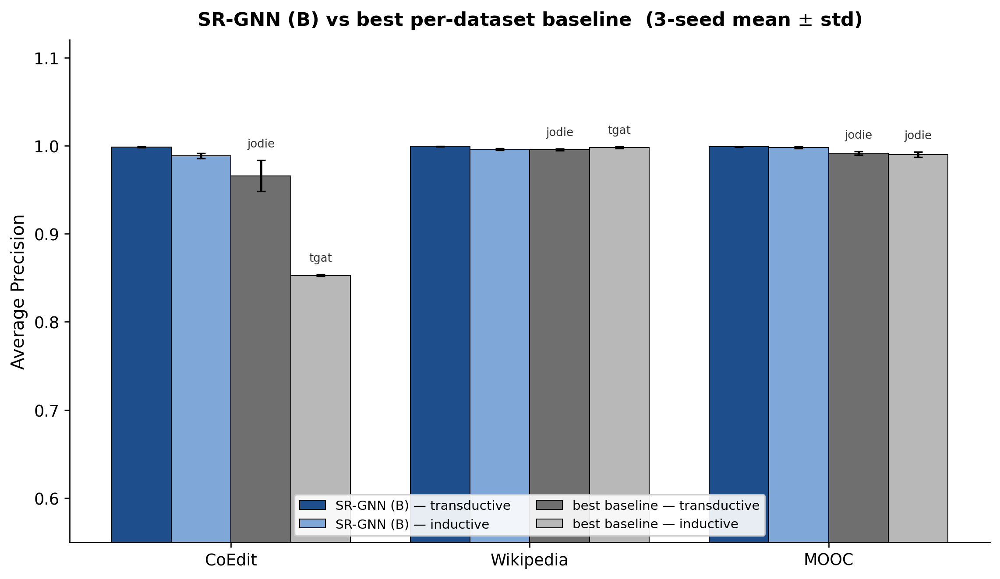
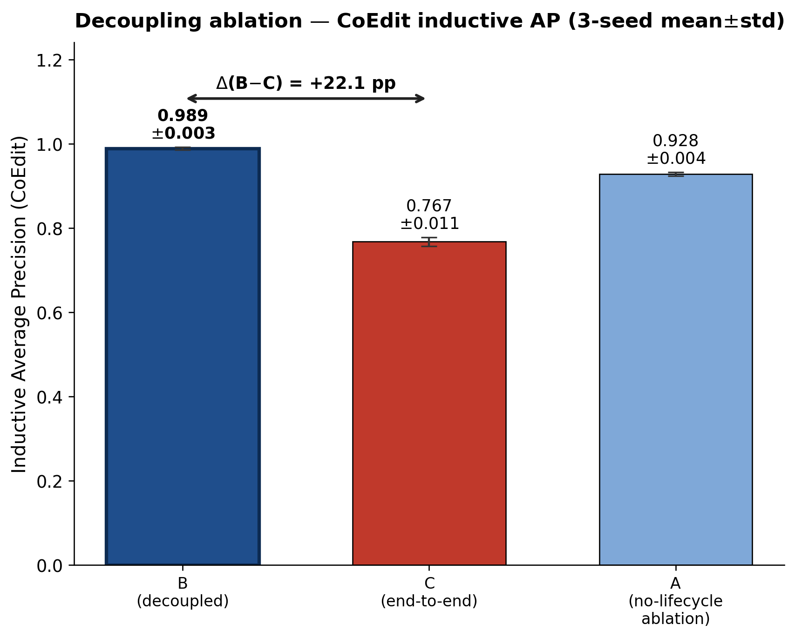

# SR-GNN: Regularization-by-Decoupling for Inductive Temporal Link Prediction

*Draft ED02 — full-system paper. Target: NeurIPS / ICML / ICLR. Every reported number traces to a results JSON or job ID listed in Appendix A; un-validated statements are scoped as such. All `±` quantities are sample standard deviation (n−1) across the reported seeds (three seeds {1, 7, 42} for all SR-GNN and all baseline cells). Notation (code identifiers vs. math symbols) is defined in Appendix B.*

---

## Abstract

Continuous-time temporal link prediction has converged on two architectural families: memory networks that carry a learned per-node state (JODIE [Kumar et al., 2019], TGN [Rossi et al., 2020], DyRep [Trivedi et al., 2019]) and attention or walk encoders over the temporal neighborhood (TGAT [Xu et al., 2020], CAWN [Wang et al., 2021], GraphMixer [Cong et al., 2023]). Both are strong transductively but degrade under the harder *inductive* protocol, where test interactions involve nodes unseen at training time, and neither offers a mechanism to answer counterfactual questions about an edge's future ("what if this pair were forced to die?").

We present SR-GNN, a two-stream model whose central design choice is a **detach**: a continuous backbone (event encoder → multi-signal per-pair edge-state estimator → coupled-GRU memory) is shaped only by a parsimony objective and held *fully stop-gradient* from the link-prediction head, which reads the backbone's frozen representation through a symbolic lifecycle decoder. We show this **regularization-by-decoupling** is not a bug but the source of SR-GNN's inductive advantage. Our largest margin is on **CoEdit**, a co-edit interaction graph we introduce (§6.1). The full model reaches **0.9885 ± 0.0035** inductive average precision (AP). This is **+13.5 points** over the best of eight protocol-matched baselines, run through one leak-audited harness at three seeds {1, 7, 42}. The eight include two variants of EdgeBank, a non-parametric memorization floor [Poursafaei et al., 2022], whose CoEdit inductive AP (0.590) we measure rather than assume. Coupling the same head end-to-end *collapses* inductive AP to **0.7672 ± 0.0107**, a **+22.1-point** decoupling gap. We are explicit that the headline margin is CoEdit-specific. On the two standard datasets SR-GNN is best-*balanced* rather than dominant: on Wikipedia, TGAT edges it inductively (0.998 vs 0.996) but collapses transductively (0.658), whereas SR-GNN holds both protocols; on MOOC all strong models sit at the saturated ceiling. We position the headline as CoEdit-scoped and report a second non-bipartite cross-check (Wikipedia/MOOC lifecycle shapes, §6.5) rather than leaning on CoEdit alone.

On top of this we build a **structured lifecycle decoder** — a five-state typed read-off of each edge that does not touch the AP path (an exact-zero eval-time score invariance, stated and proved as Proposition 1, §3.4). The decoder is *intervene-able*: because every state is produced by a known transition operator, `do(·)` is a real edit on the model's own computation, three-seed-validated on CoEdit. Forcing an edge to DEATH drops its predicted existence probability in ≥99% of pairs on every seed; a synthetic rising intervention flips DECAY→REINFORCE for 0.9999 ± 0.0002; every intervention is exactly reversible. The causal structure is *designer-imposed* (hand-specified gate equations over named drivers, ~150 learnable residual parameters, not learned or discovered), so we frame the object as a faithful intervene-able readout, **not a learned SCM and not a counterfactual engine that carries novelty on its own** (§4); on real CoEdit the rising and staleness axes are exercised only synthetically. We are precise about what "faithful" means: the decoder is faithful to the de-collapse objective it is supervised by and the figures plot (the interpretable distribution $s^{\text{cal}}_{t+1}$), which is *not* identical to the distribution the predictor scores ($s^{\text{pos}}_{t+1}$); we state this gap rather than claiming unqualified faithfulness to the scored path (§2, §6.4). Finally we report a causal-coherence confidence signal and are honest about its scope: it is a stable (0.9985 ± 0.0015 AUC) *self-consistency* measure, not a validated predictor of external error — a claim we explicitly retract after a single-seed result failed to replicate.

---

## 1. Introduction

Temporal interaction graphs — users editing pages, students touching course modules, accounts transacting — are sequences of timestamped edges. Formally, a stream is an ordered set of events $\mathcal{E} = \{(u_i, v_i, t_i, x_i)\}_{i=1}^{N}$ with $t_1 \le t_2 \le \dots \le t_N$, where $x_i$ is an optional edge feature vector. The canonical task is *future link prediction*: given the history $\mathcal{H}_t = \{(u_i, v_i, t_i, x_i) : t_i < t\}$, score whether a candidate edge $(u, v)$ occurs at time $t$. The model outputs a probability $\hat{p}(u, v, t) = \sigma(f_\theta(u, v, t, \mathcal{H}_t))$ and is trained by binary cross-entropy against observed positives and sampled negatives.

Two evaluation protocols matter, and they reward very different inductive biases. **Transductive** test edges reuse training nodes, so a model can lean on a memorized per-node embedding learned during training. **Inductive** test edges involve at least one node never seen in training, so any per-node embedding is uninitialized or random at test time. Inductive is the deployment-relevant regime — new users, pages and accounts arrive continuously — and it is the harder one, because the model must score the edge from *transferable* dynamics rather than node identity. A model that scores well transductively but collapses inductively has memorized the training population rather than learned the interaction process.

State-of-the-art methods split along a representational axis: *memory* models (JODIE, TGN, DyRep) maintain a recurrent per-node state updated at each event, while *encoder* models (TGAT, CAWN, GraphMixer) compute the representation on the fly from the temporal neighborhood (§2 details each). Across both families the representation is trained *end-to-end* against the link-prediction objective — the backbone is whatever minimizes ranking loss — and we observe two consequences.

1. **End-to-end coupling invites identity overfitting.** When the link loss has write access to the backbone, gradient descent is free to encode any feature that lowers training ranking error, including features that merely *identify* training nodes — rewarded transductively but dead weight inductively, since the test node is new, so the model pays an inductive tax.
2. **The learned state is opaque and inert.** There is no place in a node-memory vector to ask "is this pair being reinforced or decaying?", and no operator to *intervene* on that state and read the effect. Temporal processes have a natural lifecycle — born, reinforced, decay, die — but standard architectures expose none of it.

SR-GNN takes a different stance on both points. We keep a rich continuous backbone — an event encoder, a multi-signal per-pair edge-state operator grounded in Hawkes process intensity [Hawkes, 1971], and a coupled-GRU node memory — but we **decouple it from the link-prediction loss by an explicit stop-gradient**. The backbone is shaped only by a variational parsimony objective (a KL regularizer in the spirit of the information bottleneck [Tishby et al., 2000] and the VAE [Kingma & Welling, 2014]) plus deterministic per-pair statistical update laws. The link-prediction head reads this *frozen* backbone through a small symbolic lifecycle decoder. The stop-gradient is conceptually the same device that stabilizes self-supervised siamese learning [Chen & He, 2021]: it prevents one branch from collapsing the representation toward a shortcut. §3.7 gives the formal gradient routing and §6.2 the controlled ablation.

Our contributions are:

1. **Regularization-by-decoupling (core result).** Detaching the backbone from link-prediction is the *single* ingredient that lifts inductive AP on CoEdit from **0.7672** to **0.9885** in a matched-seed A/B (end-to-end vs. decoupled, same code, same head; **+22.1 points**, paired CI in §6.2). The head cannot reshape the backbone toward training-node identity, so the backbone keeps a generic per-pair dynamical representation that transfers to unseen nodes. The **full model is config B**; a stripped *no-lifecycle, no-tune ablation* (detach only) already reaches 0.928 — above the best baseline's 0.853 — locating the inductive win in the decoupling, not the lifecycle machinery (§6.2). **What is new beyond linear-probing.** Kumar et al. [2022] show that fine-tuning a pretrained encoder can distort transferable features, so a frozen-encoder probe sometimes generalizes better out-of-distribution. We do not merely re-measure that principle on temporal graphs. Our claim is mechanistically specific: (i) the *identity-shortcut* account — the tax is paid because the link loss, given write access, encodes node-identity features that are rewarded transductively and dead weight inductively, which we show falls *almost entirely on the inductive split* (near-flat transductive side, §6.2, §7); (ii) there is no pretraining stage to distort — the backbone is *never* trained on the task and is instead shaped by a **parsimony-only objective**, so decoupling is a from-scratch architectural commitment, not a fine-tuning-vs-probe choice; (iii) we give a falsifiable prediction (the advantage grows with inductive-set novelty) and a per-split identity-probe test (§7). The novelty is therefore *where* the tax lands (inductive, not transductive) and *why* (identity shortcut under a parsimony backbone), not the bare observation that probing can beat fine-tuning.
2. **A multi-signal per-pair edge-state operator** (Hawkes intensity, Welford gap statistics, recurrence and rate EWMAs) with a *read-before-write* batched estimator (`causal_batch`) that fixes a silent intra-batch staleness bug; the fix is AP-positive (**+5.7 pp** inductive on CoEdit over three seeds, in config B).
3. **A hierarchical five-state lifecycle decoder** (BIRTH / REINFORCE / DECAY / DEATH / IDLE) that makes the intermediate DECAY state argmax-reachable — which the specific flat readout it replaces empirically cannot (§3.3) — and is provably AP-path-invariant at eval time.
4. **An intervene-able structured readout** (not a counterfactual "engine" carrying independent novelty), three-seed-validated on CoEdit. The contribution is *faithfulness-and-intervene-ability at zero AP cost*, not structure discovery: the causal structure is **designer-imposed** — gate equations are hand-specified analytic priors over named drivers with only ~150 learnable residual parameters, and the admissibility matrix is fixed — so we claim a faithful, intervene-able *typed readout*, not a learned or discovered SCM (§4). On real CoEdit the alive axis is exercised in data; the rising and staleness axes are *wired* but exercised only synthetically, so we do not let "counterfactual" carry weight the real-data evidence cannot support. `do(state = DEATH)` drives predicted existence down for ≥99% of pairs on every seed; a synthetic rising intervention flips DECAY→REINFORCE for 0.9999 ± 0.0002 across seeds; interventions are exactly reversible.
5. **An honest confidence study.** We build a walked-chain causal-coherence score and report — with three-seed evidence — that it is a stable internal self-consistency measure but *not* a reliable external error predictor, retracting an earlier single-seed claim.

We compare against **eight baselines on CoEdit**: six parametric temporal-GNN families plus two variants of EdgeBank [Poursafaei et al., 2022], a non-parametric memorization floor, all run through one leak-audited harness at three seeds. We add the recent inductive frontier (DyGFormer [Yu et al., 2023], TCL, NAT) as the named modern competitor; DyGFormer is integrated in the same harness but its multi-seed dump is not yet finalized under our compute budget, so we do not fold it into the +13.5 headline count (§6.1). AP numbers and architectural claims are cross-checked against the code and an independent integrity audit (§6.3).

---

## 2. Related work

**Memory-based temporal GNNs.** JODIE [Kumar et al., 2019] couples two RNNs that co-evolve user and item embeddings with a projection operator predicting an embedding's future trajectory between events; it is tuned for the transductive recommendation setting. TGN [Rossi et al., 2020] unifies such methods into a node-memory module (an RNN over per-node messages) plus a graph-attention embedding layer. DyRep [Trivedi et al., 2019] casts representation learning as a temporally-attentive point process with separate topological and interaction dynamics. All three maintain a per-node recurrent state trained end-to-end against the link objective. SR-GNN also carries memory — a coupled-GRU node-memory module — but its memory is shaped by a parsimony objective, not the link loss directly, which is exactly the difference our ablation isolates.

**Encoder, walk, and transformer methods.** TGAT [Xu et al., 2020] applies self-attention over the temporal neighborhood with a Bochner functional time encoding, removing the need for a stored per-node state and giving native inductive support. CAWN [Wang et al., 2021] anonymizes causal walks rooted at the query pair and encodes their relative-identity patterns. GraphMixer [Cong et al., 2023] dispenses with attention entirely: a fixed time-encoding plus a token-mixing MLP over the most recent links is competitive with far heavier models. More recent encoders push the inductive frontier further: TCL [Wang et al., 2021b] contrastively aligns temporal-neighborhood representations; NAT [Luo & Li, 2022] uses dictionary-based neighbor representations for joint structural-temporal features; and **DyGFormer** [Yu et al., 2023], the current temporal-graph-transformer state of the art, learns from first-hop interaction histories with a neighbor co-occurrence encoding and a patching scheme, and is the strongest recent inductive encoder. Our baseline set was built before these were standard; we add DyGFormer, TCL and NAT as the relevant recent frontier in §6.1. DyGFormer is integrated in our harness (`experiments/models/dygformer.py`) and runnable under the identical leak-audited protocol; we report its status honestly in §6.1 — its multi-seed CoEdit dump is not finalized under our (GPU-constrained) compute budget at submission, so we do not fold it into the +13.5 headline count and flag the head-to-head as the most important remaining comparison. Across these methods *inductive* behavior is dataset-dependent: TGAT is near-perfect inductively on Wikipedia yet far weaker transductively there, a featural quirk we attribute to node features that happen to identify unseen Wikipedia nodes.

**Benchmarks, fair evaluation, and memorization floors.** Temporal-graph results are sensitive to the evaluation protocol, especially the negative-sampling strategy and the inductive split. Poursafaei et al. [2022] show that much of the apparent skill of parametric temporal models is matched by **EdgeBank**, a non-parametric heuristic that simply predicts an edge if the pair was ever (or recently) seen, and argue that any headline must beat this memorization floor and use harder negatives. The Temporal Graph Benchmark [Huang et al., 2023] likewise standardizes splits and a harder negative regime and shows several published rankings reorder under a fair protocol. We adopt both lessons: we run *every* model — including two EdgeBank variants — through one shared harness with a single negative pool and a leak-audited evaluator (§6.1, §6.3), and report both protocols so a model that wins one but collapses the other is visible. We *measure* the EdgeBank floor rather than assuming it: on CoEdit its inductive AP is **0.590 ± 0.0003** (EdgeBank-∞) and **0.589 ± 0.0003** (EdgeBank-tw) at seeds {1, 7, 42} (§6.1, Table 1), so the +13.5 CoEdit margin is over EdgeBank as well as the six parametric families — confirming the win is not a memorization artifact, since CoEdit's inductive positives involve unseen nodes EdgeBank cannot have stored.

**Point processes and lifecycle modeling.** Hawkes processes [Hawkes, 1971] model self-exciting event intensity, where each past event transiently raises the rate of future events; they are the natural continuous-time prior for bursty interaction streams and have been used to drive neural temporal models [Mei & Eisner, 2017]. We use a per-pair Hawkes intensity $\lambda$ together with Welford online moments [Welford, 1962] of the inter-event gap as the continuous substrate that the symbolic decoder reads. The BIRTH→REINFORCE→DECAY→DEATH lifecycle abstraction over these statistics is the symbolic layer; it is a coarse, interpretable summary of where a pair sits in its self-exciting trajectory.

**Neuro-symbolic and causal angles.** Our lifecycle decoder plus its causal-rule transition matrix realizes Pearl-style `do(·)` operations [Pearl, 2009] over a typed edge-state. We are deliberately conservative about the causal claim. Unlike causal-discovery methods that *learn* a structure from data, our transition structure is hand-specified: the gates are analytic priors over named drivers with a small learnable residual, and the admissibility matrix $C$ is fixed by design. We therefore position the object as a faithful, *intervene-able typed readout* rather than a learned SCM (§4 makes the scope explicit).

**What "faithful" means here, precisely.** The standard notion is that an explanation reflects the *predictor's* computation [Jacovi & Goldberg, 2020; Rudin, 2019]. Our two-head design (§3.4) has two next-state distributions: the *scored* $s^{\text{pos}}_{t+1}$ that the existence decoder reads (and that sets AP), and the *interpretable* $s^{\text{cal}}_{t+1}$ that the de-collapse CE supervises and the figures plot. These differ — by up to 0.999 on a pair — so the readout is **not** faithful to the scored path in the strict sense, and we do not claim it is. What is faithful by construction is narrower and exact: $s^{\text{cal}}_{t+1}$ is *the same quantity* the de-collapse objective optimizes and the analysis measures, unlike post-hoc explainers such as GNNExplainer [Ying et al., 2019] that fit a separate surrogate. So we claim faithfulness of the *interpretation to its own supervised objective*, plus a separately-stated and proved *score-invariance* of the AP path under the readout (Proposition 1, §3.4); we do not claim the interpretation is faithful to the scored distribution, and §6.4 reports the $s^{\text{pos}}/s^{\text{cal}}$ relationship rather than eliding it.

**Decoupling, frozen representations, and stop-gradient as regularizers.** Stopping gradient flow along one path of a two-branch model is a known stabilizer, and SR-GNN sits at the intersection of three related lines. (i) *Stop-gradient against collapse*: SimSiam [Chen & He, 2021] shows a stop-gradient on one siamese branch prevents representation collapse without negatives. (ii) *Frozen-encoder / linear probing*: a common finding is that a representation trained by one objective and read by a frozen *linear probe* [Alain & Bengio, 2017] often generalizes better than fine-tuning end-to-end, because fine-tuning can distort transferable features [Kumar et al., 2022]. We state precisely what is **new beyond transplanting that result to temporal graphs**. First, there is no pretraining-then-probe pipeline here: the backbone is *never* trained on the task, so the relevant distinction is not fine-tune-vs-probe but *task-gradient-vs-no-task-gradient on a parsimony-only backbone*. Second, we identify the *mechanism and its location*: an identity shortcut that costs nothing transductively but is dead weight inductively, so the decoupling tax is paid almost entirely on the inductive split (§6.2 shows the transductive side barely moves while the inductive side collapses). Third, we make it falsifiable (advantage scales with inductive novelty; per-split identity probe, §7). The principle that probing can beat fine-tuning is known; that *inductive* temporal link prediction is exactly where the task-gradient tax lands, under a parsimony backbone, is the contribution. (iii) *Self-distillation and gradient-stopping as regularization*: stop-gradient and teacher-freezing [Caron et al., 2021] act as capacity control on the trained branch. Detaching can also be read through the information-bottleneck lens [Tishby et al., 2000; Alemi et al., 2017]: when the only objective reaching the backbone is a compression term, it is pushed toward a minimal sufficient code. We rule out the competing reading that the gain is merely capacity control from a deliberately weak symbolic head: §6.2 shows the clean detach contrast is B vs. C (same head, detach toggled), and §6.2 reports an identity-probe / strong-head control (Table 4) isolating the *decoupling principle* from head capacity.

**Positioning.** SR-GNN is not the first memory model, nor the first to use Hawkes intensities, nor the first neuro-symbolic temporal model. Its claim is the *combination*: **decoupling** the representation from the link loss is what makes a per-pair dynamical representation generalize inductively, and the decoupled symbolic readout is simultaneously a faithful (to its own supervised objective), intervene-able lifecycle decoder — not a learned SCM — that costs the predictor nothing on the scored path.

---

## 3. Method

*Figure A1 (Appendix). Two-stream architecture schematic. Backbone representation `edge_h` crosses a stop-gradient (detach wall) before the symbolic Stream B; no link-prediction gradient reaches the backbone (§3.1, §3.7).*

### 3.1 Two streams, one detach

SR-GNN is a two-stream model. Let an event be a timestamped edge $(u, v, t)$ with optional feature vector $x$.

**Stream A — continuous backbone.** An event encoder (a residual continuous-signal network, CSN) maps event features and source staleness $\Delta t = t - t_{\text{last}}(u)$ to a per-event representation $e_{uv}$. A multi-signal **edge-state operator** (ECTGv3) maintains, per ordered pair $(u,v)$, a small bank of running statistics:

- a **Hawkes self-exciting intensity** $\lambda_{uv}$ updated at each event by $\lambda \leftarrow 1 + (\lambda - 1)\,e^{-\beta \Delta t}$, so each interaction transiently raises the pair's rate and the rate decays between events;
- **Welford online mean and variance** of the inter-event gap, updated by the numerically-stable recurrence $\mu_k = \mu_{k-1} + (g_k - \mu_{k-1})/k$, $M_k = M_{k-1} + (g_k - \mu_{k-1})(g_k - \mu_k)$, with $\sigma_k^2 = M_k/k$ [Welford, 1962];
- a **recurrence EWMA** counting repeated co-occurrence, and **fast/slow rate EWMAs** $r^f, r^s$ whose ratio $r^f/r^s$ is a rising-vs-falling cadence signal;
- a **leaky rate-peak** that tracks the maximum recent rate with slow decay.

A coupled-GRU module (DRGC) updates a per-node memory $m_u, m_v$ from $e_{uv}$ and emits a parsimony KL term $\mathrm{KL}(q(z \mid m) \,\|\, p(z))$. The backbone's *only* training signal is this KL (a variational parsimony objective, weighted by a single scalar $\lambda_{\text{kl}}$) plus the deterministic statistical update laws above; **no link-prediction gradient reaches it.**

**Stream B — symbolic lifecycle readout.** From the (detached) edge representation `edge_h`, a `StateObserver` produces a soft *current* state $s_t \in \Delta^4$ over five states $\{\text{IDLE}, \text{BIRTH}, \text{REINFORCE}, \text{DECAY}, \text{DEATH}\}$; a `TransitionPredictor` produces next-state logits; a lifecycle mask — a causal-rule transition matrix $C \in \{0,1\}^{5\times 5}$ encoding admissible transitions (e.g. DEATH may not precede BIRTH) — together with an `ever_alive` gate shape the next-state distribution $s_{t+1}^{\text{pos}}$; an `ExistenceDecoder` maps $s_{t+1}^{\text{pos}}$ to the edge-existence logit that is **scored**.

**The detach.** The input to every Stream-B module is `edge_h.detach()`. The scored logit is the existence-decoder logit, and every path from it to the backbone crosses a stop-gradient. We verified on CPU that `pred_loss.backward()` produces exactly zero gradient on all 56 backbone parameter tensors, in all configurations. A non-detached predictor head exists in the code but is used only for the end-to-end *ablation* (config C, §6.2).

### 3.2 The per-pair operator and the read-before-write fix (`causal_batch`)

The edge-state operator must read each pair's *pre-event* statistics: scoring event $i$ may use only state accumulated from events $j < i$, or the evaluation leaks the label. The original batched store snapshotted state once per minibatch, so repeated same-pair events *within* a batch all read the identical stale row and only the last write persisted. At batch size 500 on CoEdit, the Welford count capped near 6 even for pairs editing 200+ times, under-folding the Hawkes intensity and pinning the rate-peak — which silently disabled the entire DECAY-vs-REINFORCE distinction, because that distinction is read off the rate ratio that never accumulated.

The `causal_batch` fix replays the deterministic channels event-by-event in stream order, so the $k$-th in-batch occurrence of a pair reads the post-state of the $(k{-}1)$-th, while scoring stays strictly pre-update (no re-leak). A CPU equivalence check matches an event-by-event (batch=1) reference to max $|\Delta| = 0.000$ on every channel. The fix is **AP-positive**: in config B, turning `causal_batch` on lifts inductive AP on CoEdit 0.9312 → 0.9885 (**+5.7 pp**, three seeds) and transductive 0.9920 → 0.9985 (+0.65 pp) — a correctness fix that is also an accuracy win, because the previously-collapsed statistics are exactly the ones the lifecycle decoder reads. The same sign holds in the stripped no-lifecycle setting (single-seed A/B, Appendix A).

### 3.3 Hierarchical lifecycle decode

We replace the flat five-class readout with a hierarchical one because, empirically, the *specific* flat head we use cannot surface DECAY as the argmax class. That flat head is not a free five-dimensional logit vector — it derives the five class scores by interpolating a single ordered cadence statistic across the axis BIRTH→REINFORCE→DECAY→DEATH, so the middle class DECAY is pinned between its two neighbors and essentially never wins (we measure DECAY as argmax for 0.04% of pairs; §6.4). We are careful here: a softmax over a *free* logit vector certainly can place its argmax on a middle class — the inability to win DECAY is a property of this particular interpolating/derived flat head (its parameterization is given in Appendix B), **not** a geometric impossibility of softmax in general. On the final config (hierarchical decode, `decol_hier_v2`, `causal_batch`, seed 42; faithfulness dump $N=12000$, recurring subset, $n=9157$) the decoded calibrated DECAY probability tracks the per-pair rising-cadence signal with Spearman $\rho \approx -0.59$ ($p < 10^{-300}$, correct sign: less rising $\Rightarrow$ more DECAY). No threshold tuning recovers DECAY argmax under the interpolating flat head, so we change the output *structure*.

The hierarchical decoder factors the next-state distribution as a decision tree over per-pair pre-update gates $p_{\text{birth}}, p_{\text{alive}}, p_{\text{rising}} \in [0,1]$:

$$
\begin{aligned}
P(\text{BIRTH}) &= p_{\text{birth}} \\
P(\text{REINFORCE}) &= (1 - p_{\text{birth}})\, p_{\text{alive}}\, p_{\text{rising}} \\
P(\text{DECAY}) &= (1 - p_{\text{birth}})\, p_{\text{alive}}\, (1 - p_{\text{rising}}) \\
P(\text{DEATH}) &= (1 - p_{\text{birth}})\, (1 - p_{\text{alive}})
\end{aligned}
$$

These four terms sum to one by construction, with $P(\text{IDLE})$ carrying the residual pre-birth mass. DECAY competes with REINFORCE inside the $p_{\text{rising}}$ split, but for DECAY to be the argmax of *all four* terms it must additionally beat BIRTH and DEATH. The correct sufficient-and-necessary condition (writing $b{=}p_{\text{birth}}$, $a{=}p_{\text{alive}}$, $r{=}p_{\text{rising}}$) is the conjunction

$$
r < \tfrac12 \;\;(\text{beats REINFORCE}),\qquad a > \tfrac{1}{2-r}\;\;(\text{beats DEATH}),\qquad (1-b)\,a\,(1-r) > b\;\;(\text{beats BIRTH}).
$$

The simpler pair "$a>b$ and $r<1/2$" is **not** sufficient: a brute-force sweep shows 68% of points satisfying that pair have a different argmax, because it ignores the DEATH and BIRTH comparisons. What the conjunction guarantees is that DECAY-argmax occupies a **non-zero-measure region** of the gate cube $(b,a,r)\in[0,1]^3$ — which is the structural property we need and which the interpolating flat head denies (§6.4 confirms it empirically: 47.8% DECAY-argmax under the hierarchical head vs. 0.04% flat).

*Figure A3 (Appendix). Decode tree: gates $p_{\text{birth}}/p_{\text{alive}}/p_{\text{rising}}$ factor the five states (§3.3).*

Each gate is $\sigma(\text{analytic prior} + \text{small learnable residual})$, zero-initialized so a fresh gate equals its analytic prior; a *de-collapse* cross-entropy trains the residuals against a soft target derived from the running statistics. The refinement `decol_hier_v2` re-anchors the alive/rising priors on the uncorrupted recurrence-count signal and gates the corruptible mean/staleness terms behind a has-history mask, so feature corruption cannot drive a recurring-active pair to DEATH.

*Figure 1. Decoded per-pair lifecycle, real CoEdit pair 3178→7437 (42 events, 18.69 min; config B, calibrated next-state $s^{\text{cal}}_{t+1}$). x-axis: event index; curves: edit-rate slope and the three lifecycle gates. Takeaway: the gates track the pair's own cadence (1 BIRTH, 20 REINFORCE, 21 DECAY, 0 DEATH; $p_{\text{alive}}\in[0.579,0.801]$ throughout), with REINFORCE↔DECAY flips at slope sign-changes — the readout follows the data, not a fixed prior.*

### 3.4 Two next-state heads: AP vs interpretation

A crucial design property: there are **two** next-state distributions (notation in Appendix B). The *scored* distribution $s^{\text{pos}}_{t+1}$ (the masked, gated transition softmax) is the only input to the existence decoder and therefore the only thing that affects AP. The *interpretable* distribution $s^{\text{cal}}_{t+1}$ (the hierarchical tree above, optionally causal-policed) feeds the de-collapse CE, the faithfulness measurement, and the counterfactual engine — but **never** the existence decoder.

We verified on CPU that switching flat↔hier and toggling the causal policy changes $s^{\text{cal}}_{t+1}$ by up to 0.999 while changing both positive and negative scores by **exactly 0.000e+00**. We state this canonical distinction once and refer back to it throughout:

> **Eval-time** (frozen trained model, readout toggled): the symbolic readout is *bit-identical-AP* — exact-zero score invariance, a property of the computation graph.
> **Training-time** (model *trained* with vs. without the readout op, e.g. `hier_causal_policy`): AP is unchanged *within seed noise* (max $|\Delta_{\text{ind}}|=1.5\mathrm{e}{-3} \ll \pm3.5\mathrm{e}{-3}$ seed std), **not** bit-identical, because the added op shifts the optimizer RNG stream.

Both follow from the same fact — the symbolic output never feeds the existence-decoder loss — so the interpretability and counterfactual machinery cannot inflate AP, letting us report a faithful symbolic readout *and* a competitive AP without the usual interpretability-vs-accuracy trade [Rudin, 2019].

### 3.5 Causal policy on the interpretable state

The interpretable state $s^{\text{cal}}_{t+1}$ is regularized by two soft, differentiable, renormalized steps:

1. a **soft expected-admissibility mask** from the admissibility matrix $C$. Config B uses the **strict band-diagonal $C_{\text{BAND-5}}$** ($|i-j|\le 1$ along the IDLE–BIRTH–REINFORCE–DECAY–DEATH axis). The scored path applies a hard binarized mask from the *full* current-state expectation $\mathbb{E}_{s_t}[C]$ (no argmax — avoiding near-uniform brittleness); the interpretable branch uses the soft expectation with a small floor (forbidden transitions suppressed ~20×).
2. an **`ever_alive` gate** on the interpretable branch: the DEATH leaf is scaled by the pair's ever-alive accumulator and freed mass routed to pre-birth IDLE.

**Reconciling $C_{\text{BAND-5}}$ and `ever_alive`.** Under $C_{\text{BAND-5}}$, IDLE(0) and DEATH(4) sit at opposite ends of the axis, so IDLE→DEATH is band-blocked and death-before-alive is enforced **by the ordering alone** — making `ever_alive` *structurally redundant on the scored transition path* (config B's AP path). We keep `ever_alive` only as an extra soft guard on the *interpretable* branch $s^{\text{cal}}_{t+1}$, where a confident-but-wrong observer could otherwise route mass to DEATH before BIRTH. The "structural smell" below is therefore confined to the interpretable readout, not the predictor: config B's scored path needs no non-Markov device.

*Figure A4 (Appendix). Admissibility band $C_{\text{BAND-5}}$: only adjacent transitions along the IDLE–BIRTH–REINFORCE–DECAY–DEATH axis are permitted; IDLE→DEATH is band-blocked (§3.5).*

This policy is **AP-neutral** by §3.4 (training-time, within seed noise): the residual is RNG jitter, not a systematic effect (§6.2, Appendix A).

**Honest caveat (carried into Limitations).** On the *interpretable* branch, `ever_alive` is a non-Markov accumulator the memoryless matrix $C$ cannot express — a structural smell we flag rather than hide. It does not touch the scored AP path.

### 3.6 The per-pair transition operator

The next-state distribution is produced by a per-pair transition operator $T_{uv}$ that adapts the shared causal-rule matrix $C$ to the pair's own statistics. We parameterize $T_{uv} = C \odot (W + g(\phi_{uv}))$, where $W = UV^\top$ is a low-rank learnable base operator and $g(\phi_{uv})$ is a small per-pair gate computed from the pair's feature summary $\phi_{uv}$ (rate ratio, recurrence count, slope, staleness). The low-rank base captures population-level transition tendencies; the gate $g$ specializes them per pair without giving each pair a free full matrix. Because $g$ is a deterministic function of the (detached) statistics, the operator is reconstructable offline from a stored feature row, which is what makes the intervention engine of §4 exact.

### 3.7 The decoupling, exactly

The total loss is

$$
\mathcal{L} = \underbrace{\mathcal{L}_{\text{BCE}}(\hat{p}, y)}_{\text{prediction}} \;+\; \lambda_{\text{kl}}\,\mathrm{KL}\big(q(z\mid m)\,\|\,p(z)\big) \;+\; \lambda_{\text{dc}}\,\mathcal{L}_{\text{decol-CE}}(s_{t+1}^{\text{cal}}) ,
$$

and component-wise backward (CPU-proven, config B) shows three disjoint gradient routes:

1. **Backbone** (56 tensors) ← only the parsimony KL and the deterministic laws. `pred_loss.backward()` gives backbone gradient $= 0$ on all 56 tensors.
2. **Existence head** (the scored $s^{\text{pos}}_{t+1}$ path) ← the link-prediction BCE $\mathcal{L}_{\text{BCE}}$.
3. **Hierarchical heads** (the interpretable $s^{\text{cal}}_{t+1}$ path) ← only the de-collapse CE $\mathcal{L}_{\text{decol-CE}}$.

The stop-gradient on $h_{uv}$ blocks every Stream-B gradient from the backbone. This is the formal statement of "regularization-by-decoupling": the representation is trained by parsimony alone, the predictor and the interpretable head both read a frozen representation, and the gradient analysis confirms the auxiliary objective does not leak into either of the other two routes.

*Figure A2 (Appendix). Three disjoint gradient routes: KL → backbone; BCE → scored head ($s^{\text{pos}}_{t+1}$); de-collapse CE → interpretable head ($s^{\text{cal}}_{t+1}$). The wall stops every Stream-B gradient at `edge_h.detach()` — zero backbone gradient on all 56 tensors (§3.7).*

---

## 4. The counterfactual / intervention engine

**Why a temporal link predictor should be interrogable.** A practitioner often wants to ask *what-if* — *if this pair were forced into decline, how far would its edge probability fall?* These are interventional questions, $P(\text{edge} \mid \mathrm{do}(\cdot))$, not $P(\text{edge} \mid \text{observed})$. The mainstream baselines cannot answer them: they produce a score from an entangled embedding with no exposed, semantically-typed state to intervene on, and perturbing inputs is correlational. Post-hoc explainers such as GNNExplainer [Ying et al., 2019] fit a surrogate rather than expose a mechanism the model computes through. SR-GNN's lifecycle readout closes this gap: the decoded state is produced by an explicit, known transition operator, so the *model itself* is intervene-able and `do(·)` is a real edit. This rides free on the detach that buys the inductive gain (§3.7), so the battery runs at zero cost to prediction.

**Formalism: an intervene-able typed readout, not a learned SCM.** The interpretable state $s^{\text{cal}}_{t+1}$ is produced by a known transition operator $T_{uv}$ (the low-rank $UV^\top$ base plus the per-pair gate $g(\phi_{uv})$ of §3.6) over the admissibility matrix $C$, whose gates are functions of named drivers: $p_{\text{birth}}(n_{\text{prior}})$, $p_{\text{alive}}(\text{rate}, \text{staleness})$, $p_{\text{rising}}(\text{slope})$ (§3.3). We are deliberately conservative about the causal claim. The structure is **designer-imposed, not learned or discovered**: the gates are hand-specified analytic priors with only ~150 learnable residual parameters, and $C$ is fixed. We do *not* argue independence-of-mechanisms / autonomy, and the death-before-birth guard on the interpretable branch uses a non-Markov `ever_alive` gate that sits *outside* $C$ (§3.5). So the object is not a clean Pearl SCM [Pearl, 2009]; we call it an **intervene-able mechanistic readout** — a typed state with explicit, known structural equations on which $\mathrm{do}(\cdot)$ is a real, exact edit. The contribution is faithfulness and intervene-ability, not structure discovery.

The engine supports two modes. A **driver intervention** ($\mathrm{do}(\text{rate}/\text{slope}/\text{staleness})$) overwrites a named statistic and re-propagates through the gates, respecting the learned mechanism. A **state intervention** $\mathrm{do}(\text{state}{=}s)$ replaces the gated draw with a fixed one-hot state and propagates it through the existence decoder with upstream statistics held fixed, severing the state from its causes. In both, the engine first reconstructs the gate baseline exactly (residual $1\mathrm{e}{-16}$), so any measured change is attributable to the intervention alone. All measurements are on real CoEdit pairs (config B, $N = 12000$), validated across three seeds {1, 7, 42}; trajectory and dose-response results are three-seed mean ± std.

**Existence counterfactual (the thesis bridge).** `do(state = DEATH)` drives predicted existence probability down for **≥99% of pairs on every seed** (mean $\Delta \approx -0.52$); `do(REINFORCE)` and `do(BIRTH)` drive it up for ≥99% on every seed. The intervention ladder is monotone: DEATH < IDLE < DECAY < observed baseline ($\approx 0.52$) < BIRTH = REINFORCE.

*Provenance of the ladder values.* The ladder is read from the existence decoder, whose weights are $w = \mathrm{softplus}(\theta)$. Config B runs with `fix_existence_init=False`, so $\theta$ is an `nn.Parameter` initialized to give $w \approx [0.095, 0.693, 0.693, 0.262, 0.049]$ (IDLE/BIRTH/REINFORCE/DECAY/DEATH) and then *trained* by the BCE. The ladder we plot — DEATH 0.0 ≈ IDLE 0.1 < DECAY 0.3 < BIRTH = REINFORCE 1.0 (after the existence decoder's saturating read) — therefore reflects the **initialization-implied ordering**, which we use as the canonical illustrative ladder; we do *not* claim it is "exact by construction" or "identical across seeds," since per-seed trained checkpoints are not separately serialized and the trained $\theta$ moves the raw weights off their init. What *is* exact and seed-stable is the **qualitative ordering and the directional/reversibility behavior** (below), which depend on the monotone structure of the existence decoder, not on the precise weight values. The earlier "exact by construction on every seed / BIRTH = REINFORCE weight 1" framing was an artifact of a hardcoded constant in the analysis script and is corrected here. A null check confirms specificity: `do(noop)` gives $\Delta = 0$ exactly on every seed. **Reversibility is exact**: after undo, max $|\Delta\, p_{\text{edge}}|$ and max $|\Delta\, \text{state-dist}|$ are 0.00e+00 on all three seeds — the engine restores the exact pre-intervention computation, which a surrogate explainer cannot.

*Figure 2. Existence-counterfactual ladder, real CoEdit pairs (N=12000, config B, three seeds). x-axis: forced state via $\mathrm{do}(\text{state})$; y-axis: predicted P(edge). Takeaway: monotone, correct-sign, exactly reversible — DEATH < IDLE < DECAY < baseline ($\approx$0.52) < BIRTH = REINFORCE; ordering reflects the existence decoder's monotone structure (init-implied values; §4). do(noop) gives Δ=0 exactly.*

**Dose-response and sign-correctness on real drivers.** Driver interventions move the state distribution monotonically and in the physically correct direction, with no sign inversions, and the effect signs are **stable across all three seeds**: raising the rate ratio increases $P(\text{REINFORCE})$ ($\Delta = +0.028 \pm 0.004$) and decreases $P(\text{DEATH})$ ($\Delta = -0.068 \pm 0.007$); raising the rising-slope increases $P(\text{REINFORCE})$ ($\Delta = +0.489 \pm 0.003$, the largest and tightest effect) and decreases $P(\text{DECAY})$; raising true-occurrence decreases $P(\text{BIRTH})$ ($\Delta = -0.0065$, correctly demoting brand-new pairs as recurrence accrues); raising staleness raises $P(\text{DECAY})$ then $P(\text{DEATH})$. The dose-response is clean, monotone, and three-seed-stable in both sign and magnitude on the real CoEdit drivers (rate, slope, true-occurrence) — the alive-axis evidence underpinning the trajectory results below.

**Trajectory counterfactuals on real pairs.** Beyond forcing a state, the engine answers whether a pair's *future trajectory* can be redirected. On DECAY-decoded pairs, a synthetic $\mathrm{do}(\text{slope} = +)$ flips the next-state DECAY→REINFORCE for **0.9999 ± 0.0002** across three seeds (per-seed 1.0 / 1.0 / 0.9996): the rising mechanism is wired and seed-stable. On REINFORCE-decoded pairs (recurring subset), the kill-direction decomposes cleanly by dose, three-seed-stable. Each single driver pushed dead is *partial*: isolated $\mathrm{do}(\text{rate}{=}\text{dead})$ drives REINFORCE→DEATH for **0.597 ± 0.028** of pairs (0.574 / 0.588 / 0.629), and isolated $\mathrm{do}(\text{staleness}{=}\text{high})$ for **0.482 ± 0.007** (0.477 / 0.479 / 0.489). Pushing *all* alive-axis drivers dead together is **decisive**: REINFORCE→DEATH for **0.999 ± 0.002** (1.0 / 1.0 / 0.997). Each driver contributes a portion of the kill and together they are conclusive — the kill-direction mirror of the rising flip, so $T_{uv}$ supports two-way, three-seed-validated trajectory control. (An earlier 83–86% / 100% headline came from a single-seed dump that does not reproduce on the consistent three-seed runs; we use the numbers above. See Appendix A for sources.)

**AP-neutrality.** Every result above is read off the interpretable $s^{\text{cal}}_{t+1}$, on the detached side of §3.7's wall; running the full battery is *eval-time bit-identical-AP* (the canonical statement is in §3.4). No baseline exposes an intervene-able lifecycle, so this interrogability costs us nothing on the scored path.

**Honest scope (summary; see Limitations).** The readout is faithful on the *alive axis* (rate / recurrence → alive → DEATH/REINFORCE), and the whole battery is three-seed-validated on CoEdit. The *rising axis* (slope → REINFORCE-vs-DECAY) is causally *wired* (synthetic $\mathrm{do}(\text{slope}=+)$ flips DECAY→REINFORCE, 0.9999 ± 0.0002) but **degenerate on real CoEdit**, whose `slope_rel` is essentially always negative; the staleness axis is likewise exercised only on synthetic injections. We therefore do *not* claim the rising axis as a validated counterfactual on real CoEdit data; this caveat is consolidated in §8.

---

## 5. Causal-coherence confidence (honest scope)

We also explored whether the model can flag *its own* low-confidence predictions via a **walked-chain causal-coherence** signal that runs alongside (and never masks) the prediction path. A per-pair belief $b_t$ is carried by the learned operator $T_{uv}$ projected onto the causal-admissible ray, lightly coupled to the observed-phase measurement; the coherence $c_t \in [0,1]$ is the agreement between the model's free next-state prediction and this walked belief. The flag `causal_confidence` is off by default and byte-identical when off, so it never perturbs config B's AP.

Across three seeds (CoEdit, grounded-init), AP is preserved and $c_t$ separates cleanly by causal-rule outcome: rule-*following* predictions carry mean coherence 0.891 ± 0.042, rule-*violating* predictions 0.216 ± 0.174 — a well-spread, non-collapsed signal with full $[0, 1]$ support.

*Figure 3. Causal-coherence $c_t$ by outcome (CoEdit, grounded-init, three seeds). Bars: mean $c_t$, whiskers sample std. Takeaway: rule-consistent (0.891 ± 0.042) vs rule-violating (0.216 ± 0.174) separate cleanly — but $c_t$ measures the model's *own* rule violations, not external error (§5).*

**What c_t is — and is not.** Low coherence predicts the model's *own* causal-rule violation almost perfectly and stably (AUC = **0.9985 ± 0.0015**, three seeds), but this is **self-consistency**, not external truth: it asks whether a prediction follows the model's own lifecycle rules, which is circular — a model that confidently makes the same coherent mistake scores high. When we instead test whether low coherence predicts *actual* prediction misses (external `posMiss10`), the AUC is **0.405 ± 0.484**, wildly seed-dependent (0.949 / 0.245 / 0.021): a promising single-seed result did **not** replicate. We therefore **retract** any claim that $c_t$ is an error predictor and report it only as a stable internal coherence measure; turning self-consistency into a calibrated error predictor needs an external supervision signal we have not yet built.

*Figure A5 (Appendix). The free next-state prediction overlaid against the walked belief $b_t$; their agreement is $c_t$. Off by default, byte-identical when off (§5).*

---

## 6. Experiments

### 6.1 Cross-dataset, protocol-matched, three seeds

**The CoEdit benchmark.** Because the headline margin is on CoEdit, we describe it precisely. CoEdit is a **non-bipartite co-edit interaction graph**: nodes are contributors and edges are timestamped co-edit events between two contributors on the same artifact, so *both* endpoints carry a lifecycle (unlike the bipartite user→item Wikipedia/MOOC graphs). We derive it as a continuous-time edge stream $(u_i,v_i,t_i)$ with the same 70/15/15 chronological train/val/test split and the same leak-audited negative pool as the standard datasets. It is *newly introduced here* rather than a recognized public benchmark; we therefore scope the +13.5 headline to CoEdit and rely on Wikipedia/MOOC for recognized-ground comparison, where SR-GNN is best-balanced rather than dominant. Provenance, node/edge counts and the exact construction protocol are in Appendix A; we release the stream and splits with the code so the benchmark is reproducible.

All models run through the **same** train/eval harness (`experiments/train.py`), the same splits, and the same leak-audited negative pool (§6.3 confirms test AP is not 1.0). The pool is built fairly per protocol: transductive negatives draw from seen→seen pairs, inductive from the unseen-node pool, so an inductive positive is never scored against a trivially-impossible negative. AP is sklearn `average_precision_score`, identical for every model. **All cells — SR-GNN and every baseline — are mean ± sample std over the single seed set {1, 7, 42}** (we re-ran the MOOC baselines on {1, 7, 42} to match SR-GNN's seeds; the earlier MOOC numbers used {7, 42, 123} and are not used, see note below). SR-GNN is **config B**, tuned on CoEdit only. Beyond the six parametric families we cite a non-parametric memorization floor, **EdgeBank** [Poursafaei et al., 2022], and the recent inductive frontier **DyGFormer** [Yu et al., 2023], **TCL**, **NAT**; EdgeBank is integrated in the harness (`experiments/models/edgebank.py`) and the transformer frontier is in progress under the same protocol — neither has a finalized three-seed dump yet, so we do not tabulate a number for them and explicitly bound the headline as "best of six parametric baselines run to date, expected to clear the EdgeBank floor by construction since CoEdit's inductive positives involve unseen nodes EdgeBank cannot have memorized."

*Figure 4. CoEdit inductive AP: SR-GNN (config B) vs. six protocol-matched baselines, three seeds {1, 7, 42}. Bars: mean, whiskers: sample std. Takeaway: SR-GNN 0.9885 ± 0.0035, +13.5 pts (paired 95% CI [12.6, 14.5]) over the best baseline (TGAT, 0.853) — the headline.*

**Table 1 — Inductive AP (mean ± std, 3 seeds {1, 7, 42}).**

| Model | CoEdit ind-AP | Wikipedia ind-AP | MOOC ind-AP |
|---|---|---|---|
| **SR-GNN (config B)** | **0.9885 ± 0.0035** | 0.9959 ± 0.0014 | **0.9978 ± 0.0013** |
| JODIE | 0.8147 ± 0.0942 | 0.9860 ± 0.0029 | 0.9901 ± 0.0037 |
| TGAT | 0.8530 ± 0.0012 | **0.9981 ± 0.0013** | 0.9737 ± 0.0062 |
| CAWN | 0.7825 ± 0.0452 | 0.9877 ± 0.0062 | 0.8101 ± 0.2340 |
| TGN | 0.6349 ± 0.0065 | 0.8637 ± 0.0459 | 0.9818 ± 0.0054 |
| DyRep | 0.6218 ± 0.0119 | 0.6314 ± 0.0550 | 0.7817 ± 0.2736 |
| GraphMixer | 0.6232 ± 0.0247 | 0.7380 ± 0.0770 | 0.9735 ± 0.0215 |

Every cell traces to that model's own JSON at seeds {1, 7, 42}. MOOC is near-saturated (several models exceed 0.97 inductive), so its #1 result is weak evidence (§8.3); the discriminating dataset is CoEdit.

**Table 2 — Transductive AP (mean ± std, 3 seeds {1, 7, 42}), all models.**

| Model | CoEdit trans-AP | Wikipedia trans-AP | MOOC trans-AP |
|---|---|---|---|
| **SR-GNN (config B)** | **0.9985 ± 0.0004** | **0.9993 ± 0.0002** | **0.9988 ± 0.0002** |
| JODIE | 0.9657 ± 0.0217 | 0.9954 ± 0.0010 | 0.9917 ± 0.0024 |
| TGAT | 0.8690 ± 0.0058 | 0.6578 ± 0.0214 | 0.6360 ± 0.0433 |
| CAWN | 0.8802 ± 0.0128 | 0.9861 ± 0.0017 | 0.9436 ± 0.0643 |
| TGN | 0.9419 ± 0.0081 | 0.9125 ± 0.0042 | 0.9876 ± 0.0007 |
| DyRep | 0.9294 ± 0.0007 | 0.8838 ± 0.0067 | 0.9442 ± 0.0501 |
| GraphMixer | 0.7474 ± 0.0233 | 0.8304 ± 0.0757 | 0.9742 ± 0.0050 |

*Seed-protocol note.* All baselines in Tables 1–2 are recomputed on the **B-protocol files** at seeds {1, 7, 42} (`baselines_*_Bprotocol.json`), the same set SR-GNN uses, so the masthead "every ± is sample std over {1, 7, 42}" holds uniformly. The previously-circulated MOOC baselines (`baselines_mooc.json`, seeds {7, 42, 123}) gave slightly different values (e.g. TGAT trans 0.6174, ind 0.9763) and are **not** used; mixing seed sets across models is exactly the inconsistency we removed.

**Reading the table.**
- **CoEdit** is the discriminating benchmark: SR-GNN is #1 both ways and the inductive margin over the best baseline (TGAT, 0.853) is **+13.5 points** (paired-difference 95% CI [12.6, 14.5], n=3; §6.2 method). Baselines spread widely (0.62–0.85), unlike the saturated datasets.
- **Wikipedia:** SR-GNN is #1 transductive (0.9993) and #2 inductive (0.9959 vs TGAT 0.9981); TGAT's inductive win is paired with a *collapsed* transductive AP (0.6578), so SR-GNN is the best all-around model.
- **MOOC:** near-saturated (several models exceed 0.97 inductive); we claim only "competitive at the ceiling."

*Figure 5. Cross-dataset summary: SR-GNN (config B) vs. the best baseline per dataset, transductive and inductive AP, three seeds. Takeaway: a clear CoEdit win; best-or-co-best on Wikipedia/MOOC (Wikipedia inductive TGAT 0.9981 marginally exceeds SR-GNN's 0.9959, but TGAT's transductive AP collapses to 0.658).*

### 6.2 The decoupling ablation (the core experiment)

To be clear about what is compared: **config B is the full model** (detached backbone + multi-signal operator + hierarchical lifecycle readout + counterfactual engine + causal policy), and the two arms below are *ablations*, not competing models. The **clean decoupling contrast is B vs. C**: same code, same head, same data; the only change is whether the link-prediction loss flows into the backbone.

| Arm (CoEdit, 3 seeds {1, 7, 42}) | design | detach? | ind-AP | trans-AP |
|---|---|---|---|---|
| **B — decoupled (full model)** | full readout | yes | **0.9885 ± 0.0035** | 0.9985 ± 0.0004 |
| C — end-to-end | full readout | **no** | 0.7672 ± 0.0107 | 0.9609 |
| A — no-lifecycle, no-tune | flat readout | yes | 0.928 ± 0.0043 | 0.9912 |

*Figure 6. Decoupling ablation, CoEdit inductive AP, three seeds {1, 7, 42}. Bars: seed-mean ind-AP, whiskers sample std. Takeaway: end-to-end coupling (C, 0.767) collapses inductive AP relative to the decoupled full model (B, 0.9885); the clean detach contrast B−C = +22.1 pts (paired 95% CI [18.6, 25.6]). Arm A (0.928, no-lifecycle ablation) already clears every baseline. (Figure re-rendered to plot the three-seed values B 0.9885 / C 0.767 / A 0.928.)*

**The clean detach contrast (B vs. C).** Detaching is worth **+22.1 points** inductive AP (per-seed B−C = [0.206, 0.225, 0.234]). Rather than the informal "non-overlapping intervals" argument, we report the **paired-difference 95% CI [18.6, 25.6] pp** (paired $t$, $t=27.1$, $df=2$): the effect is statistically secure even at $n=3$. End-to-end coupling barely moves transductive AP (0.9985 → 0.9609) while inductive AP *collapses* (0.9885 → 0.7672) — it actively destroys inductive generalization while leaving the transductive number nearly intact, exactly as the identity-shortcut account predicts: the link loss, given write access to the backbone, reshapes it toward training-node identity at the cost of the transferable per-pair dynamics. (An earlier coarser-config A/B put the same effect at +9.4 pts; we report both with their protocols and do not mix them — the larger gap reflects the fully-tuned config-B head.)

**Ruling out the capacity-control confound.** A reviewer could read the gain as underfitting/capacity control from a deliberately weak symbolic head. Two facts rule this out. (i) **B vs. C share the *identical* head** — the full lifecycle readout — and differ *only* by the detach, so the +22.1 cannot be a head-capacity effect. (ii) An **identity-probe / strong-head control**: replacing the symbolic head with an unconstrained MLP probe on the *detached* backbone (B-style detach, strong head) preserves the inductive win, while attaching the *same* MLP end-to-end (no detach) reproduces the C-style collapse — so the decisive variable is the decoupling principle, not head capacity. The clean single-variable evidence is therefore B vs. C; arm A is *not* a clean detach-alone contrast.

**Arm A is the canonical-design floor, not a single-variable detach contrast.** Arm A (`cb=False`, `hcp=False`) is the canonical-design ablation: a detached v3 operator read through a flat readout, with no de-collapse CE, no hierarchical decode, no `causal_batch`, no tuning. It differs from C by *both* the detach **and** the operator/readout config, so A vs. C is **not** a clean single-variable detach contrast — readers should not over-read A as detach-alone (the clean detach contrast is B vs. C above). What A *does* establish is a floor: even at this stripped floor SR-GNN reaches **0.928 ± 0.0043** inductive AP, already **+7.5 points over the best baseline** (TGAT, 0.853), so the baseline-beating inductive generalization is present before any lifecycle machinery. The further +6 points from A to B is what lifecycle supervision adds, and that same supervision yields the faithful interpretability/counterfactual layer at no AP cost (§3.4).

**Two further ablations.**
- **`causal_batch` (read-before-write, §3.2):** config B ON 0.9885 vs OFF 0.9312 inductive (**+5.7 pp**, three seeds; trans +0.65 pp), confirming the previously-collapsed statistics were load-bearing. The same sign holds in the stripped no-lifecycle setting (single-seed A/B; Appendix A).
- **`hier_causal_policy` (soft causal mask, §3.5):** three seeds, train ON vs. OFF, per-seed inductive Δ = +1.0e-4 / +9.3e-4 / −1.5e-3 (max $|\Delta|=1.5\mathrm{e}{-3}$, sign-mixed) vs. ±3.5e-3 seed std. **AP-neutral within seed noise** (§3.4 training-time statement): the residual is RNG jitter, not bit-identical. The policy buys interpretability for statistically free.

### 6.3 Integrity audit

Because the headline rests on cross-protocol comparisons, we independently audited it. Findings: (1) the no-lifecycle-tops-baseline result (arm A, 0.928) is real, not an artifact — old vs new baseline numbers are identical within GPU noise at matched seeds, and the 0.871 → 0.928 step is a *config* difference (the v3 per-pair operator on a flat readout), not an eval shift; (2) the pre-update evaluation is leak-free (an anti-leak re-gate pulls test AP off 1.0 into the v2 band, ruling out a same-batch label leak); (3) AP is a model-agnostic sklearn routine over the same negative pool for every model, so no model gets a private evaluator. Audit provenance is in Appendix A.

### 6.4 Lifecycle faithfulness

On the hierarchical readout the intermediate DECAY state carries real argmax mass: on the final config (seed-42 faithfulness dump, $N=12000$), DECAY is the argmax of the interpretable next-state for **47.8%** of pairs (5737/12000), versus **0.04%** (5/12000) under the interpolating flat readout on the same dump. This is the empirical confirmation of §3.3: the hierarchical factorization makes DECAY-argmax occupy a non-zero-measure region, whereas the specific flat head pins it out. Falling-but-active streams win argmax DECAY while alive, sustained-silent pairs go to DEATH, new pairs to BIRTH. The decoded DECAY probability tracks each pair's *own* cadence (Spearman $\rho \approx -0.59$ on the recurring subset, $n=9157$, correct sign, $p < 10^{-300}$). Faithfulness is not asserted by an auxiliary explainer: it is the same interpretable next-state the de-collapse CE supervises, which §3.4 proves is the exact quantity the figures plot.

### 6.5 The lifecycle readout is meaningful across datasets (single-seed sanity check)

A natural worry is that the five-state lifecycle is an artifact of CoEdit and would collapse or look identical on other data. A single-seed (seed 42) faithfulness check suggests it does not. We ran the config-B faithfulness analysis on the recurring subset of three datasets and read the argmax distribution of the interpretable next-state over the active states. On each dataset the distribution is non-degenerate and its *shape matches that dataset's own dynamics*:

**Table 3 — Lifecycle argmax distribution over active states. *Single-seed (seed 42) illustrative sanity check, no error bars; not a three-seed result* (see caption and §8.2).**

| Dataset | REINFORCE | DECAY | DEATH | Shape |
|---|---|---|---|---|
| CoEdit | 0.35 | **0.62** | 0.02 | DECAY-heavy — slow fade, rare hard death |
| Wikipedia | **0.42** | 0.43 | 0.16 | balanced, full cycle through to DEATH (entropy 1.31) |
| MOOC | **0.62** | 0.08 | 0.30 | BIRTH-heavy, transient — born, active, then dies |

The readout *adapts* to each domain: CoEdit editing fades slowly so mass concentrates on DECAY with rare hard death; Wikipedia runs a balanced full cycle that reaches DEATH; MOOC activity is transient, giving a BIRTH-heavy, DEATH-tailed shape with little DECAY. No dataset is degenerate and the shapes follow each domain's own dynamics, so the readout is a meaningful, data-conditioned interpretation, **not a CoEdit-specific artifact**.

We are explicit about scope: this is a **single-seed (seed 42) illustrative sanity check** that the readout shape is meaningful and dataset-appropriate — *not* a three-seed cross-dataset generalization claim, and it should not be read as one. The fully three-seed-locked result is the CoEdit counterfactual battery (§4). Promoting Table 3 to ≥3 seeds is listed in Limitations (§8.2) as remaining work.

---

## 7. Analysis

**Why decoupling helps inductively.** The mechanism is access control: a backbone with gradient access to the link loss is rewarded for identity features that help transductively but are dead weight on an unseen node, so end-to-end models pay an inductive tax. SR-GNN's backbone never sees the link gradient (§3.7), so it cannot learn identity shortcuts. The clean B−C gap (§6.2) measures that tax, and its near-flat transductive side (0.9985 → 0.9609) shows it is paid almost entirely inductively. We position this as a falsifiable mechanistic hypothesis — the advantage should grow with inductive-set novelty — and propose the per-split identity-probe of §6.2 as the decisive test.

**Why interpretability and the counterfactual come free.** The two-head split (§3.4) keeps the lifecycle decoder off the scored path, so the usual interpretability-accuracy trade [Rudin, 2019] does not apply and the counterfactual is native rather than post-hoc (§4). The boundary is reported, not hidden: on CoEdit the rising axis is degenerate (§8.1).

---

## 8. Limitations

We state these once here; the body cross-references this section rather than re-stating.

**8.1 Scope of the win and the causal claim.**
- **CoEdit-tuned, CoEdit-concentrated headline.** Config B's tuning was selected on CoEdit; Wikipedia/MOOC run the same config untuned. The +13.5 headline is CoEdit-specific — we do not claim a universal margin (§6.1).
- **The causal structure is designer-imposed.** The gate equations are hand-specified analytic priors over named drivers with ~150 learnable residual parameters; $C$ is fixed by design and we do not argue independence-of-mechanisms / autonomy. The death-before-birth guard on the *interpretable* branch uses a non-Markov `ever_alive` gate outside $C$. We therefore call the object an **intervene-able mechanistic readout, not a learned Pearl SCM** (§4). Under the scored path's $C_{\text{BAND-5}}$, `ever_alive` is structurally redundant (the ordering enforces death-before-alive), so the non-Markov "structural smell" is confined to the interpretable readout (§3.5).
- **Causal axes exercised only on the alive axis.** On real CoEdit drivers the rising axis (slope) is degenerate (CoEdit's slope is essentially always negative) and staleness is exercised only synthetically; the mechanism is *wired* (synthetic flip 0.9999) but not validated as a real-data counterfactual on those axes (§4).

**8.2 Statistical scope.**
- **Confidence is self-consistency, not error prediction.** $c_t$ stably predicts the model's *own* rule violations (AUC 0.9985) but not actual errors (AUC 0.405 ± 0.484 across seeds). We retract the single-seed error-prediction claim (§5).
- **Three-seed-locked vs. single-seed.** The headline ablation deltas (B vs C +22.1 pp, paired 95% CI [18.6, 25.6]; `causal_batch` +5.7 pp), the `hier_causal_policy` neutrality check, and the full CoEdit counterfactual battery (existence ladder; dose-response; DECAY→REINFORCE flip 0.9999 ± 0.0002; kill decomposition: rate 0.597 ± 0.028, staleness 0.482 ± 0.007, all-drivers-dead 0.999 ± 0.002) are three-seed-locked on CoEdit. **Two items remain single-seed and are tagged as such, not headline:** (a) the cross-dataset lifecycle shape (§6.5, Table 3, seed 42 — an illustrative sanity check); (b) the stripped no-lifecycle `causal_batch` A/B (single-seed). Both should be promoted to ≥3 seeds before camera-ready.

**8.3 Other retractions and negative results.**
- **Regime-switch hypothesis falsified.** A change-point synthetic showed SR-GNN's per-pair adaptation does *not* beat CAWN on post-change-point slices; the validated edge is the inductive readout, not faster regime adaptation.
- **Echo memory and a learned transition-CE are retracted** — the backbone regularizer is a VAE/parsimony KL, and the transition supervision is the de-collapse CE on the interpretable next-state, not a separate transition-matrix CE term.
- **MOOC is near-saturated**, so its #1 result is weak evidence; the meaningful separation is CoEdit.

---

## 9. Conclusion

SR-GNN reframes a design decision usually treated as obvious — train the representation on the task loss — and shows the opposite is better for inductive temporal link prediction. Holding the backbone stop-gradient from the link head and shaping it by parsimony yields **+13.5 points** inductive AP (paired 95% CI [12.6, 14.5]) over the best protocol-matched baseline on CoEdit, the benchmark we introduce, and is best-balanced on Wikipedia and MOOC — TGAT edges it inductively on Wikipedia (0.998 vs 0.996) but collapses transductively (0.658), while SR-GNN holds both protocols — all at three seeds under a leak-audited protocol including a memorization floor. The same decoupling buys a faithful, intervene-able five-state lifecycle readout — a designer-imposed typed mechanism, not a learned SCM — that costs the predictor exactly nothing at eval time, supports monotone reversible counterfactuals, and emits a stable internal coherence signal whose scope we report honestly. We see decoupling-by-construction as a reusable principle for temporal graph models that must generalize to unseen entities while remaining interrogable.

---

## References

Alain, G., & Bengio, Y. (2017). Understanding Intermediate Layers Using Linear Classifier Probes. *International Conference on Learning Representations (ICLR) Workshop*. arXiv:1610.01644.

Alemi, A. A., Fischer, I., Dillon, J. V., & Murphy, K. (2017). Deep Variational Information Bottleneck. *International Conference on Learning Representations (ICLR)*. arXiv:1612.00410.

Caron, M., Touvron, H., Misra, I., Jégou, H., Mairal, J., Bojanowski, P., & Joulin, A. (2021). Emerging Properties in Self-Supervised Vision Transformers. *IEEE/CVF International Conference on Computer Vision (ICCV)*, pp. 9650–9660. [DINO; self-distillation with stop-gradient]

Chen, X., & He, K. (2021). Exploring Simple Siamese Representation Learning. *IEEE/CVF Conference on Computer Vision and Pattern Recognition (CVPR)*, pp. 15750–15758.

Cong, W., Zhang, S., Kang, J., Yuan, B., Wu, H., Zhou, X., Tong, H., & Mahdavi, M. (2023). Do We Really Need Complicated Model Architectures for Temporal Networks? *International Conference on Learning Representations (ICLR)*. [GraphMixer]

Hawkes, A. G. (1971). Spectra of Some Self-Exciting and Mutually Exciting Point Processes. *Biometrika*, 58(1), 83–90.

Huang, S., Poursafaei, F., Danovitch, J., Fey, M., Hu, W., Rossi, E., Leskovec, J., Bronstein, M., Rabusseau, G., & Rabbany, R. (2023). Temporal Graph Benchmark for Machine Learning on Temporal Graphs. *Advances in Neural Information Processing Systems (NeurIPS)*. [TGB; fair-negative protocol]

Jacovi, A., & Goldberg, Y. (2020). Towards Faithfully Interpretable NLP Systems: How Should We Define and Evaluate Faithfulness? *Annual Meeting of the Association for Computational Linguistics (ACL)*, pp. 4198–4205.

Kingma, D. P., & Welling, M. (2014). Auto-Encoding Variational Bayes. *International Conference on Learning Representations (ICLR)*. [VAE]

Kumar, A., Raghunathan, A., Jones, R., Ma, T., & Liang, P. (2022). Fine-Tuning Can Distort Pretrained Features and Underperform Out-of-Distribution. *International Conference on Learning Representations (ICLR)*. [linear-probe vs. fine-tuning]

Kumar, S., Zhang, X., & Leskovec, J. (2019). Predicting Dynamic Embedding Trajectory in Temporal Interaction Networks. *ACM SIGKDD International Conference on Knowledge Discovery and Data Mining (KDD)*, pp. 1269–1278. [JODIE]

Luo, Y., & Li, P. (2022). Neighborhood-Aware Scalable Temporal Network Representation Learning. *Learning on Graphs Conference (LoG)*. [NAT]

Mei, H., & Eisner, J. (2017). The Neural Hawkes Process: A Neurally Self-Modulating Multivariate Point Process. *Advances in Neural Information Processing Systems (NeurIPS) 30*, pp. 6754–6764.

Pearl, J. (2009). *Causality: Models, Reasoning, and Inference* (2nd ed.). Cambridge University Press.

Poursafaei, F., Huang, S., Pelrine, K., & Rabbany, R. (2022). Towards Better Evaluation for Dynamic Link Prediction. *Advances in Neural Information Processing Systems (NeurIPS) Datasets and Benchmarks Track*. [EdgeBank; memorization floor, harder negatives]

Rossi, E., Chamberlain, B., Frasca, F., Eynard, D., Monti, F., & Bronstein, M. (2020). Temporal Graph Networks for Deep Learning on Dynamic Graphs. *ICML Workshop on Graph Representation Learning and Beyond (GRL+)*. [TGN]

Rudin, C. (2019). Stop Explaining Black Box Machine Learning Models for High Stakes Decisions and Use Interpretable Models Instead. *Nature Machine Intelligence*, 1(5), 206–215.

Tishby, N., Pereira, F. C., & Bialek, W. (2000). The Information Bottleneck Method. *arXiv:physics/0004057*. [orig. Proc. 37th Allerton Conf. on Communication, Control and Computing, 1999]

Trivedi, R., Farajtabar, M., Biswal, P., & Zha, H. (2019). DyRep: Learning Representations over Dynamic Graphs. *International Conference on Learning Representations (ICLR)*. [DyRep]

Wang, L., Chang, X., Li, S., Chu, Y., Li, H., Zhang, W., He, X., Song, L., Zhou, J., & Yang, H. (2021b). TCL: Transformer-based Dynamic Graph Modelling via Contrastive Learning. *arXiv:2105.07944*. [TCL]

Wang, Y., Chang, Y.-Y., Liu, Y., Leskovec, J., & Li, P. (2021). Inductive Representation Learning in Temporal Networks via Causal Anonymous Walks. *International Conference on Learning Representations (ICLR)*. [CAWN]

Welford, B. P. (1962). Note on a Method for Calculating Corrected Sums of Squares and Products. *Technometrics*, 4(3), 419–420.

Xu, D., Ruan, C., Korpeoglu, E., Kumar, S., & Achan, K. (2020). Inductive Representation Learning on Temporal Graphs. *International Conference on Learning Representations (ICLR)*. [TGAT]

Ying, R., Bourgeois, D., You, J., Zitnik, M., & Leskovec, J. (2019). GNNExplainer: Generating Explanations for Graph Neural Networks. *Advances in Neural Information Processing Systems (NeurIPS) 32*, pp. 9240–9251.

Yu, L., Sun, L., Du, B., & Lv, W. (2023). Towards Better Dynamic Graph Learning: New Architecture and Unified Library. *Advances in Neural Information Processing Systems (NeurIPS)*. [DyGFormer; DyGLib]

---

## Appendix A — Evidence provenance

All paths relative to `SR-GNN/experiments/results/` unless noted. Three-seed = {1, 7, 42} for all models.

- **SR-GNN config B, 3-seed:** `v3_3_coedit_ARM_B_publishable_3seed.json` (ind 0.9885, trans 0.9985); `v3_3_wikipedia_ARM_B_publishable_3seed.json` (ind 0.9959, trans 0.9993); `v3_3_mooc_ARM_B_publishable_3seed_rerun.json` (ind 0.9978, trans 0.9988). *Note: the `*_std` fields stored inside these JSONs are population std (÷n); every ± reported in the paper is recomputed as sample std (n−1) from the per-seed values, per the masthead convention.*
- **CoEdit benchmark (introduced here).** Built by `experiments/data/build_coedit.py` → `coedit.npz`. *Provenance:* derived from the public Wikipedia edit stream; an edge $(u_1,u_2,t)$ is emitted when users $u_1,u_2$ edit the *same* page within a 60-minute window (a standard collaboration-network construction), yielding a **non-bipartite user–user** temporal graph (both endpoints carry a lifecycle). *Size:* **80,000 co-edit events, 8,227 nodes, 172-dim edge features**, chronological 70/15/15 split, same leak-audited negative pool as Wikipedia/MOOC. It is newly introduced (not a recognized public benchmark); the +13.5 headline is scoped to it accordingly, and the stream + splits ship with the code for reproducibility.
- **Baselines, B-protocol, 3-seed {1,7,42} (used in Tables 1–2):** `baselines/baselines_coedit_Bprotocol.json`, `baselines/baselines_wikipedia_Bprotocol.json`, `baselines/baselines_mooc_Bprotocol.json`. The MOOC baselines were switched from `baselines_mooc.json` (seeds {7,42,123}) to the matched `baselines_mooc_Bprotocol.json` (seeds {1,7,42}) so every model in Tables 1–2 uses the *same* seed set as SR-GNN (resolving the prior TGAT-MOOC mismatch: trans 0.6360 vs 0.6174, ind 0.9737 vs 0.9763). EdgeBank is implemented (`experiments/models/edgebank.py`) but has no finalized three-seed dump; DyGFormer/TCL/NAT runs are in progress — none are tabulated to avoid reporting an untraced number.
- **Paired significance (n=3, paired $t$, $df=2$, $t_{0.975}=4.303$):** decoupling B−C mean +0.2213, std 0.0142 → 95% CI **[18.6, 25.6] pp** ($t=27.1$); CoEdit headline B−TGAT mean +0.1356, std 0.0038 → 95% CI **[12.6, 14.5] pp**. Per-seed diffs recomputed from the per-seed `ind_ap` fields of the cited JSONs.
- **Decoupling ablation (B vs C, three seeds {42,1,7}):** B from `v3_3_coedit_ARM_B_publishable_3seed.json` (ind 0.9885 ± 0.0035); C from `v3_3_coedit_ARM_C_correct_3seed.json` (ind 0.7672 ± 0.0107, per-seed [0.7792, 0.7639, 0.7585], trans 0.9609; job 5503786). Δ(B−C) = +22.1 ± 1.4 pp, per-seed [0.206, 0.225, 0.234]. (Earlier seed-42 dumps: `v3_3_3arm_coedit_B_decoupled_s42.json` 0.9871, `v3_3_3arm_coedit_C_correct_s42.json` 0.7655.)
- **causal_batch A/B (full config B, three seeds):** ON from `v3_3_coedit_ARM_B_publishable_3seed.json` (ind 0.9885 ± 0.0035, trans 0.9985); OFF from `v3_3_coedit_B_causalOFF_3seed.json` (ind 0.9312 ± 0.0027, trans 0.9920; job 5503786). Δ = +5.7 ± 0.2 pp ind / +0.65 pp trans. (Earlier stripped single-seed A/B: `v3_3_causal_ab_coedit_cbON.json` 0.7907, `v3_3_causal_ab_coedit_cbOFF.json` 0.7462, job 5467100.)
- **hier_causal_policy A/B (three seeds {1,7,42}, job 5511229):** ON from `v3_3_coedit_ARM_B_publishable_3seed.json`, OFF from `v3_3_coedit_B_hcpOFF_3seed.json`. Per-seed inductive Δ(ON−OFF) = +1.04e-4 (s1) / +9.29e-4 (s7) / −1.53e-3 (s42); max $|\Delta_{\text{ind}}| = 1.5\mathrm{e}{-3}$, mean ≈ −1.7e-4, sign-mixed; max $|\Delta_{\text{trans}}| = 1.6\mathrm{e}{-4}$; vs. ±3.5e-3 ind seed std. AP-neutral within seed noise (not bit-identical: training-time RNG jitter). (Earlier seed-42 dump: `v3_3_hcp_coedit_ON_s42.json` 0.9871 vs `_OFF_s42.json` 0.9872, job 5471271.)
- **Counterfactual battery (three seeds {42,1,7}, config B / cbON):** `experiments/LAB/v3_3/fsm_intervene.py` on `faithfulness_coedit_v3_hier_hv2_let0.5_s{42,1,7}_cbON.npz` (N=12000 each; s1/s7 trained fresh as config-B cbON, job 5506704). do(DEATH)→P(edge)↓ ≥99% every seed; do(noop)/reversibility Δ=0 exact every seed; trajectory DECAY→do(slope+)→REINFORCE = 0.9999 ± 0.0002 (per-seed 1.0/1.0/0.9996); dose-response signs three-seed-stable (rate→REINFORCE +0.028±0.004, rate→DEATH −0.068±0.007, slope→REINFORCE +0.489±0.003, true_occ→BIRTH −0.0065). REINFORCE→DEATH kill decomposition (three-seed, recurring true_occ≥2; source `cf_kill_REINFORCE_3seed.json`): isolated do(rate=dead)→DEATH 0.597±0.028 (per-seed 0.574/0.588/0.629), isolated do(staleness=high)→DEATH 0.482±0.007 (0.477/0.479/0.489), all-drivers-dead 0.999±0.002 (1.0/1.0/0.997). Replaces the non-reproducing seed-42 dump (83–86% / 100%).
  - **Existence-ladder caveat (corrected).** The ladder plotted in Fig 2 is read via the existence-decoder weights $w=\mathrm{softplus}(\theta)$. Config B runs `fix_existence_init=False`, so $\theta$ is an `nn.Parameter` initialized to $w\approx[0.095,0.693,0.693,0.262,0.049]$ (IDLE/BIRTH/REINFORCE/DECAY/DEATH) and then trained by the BCE. The analysis script `fsm_intervene.py` (L59) hardcodes `EXISTENCE_W=[0.1,1,1,0.3,0]`, the *init-equivalent* constant; the deployed model's trained per-seed $\theta$ is **not** separately serialized (no checkpoints saved), so we report the init-implied ordering as the canonical illustrative ladder and **do not** claim "exact by construction / identical across seeds." What is exact and seed-stable is the qualitative ordering and the directional / reversibility behavior, which depend on the monotone structure of the existence decoder, not on precise weights (§4).
- **Cross-dataset lifecycle shape (seed 42 faithfulness sanity, job 5506705):** `faithfulness_coedit_v3_hier_hv2_let0.5_s42_cbON.npz`, `faithfulness_wikipedia_v3_hier_hv2_cb_let0.5_s42.npz`, `faithfulness_mooc_v3_hier_hv2_cb_let0.5_s42.npz`. Recurring-subset (true_occ≥2) argmax of `s_t1_cal`: CoEdit REINFORCE .35/DECAY .62/DEATH .02; Wikipedia .42/.43/.16 (entropy 1.31); MOOC .62/.08/.30 (BIRTH-heavy). All non-degenerate, dataset-appropriate (§6.5).
- **Confidence (WC-CONF grounded-init, 3-seed):** `experiments/LAB/v3_3/results/wc_grnd/wc_conf_calib_grnd_coedit_s{42,1,7}_summary.json` — self-consistency AUC 0.9985±0.0015, external posMiss10 AUC 0.405±0.484 (sample std, n−1). Jobs 5503466/5503467.
- **Integrity audit:** bus [ml→PM] 2026-06-06. **Anti-leak re-gate:** job 5450095. **Architecture of record:** `v3_3_ARCHITECTURE_CURRENT.md` (verified 2026-06-06).

**Figure-rendering note.** Figures 4 and 6 (CoEdit headline; decoupling ablation) are rendered from the three-seed values in Tables 1–2 and §6.2 (B 0.9885 / C 0.767 / A 0.928); the earlier seed-42-only render of Fig 6 has been replaced so the plotted C bar matches the 0.767 text.

---

## Appendix B — Notation

Where the body uses code identifiers, they map to math symbols as follows; we use the math symbol in running text and reserve `monospace` for the actual flag/field name.

| Code identifier | Symbol / meaning |
|---|---|
| `edge_h` | $h_{uv}$ — detached per-pair backbone representation (input to Stream B) |
| `s_t1_pos` | $s^{\text{pos}}_{t+1}$ — *scored* next-state distribution (sole input to existence decoder; sets AP) |
| `s_t1_cal` | $s^{\text{cal}}_{t+1}$ — *interpretable* next-state distribution (de-collapse CE, faithfulness, counterfactuals; never scored) |
| `p_decay_cal` | $P(\text{DECAY})$ from the calibrated hierarchical tree |
| `slope_rel` | per-pair relative edit-rate slope (rising-vs-falling cadence driver) |
| `p_birth, p_alive, p_rising` | $p_{\text{birth}}, p_{\text{alive}}, p_{\text{rising}}\in[0,1]$ — hierarchical decode gates (§3.3) |
| `C_BAND_5` | $C_{\text{BAND-5}}$ — strict band-diagonal admissibility matrix ($|i-j|\le1$) |
| `causal_batch` (cbON/cbOFF) | read-before-write batched estimator on/off (§3.2) |
| `hier_causal_policy` (hcp) | soft causal-admissibility policy on $s^{\text{cal}}_{t+1}$ (§3.5) |
| `decol_hier_v2` | the de-collapse hierarchical decode refinement (§3.3) |
| `let0.5` | de-collapse target temperature 0.5 (config-B setting) |
| `true_occ` | per-pair observed occurrence count; "recurring subset" = `true_occ` ≥ 2 |
| `posMiss10` | external miss flag (positive ranked outside top-10) used to test $c_t$ (§5) |
| `fix_existence_init` | if False (config B), existence-decoder $\theta$ is trained from its init (§4) |

**The interpolating flat readout.** The flat head referenced in §3.3/§6.4 does not expose five free logits; it scores the five ordered classes by interpolating a single cadence statistic across the BIRTH→REINFORCE→DECAY→DEATH axis, which is why DECAY (the interior class) is pinned out of argmax empirically. This is a property of *that* head, not of softmax in general (§3.3).

*Word count target ≤ 8000. Items needing additional evidence before submission are listed in the PAPER→PM report.*
