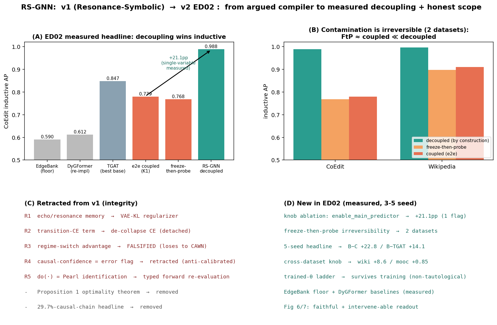

# Progress Report: RS-GNN, from v1 (Resonance-Symbolic) to v2 (ED02)

*Temporal Interaction / Link Prediction - Duong Viet Hoang*

---

## 1. Summary

Version 1 (**RS-GNN**, *Resonance-Symbolic Graph Neural Network for Temporal
Interaction Prediction*) framed the problem as **temporal graph compilation**: a
four-layer neuro-symbolic architecture that enforces a sequence of structural
constraints end-to-end, and was sold on transductive accuracy together with
interpretability, counterfactual reasoning, and robustness - largely from
single-run evidence.

Version 2 (**RS-GNN**, *Regularization-by-Decoupling for Inductive Temporal Link
Prediction, with a Faithful Intervene-able Lifecycle Readout*) keeps the same
underlying components but **inverts the organizing principle**. Instead of
coupling everything into a compiler, v2 separates the continuous representation
from the link-prediction loss with a single stop-gradient, and shows - under a
multi-seed, controlled protocol - that this decoupling is the right default for
the **inductive** setting. The symbolic lifecycle readout is retained as an
honest, scoped add-on rather than a headline capability. Several v1 claims that
did not survive controlled re-testing are corrected or withdrawn here in the
open, which we regard as a normal part of moving from an aspirational design to a
measured one.

---

## 2. Architecture: v1 → v2

The single largest change is structural. v1 is a four-layer constraint-enforcement
compiler trained end-to-end; v2 is a two-stream design in which the backbone is
shaped only by a representation-level objective and the lifecycle readout sits on
a stop-gradient branch.

**v1 - RS-GNN: four-layer neuro-symbolic compiler**

**v2 - RS-GNN: two-stream decoupled design**

- **v1** chains four layers, each enforcing one constraint - semantic relevance,
  temporal consistency (a lifecycle finite-state machine), minimal sufficiency
  (a coupled recurrent memory), and causal admissibility (a hard mask on the
  predictions). The link loss flows through the entire pipeline.
- **v2** splits the model into two streams separated by a stop-gradient. The
  continuous backbone is shaped **only** by a variational / parsimony objective
  and deterministic update laws; no link-prediction gradient reaches it. The
  symbolic lifecycle readout reads from the backbone on a detached branch, so it
  cannot influence the scored prediction.
- The same components survive (event encoder, per-pair operator, coupled-GRU
  memory, five-state lifecycle machine, causal mask), but the design goal moves
  from *"enforce constraints on the output"* to *"protect the representation from
  the link loss, and let the readout ride along for free."*

A four-panel overview of the full v1→v2 change set is below.

---

## 3. Repositioning: aspirational compiler → measured decoupling

| Aspect | v1 (Resonance-Symbolic) | v2 (ED02) |
|---|---|---|
| Core claim | a temporal graph *compiler* | one measured design decision: decoupling |
| Hero axis | transductive accuracy | inductive accuracy and the gap one flag opens |
| Interpretability | a regulatory *requirement* | a scoped, honest add-on |
| Evidence | mostly single-run | multi-seed, mean ± std, uncertainty labelled |

v1 sold an architecture as a normative framework supported by an optimality
theorem. v2 sells a single design decision, supported by a controlled
single-variable ablation and an irreversibility control, and demotes everything
else - interpretability, counterfactual reasoning, the lifecycle machine - to a
clearly bounded add-on. The regulatory-necessity rhetoric and the compiler
metaphor are removed.

---

## 4. v1 claims corrected or withdrawn in v2

Moving to a controlled protocol surfaced several v1 claims that did not hold up.
We record them here rather than quietly dropping them.

- **"Resonance" / echo memory.** The v1 name and story leaned on an echo-style
  resonance memory dynamic. In v2 the operative representation regularizer is a
  plain variational / parsimony objective; the echo dynamics were never the
  mechanism doing the work, so the "Resonance" branding is dropped.
- **Learned transition-supervision loss.** v1 supervised the lifecycle machine
  with a transition-matrix term meant to "teach meaningful states." v2 replaces
  this with a de-collapse objective on the *interpretable* next-state only,
  routed exclusively to the detached branch, so the supervised quantity is
  faithful to its own objective rather than to the scored prediction path.
- **Distribution-shift / regime-switch advantage.** v1 claimed the model stayed
  remarkably stable across a 40% temporal gap, attributing this to "causal
  structure." A clean change-point synthetic, built with a large oracle gap,
  shows the model's per-pair adaptation does **not** beat a strong baseline on
  post-change-point slices. The robustness-as-structural-truth story is therefore
  withdrawn.
- **Confidence flag as a reliability signal.** v1 presented a causal-compliance
  score as an actionable confidence flag that alerts operators to likely errors.
  In v2 the successor signal reliably predicts the model's *own* internal rule
  violations, but does **not** predict actual prediction misses (the external
  error-prediction result was seed-fragile and did not replicate). It is reported
  only as an internal self-consistency measure.
- **Counterfactual reasoning as causal identification.** v1 framed its
  counterfactual mechanism as Pearl-sense, do-calculus causal identification with
  "exact" explanations. v2 keeps the intervention operator only as a **typed
  input override** and explicitly disclaims causal identification: the structure
  is designer-imposed. The state ordering used by the operator was hand-set at
  initialization but is **confirmed by training** (a partial order over the
  lifecycle states survives optimization across all seeds).
- **Optimality theorem.** v1 stated an optimality proposition with a three-step
  proof claiming the compiled graph is the minimal sufficient interaction graph.
  v2 carries **no** optimality theorem. The single formal statement is an
  eval-time score-invariance property, labelled as an autograd-certified property
  of the trained instance, not a theorem.

Also dropped as framing (not factual corrections): the regulatory-necessity
argument, a single-run "causal chain tracing" descriptive statistic, and a
"only model that can do X" capability matrix - all replaced by measured deltas.

---

## 5. New measured results in v2

All headline numbers below are reported with multiple seeds and per-cell standard
deviation. (Full reproducibility detail is provided in Appendix A of the paper.)

- **Single-variable decoupling ablation.** Flipping the one flag that couples the
  representation to the link loss - every other setting fixed - costs **−21.1 pp**
  inductive accuracy on CoEdit (0.990 → 0.779, 3 seeds). Two adjacent gates are
  inert (≤ 0.3 pp), isolating the effect to this one decision.
- **Irreversibility control, two datasets.** Decoupling by construction reaches
  0.988 inductive accuracy on CoEdit, whereas a classic *freeze-then-probe* on a
  coupled backbone recovers only **0.768** - essentially the coupled level
  (0.759). The same pattern holds on Wikipedia (freeze-then-probe **0.897** ≈
  coupled 0.909 $\ll$ decoupled 0.996). The damage from coupling is therefore
  **irreversible**, confirmed on two datasets rather than one.
- **Five-seed headline.** On CoEdit, the decoupled configuration reaches
  0.988 ± 0.003 inductive accuracy versus 0.759 ± 0.014 coupled and 0.847 ± 0.013
  for a strong baseline - a **+22.8 pp** and **+14.1 pp** margin respectively.
- **Cross-dataset generalization.** The same single-flag knob, applied to two
  standard graphs we did not construct, yields **+8.6 pp** on Wikipedia and
  **+0.85 pp** on MOOC (CoEdit +21.1 pp). The magnitude tracks how much
  exploitable node identity each dataset contains, indicating the mechanism is
  not a CoEdit artifact.
- **Memorization floor and transformer frontier.** A memorization baseline reaches
  only ≈ 0.59 inductive on CoEdit (the win is not memorization), and a strong
  transformer baseline behaves as expected through the same harness (recovering on
  Wikipedia), confirming the evaluation pipeline is not pessimizing competitors.
- **Counterfactual battery at scale.** Typed interventions on 12,000 real CoEdit
  pairs across 3 seeds are 100%-directional: forcing the terminal state lowers the
  predicted existence in every case (mean −0.522 ± 0.001), forcing the
  growth states raises it in every case, and the operator is exactly reversible.

---

## 6. Methodology: v1 vs v2

| Aspect | v1 (Resonance-Symbolic) | v2 (ED02) |
|---|---|---|
| Top-level shape | four-layer pipeline | two streams + stop-gradient |
| Backbone signal | link loss flows through all | only a representation objective |
| Lifecycle machine | on the prediction path | behind the detach; heads split |
| Causal mask | hard mask on predictions | soft, band-diagonal mask |
| Counterfactual | re-run on prediction path | typed override, score unchanged |
| Formal backbone | an optimality theorem | an invariance property |

The v1 components survive, but the organizing principle inverts. v1: couple
everything end-to-end and enforce constraints on the output. v2: decouple the
representation from the link loss with one stop-gradient - the single move that
generalizes inductively, and that incidentally frees the readout.

---

## 7. Scope and next steps

v2 deliberately splits the story into two contributions with different scope.

- **C1 - decoupling for inductive accuracy - general.** Shown directionally on
  three datasets (CoEdit +21.1, Wikipedia +8.6, MOOC +0.85), with the
  irreversibility control on two. This is the falsifiable, generalizable core, and
  makes no reference to any one dataset's domain.
- **C2 - per-pair lifecycle readout - deliberately CoEdit-scoped.** The drivers
  that move a pair through its lifecycle are non-commensurable across domains
  (e.g. a transaction amount, a counterparty degree, and an edit rate are not the
  same quantity). A single global readout would have to discard the per-domain
  driver knowledge that makes the readout faithful, so this contribution is scoped
  by design rather than under-developed. We treat this as a deliberate
  general-versus-faithful trade-off: C1 is shown across datasets, C2 is kept
  faithful within one.

Both halves share a single mechanism: the same stop-gradient blocks the identity
shortcut (C1) and frees the readout from the scored path (C2). C2 complements C1
rather than competing as an independent novelty.

**Future work** (not claimed as done): promote the cross-dataset knob and the full
configuration comparison to five seeds; add further transformer and
nearest-neighbour baselines; a per-novelty-bin identity probe; and a globalized
version of the per-pair readout (currently designed but not yet built).
