# RS-GNN: Regularization-by-Decoupling cho Dự đoán Liên kết Thời gian theo hướng Inductive, kèm một Bộ đọc Vòng đời Trung thực và Có thể Can thiệp

\begin{center}
{\large \textbf{Duong Viet Hoang}\textsuperscript{1,\,*} \qquad \textbf{Shih Lun-Min}\textsuperscript{1}}

\textsuperscript{1}\,Department of Computer Science, Da-Yeh University, Taiwan

\texttt{Hoangduong4316@icloud.com} \qquad \texttt{Lmshih@mail.dyu.edu.tw}

\textsuperscript{*}\,Tác giả liên hệ
\end{center}

*Ghi chú khả tái lập: mọi con số được báo cáo đều truy vết được tới một hiện vật liệt kê trong Phụ lục A; những phát biểu chưa được kiểm chứng đều được giới hạn phạm vi rõ ràng. Mọi đại lượng `±` đều là độ lệch chuẩn mẫu (n−1) trên các seed được báo cáo.*

---

## Abstract (Tóm tắt)

Các bộ dự đoán liên kết thời gian tân tiến nhất huấn luyện biểu diễn end-to-end so với link loss. Chúng tôi cho thấy đây là mặc định *sai* cho tổng quát hóa *inductive*. Một ablation knob đơn-biến cô lập nguyên nhân: bật đầu dự đoán end-to-end, giữ mọi flag khác cố định, làm rớt AP inductive trên CoEdit - một đồ thị co-edit chúng tôi giới thiệu - đi −21.1 điểm (0.9899 → 0.7788), về cơ bản là toàn bộ khoảng cách decoupled-vs-coupled. Cùng flag đó giữ decoupling dẫn trước trên hai đồ thị chuẩn mà chúng tôi không xây (Wikipedia +8.6, MOOC +0.9), nên cơ chế không phải một hiện vật (artifact) riêng của CoEdit. Tại năm seed, RS-GNN đã detach đạt 0.9876 AP inductive, +22.8 so với cấu hình coupled; so với baseline nó dẫn +14.1 so với một TGAT khớp-giao-thức *trong cùng harness của chúng tôi* - các baseline của chúng tôi là bản tái hiện đơn giản hóa, nên đây là biên độ within-harness, không phải tuyên bố so với state of the art đã công bố (§6.1). Các thành phần nguyên thủy đều là prior art (stop-gradient, frozen probing, temporal concept bottleneck); kết quả thì không. Một control quyết định cho thấy freeze-then-probe kinh điển chỉ đạt 0.768 (CoEdit) và 0.897 (Wikipedia), sát arm coupled, trong khi decoupling-by-construction đạt 0.988 / 0.996: một khi link loss định hình backbone thì hư hại là không đảo ngược trên cả hai dataset. Theo hiểu biết của chúng tôi, tính không-đảo-ngược này là mới cho dự đoán liên kết thời gian; đóng góp là *ngăn nhiễm BY CONSTRUCTION*, định vị lên split inductive. Dưới cả historical và inductive hard negatives [Poursafaei et al., 2022] thứ tự không đảo mà nở rộng lên +40-43 điểm trên Wikipedia và CoEdit, khi nhánh coupled sụp về gần ngẫu nhiên. Cùng thao tác detach giải phóng một bộ đọc vòng đời năm trạng thái ký hiệu khỏi đường được chấm điểm với chi phí accuracy bằng không, bất biến điểm số chính xác và falsifiable dưới các override do(state).

**Từ khóa (Keywords):** Inductive temporal link prediction · Regularization by decoupling · Stop-gradient feature decoupling · Temporal graph neural networks · Interpretable and intervene-able lifecycle readout · Temporal concept bottleneck · Information bottleneck · Reproducible evaluation

---

## 1. Giới thiệu

Các đồ thị tương tác thời gian - người dùng chỉnh sửa trang, sinh viên truy cập các module khóa học, các tài khoản giao dịch - là những chuỗi cạnh có dấu thời gian (timestamped edges). Một cách hình thức, một luồng (stream) là một tập có thứ tự các sự kiện $\mathcal{E} = \{(u_i, v_i, t_i, x_i)\}_{i=1}^{N}$ với $t_1 \le t_2 \le \dots \le t_N$, trong đó $x_i$ là một vector đặc trưng cạnh tùy chọn. Tác vụ kinh điển là *dự đoán liên kết tương lai (future link prediction)*: cho lịch sử $\mathcal{H}_t = \{(u_i, v_i, t_i, x_i) : t_i < t\}$, hãy chấm điểm xem một cạnh ứng viên $(u, v)$ có xảy ra tại thời điểm $t$ hay không. Mô hình xuất ra một xác suất $\hat{p}(u, v, t) = \sigma(f_\theta(u, v, t, \mathcal{H}_t))$ và được huấn luyện bằng binary cross-entropy so với các positive quan sát được và các negative được lấy mẫu.

Có hai giao thức đánh giá quan trọng, và chúng tưởng thưởng cho những thiên kiến quy nạp (inductive bias) rất khác nhau. Các cạnh kiểm thử **transductive** tái sử dụng các node huấn luyện, nên một mô hình có thể dựa vào một embedding theo từng node đã được ghi nhớ trong quá trình huấn luyện. Các cạnh kiểm thử **inductive** liên quan tới ít nhất một node chưa từng thấy trong huấn luyện, nên bất kỳ embedding theo từng node nào cũng chưa được khởi tạo hoặc ngẫu nhiên tại thời điểm kiểm thử. Inductive là chế độ liên quan tới triển khai thực tế - người dùng, trang và tài khoản mới liên tục xuất hiện - và là chế độ khó hơn, bởi mô hình phải chấm điểm cạnh từ các động lực học *có thể chuyển giao (transferable)* thay vì từ danh tính node. Một mô hình chấm điểm tốt theo transductive nhưng sụp đổ theo inductive thì đã ghi nhớ tổng thể huấn luyện chứ không học được quá trình tương tác.

Các phương pháp tân tiến nhất phân tách theo một trục biểu diễn: các mô hình *memory* (JODIE, TGN, DyRep) duy trì một trạng thái hồi quy (recurrent) theo từng node được cập nhật tại mỗi sự kiện, trong khi các mô hình *encoder* (TGAT, CAWN, GraphMixer) tính biểu diễn tức thời (on the fly) từ lân cận thời gian (§2 trình bày chi tiết từng phương pháp). Trên cả hai họ, biểu diễn được huấn luyện *end-to-end* so với mục tiêu dự đoán liên kết - backbone là bất kỳ thứ gì tối thiểu hóa loss xếp hạng (ranking loss) - và chúng tôi quan sát hai hệ quả.

1. **Ghép end-to-end mời gọi overfitting theo danh tính.** Khi link loss có quyền ghi vào backbone, gradient descent được tự do mã hóa bất kỳ đặc trưng nào làm giảm sai số xếp hạng huấn luyện, kể cả các đặc trưng chỉ đơn thuần *nhận dạng (identify)* các node huấn luyện - được tưởng thưởng theo transductive nhưng là khối lượng chết (dead weight) theo inductive, vì node kiểm thử là mới, nên mô hình phải trả một khoản "thuế inductive".
2. **Trạng thái học được vừa mờ đục vừa trơ.** Không có chỗ nào trong một vector bộ nhớ node để hỏi "cặp này đang được củng cố hay đang suy tàn?", và cũng không có toán tử nào để *can thiệp (intervene)* lên trạng thái đó và đọc ra tác động. Các quá trình thời gian có một vòng đời (lifecycle) tự nhiên - sinh ra, được củng cố, suy tàn, chết - nhưng các kiến trúc tiêu chuẩn không phơi bày gì trong số đó.

RS-GNN có một lập trường khác trên cả hai điểm. Chúng tôi giữ một backbone liên tục phong phú - một bộ mã hóa sự kiện, một toán tử trạng thái cạnh theo từng cặp đa tín hiệu được neo vào cường độ (intensity) của quá trình Hawkes [Hawkes, 1971], và một bộ nhớ node coupled-GRU - nhưng chúng tôi **tách rời nó khỏi link-prediction loss bằng một stop-gradient tường minh**. Backbone chỉ được định hình bởi một mục tiêu tiết kiệm biến phân (variational parsimony objective) (một bộ chính quy KL theo tinh thần của information bottleneck [Tishby et al., 2000] và VAE [Kingma & Welling, 2014]) cộng với các định luật cập nhật thống kê theo từng cặp mang tính tất định. Đầu dự đoán liên kết đọc backbone *đã đóng băng* này qua một bộ giải mã vòng đời ký hiệu nhỏ. Stop-gradient về mặt khái niệm chính là cùng một thiết bị ổn định việc học siamese tự giám sát (self-supervised siamese learning) [Chen & He, 2021]: nó ngăn một nhánh khỏi việc làm sụp đổ biểu diễn về một lối tắt (shortcut).

Các đóng góp của chúng tôi là:

1. **Regularization-by-decoupling cho dự đoán liên kết thời gian inductive (kết quả lõi).** Các viên gạch - stop-gradient [Chen & He, 2021], frozen probing [Alain & Bengio, 2017; Kumar et al., 2022], information bottleneck [Tishby et al., 2000] - đều là prior art. Bằng một ablation đơn-biến và một control tính-không-đảo-ngược, chúng tôi thiết lập rằng **ghép end-to-end là mặc định SAI cho dự đoán liên kết thời gian inductive, và hư hại nó gây ra là KHÔNG ĐẢO NGƯỢC** - freeze-then-probe không phục hồi được. Theo hiểu biết của chúng tôi, tính không-đảo-ngược này chưa từng được chứng minh trong thiết lập này. (a) Một ablation đơn-biến, ba seed cô lập nguyên nhân: bật đầu dự đoán đầu-cuối (end-to-end; ứng với cờ `enable_main_predictor=False` được bật lên True), giữ mọi công tắc cấu hình khác cố định, tốn **−21.1 điểm** AP inductive trên CoEdit (0.9899 → 0.7788), về cơ bản là toàn bộ khoảng cách decoupled-vs-coupled, với hai cổng đồng-biến trơ (§6.2). (b) Cùng flag đơn đó giữ decoupling dẫn trước trên hai đồ thị *chuẩn* chúng tôi không xây - Wikipedia +8.6 pp, MOOC +0.9 pp - nên cơ chế không phải artifact của CoEdit, độ lớn theo dõi mức danh tính node mà đầu coupled khai thác được (§6.5). (c) Một control quyết định đo delta so với freeze-then-probe: đóng băng backbone *sau* link loss chỉ đạt 0.768 (CoEdit) và 0.897 (Wikipedia) - sát arm coupled end-to-end, thấp hơn hẳn 0.988 / 0.996 của decoupling-by-construction - nên hư hại là **không đảo ngược** trên cả hai dataset, và đóng góp là ngăn nhiễm đó BY CONSTRUCTION. Theo hiểu biết của chúng tôi, tính không-đảo-ngược này chưa từng được chứng minh cho dự đoán liên kết thời gian (§6.2). Không có gradient liên kết, đầu giữ một biểu diễn per-pair tổng quát chuyển giao được sang node chưa thấy, và thuế-lối-tắt-danh-tính nó loại bỏ rơi gần như toàn bộ lên split inductive (§7).
2. **Một toán tử trạng thái cạnh theo từng cặp đa tín hiệu** (cường độ Hawkes, thống kê khoảng cách Welford, các EWMA tái diễn (recurrence) và tốc độ (rate)) với một bộ ước lượng theo batch kiểu *đọc-trước-khi-ghi (read-before-write)* (`causal_batch`) sửa một lỗi cũ kỹ (staleness) im lặng trong nội bộ batch; bản sửa này có lợi cho AP (**+5.7 ± 0.2 pp** inductive trên CoEdit qua ba seed, trong config B đầy đủ).
3. **Một bộ giải mã vòng đời năm trạng thái phân cấp** (BIRTH / REINFORCE / DECAY / DEATH / IDLE) làm cho trạng thái DECAY trung gian có thể đạt được bằng argmax - một softmax phẳng trên một trục có thứ tự về mặt cấu trúc là không thể - *và có thể chứng minh là bất biến với đường AP (AP-path-invariant)* (thay đổi điểm số chính-xác-bằng-không).
4. **Một bộ đọc vòng đời trung thực, có thể can thiệp đi kèm miễn phí trên cùng detach (một add-on sạch).** Cùng stop-gradient đặt bộ giải mã ký hiệu ngoài đường được chấm điểm, nên các override `do(state)` - đánh giá xuôi có kiểu dưới một override đầu vào - không bao giờ tốn AP. Bộ đọc *có thể bác bỏ*: một quy luật học được "REINFORCE ⟺ nhịp chỉnh sửa đang tăng" được xác nhận ở mức quần thể, do(slope), và đơn-cặp, còn các trọng số tồn tại đã huấn luyện giữ thứ tự DEATH<IDLE<DECAY<active, nên chiều của do(state) sống sót qua huấn luyện (§4). Đây là một concept bottleneck thời gian [Koh et al., 2020] với typed forward re-evaluation - một bộ đọc trung thực, can thiệp được mà detach của đóng góp 1 làm cho miễn phí, bổ trợ cho kết quả lõi chứ không cạnh tranh với nó.
5. **Một nghiên cứu về độ tin cậy trung thực.** Chúng tôi xây dựng một điểm tính-nhất-quán-nhân-quả theo chuỗi-bước (walked-chain causal-coherence) và báo cáo - với bằng chứng ba seed - rằng đó là một thước đo tự-nhất-quán nội tại ổn định nhưng *không phải* một bộ dự báo lỗi ngoại tại đáng tin cậy, rút lại một tuyên bố đơn-seed trước đó.

Xuyên suốt, các con số AP và các tuyên bố kiến trúc đều được đối chiếu chéo với code và với một cuộc kiểm toán liêm chính (integrity audit) độc lập (§6.3).

---

## 2. Công trình liên quan (Related work)

**Temporal GNN dựa trên bộ nhớ.** JODIE [Kumar et al., 2019] ghép hai RNN cùng tiến hóa embedding của user và item với một toán tử phép chiếu (projection) dự đoán quỹ đạo tương lai của một embedding giữa các sự kiện; nó được tinh chỉnh cho thiết lập gợi ý (recommendation) transductive. TGN [Rossi et al., 2020] hợp nhất các phương pháp như vậy thành một module bộ nhớ node (một RNN trên các message theo từng node) cộng một lớp embedding graph-attention. DyRep [Trivedi et al., 2019] đặt việc học biểu diễn như một quá trình điểm (point process) chú ý theo thời gian với động lực học topo và tương tác tách biệt. Cả ba đều duy trì một trạng thái hồi quy theo từng node được huấn luyện end-to-end so với mục tiêu liên kết. RS-GNN cũng mang bộ nhớ - một module bộ nhớ node coupled-GRU - nhưng bộ nhớ của nó được định hình bởi một mục tiêu tiết kiệm, chứ không phải trực tiếp bởi link loss, và đó chính xác là sự khác biệt mà ablation của chúng tôi cô lập.

**Các phương pháp encoder và dựa trên walk.** TGAT [Xu et al., 2020] áp dụng self-attention trên lân cận thời gian với một bộ mã hóa thời gian theo hàm Bochner, loại bỏ nhu cầu lưu một trạng thái theo từng node và cho hỗ trợ inductive bản địa (native). CAWN [Wang et al., 2021] ẩn danh hóa (anonymize) một tập các causal walk bắt rễ tại cặp truy vấn và mã hóa các mẫu danh-tính-tương-đối của chúng, nắm bắt cấu trúc thời gian ở cấp motif. GraphMixer [Cong et al., 2023] bỏ hẳn attention: một bộ mã hóa thời gian cố định cộng một MLP trộn token (token-mixing) trên các liên kết gần nhất là đủ cạnh tranh với các mô hình nặng hơn nhiều, một kết quả thúc đẩy việc dùng các baseline mạnh, đơn giản. Các phương pháp này mạnh theo transductive nhưng, như các lần chạy khớp giao thức của chúng tôi cho thấy (§6.1), hành vi *inductive* của chúng phụ thuộc dataset: TGAT gần như hoàn hảo theo inductive trên Wikipedia nhưng yếu hơn nhiều theo transductive ở đó, một sự kỳ quặc về đặc trưng (featural quirk) mà chúng tôi quy cho các đặc trưng node tình cờ nhận dạng được các node Wikipedia chưa thấy.

**Benchmark và đánh giá công bằng.** Kết quả đồ thị thời gian nhạy với giao thức đánh giá, đặc biệt là chiến lược lấy mẫu negative và split inductive. Temporal Graph Benchmark [Huang et al., 2023] chuẩn hóa các split và một chế độ negative khó hơn, và cho thấy nhiều bảng xếp hạng đã công bố bị sắp xếp lại dưới một giao thức công bằng. Chúng tôi tuân theo bài học này bằng cách chạy *mọi* mô hình qua một harness chung duy nhất với một pool negative duy nhất và một bộ đánh giá đã được kiểm toán rò rỉ (§6.1, §6.3), báo cáo cả hai giao thức để một mô hình thắng giao thức này nhưng sụp đổ giao thức kia được hiển thị thay vì bị che giấu.

**Quá trình điểm và mô hình hóa vòng đời.** Quá trình Hawkes [Hawkes, 1971] mô hình hóa cường độ sự kiện tự kích thích (self-exciting), trong đó mỗi sự kiện trong quá khứ tạm thời nâng tốc độ của các sự kiện tương lai; chúng là tiên nghiệm (prior) thời gian liên tục tự nhiên cho các luồng tương tác bùng nổ (bursty) và đã được dùng để dẫn dắt các mô hình thời gian neural [Mei & Eisner, 2017]. Chúng tôi dùng một cường độ Hawkes theo từng cặp $\lambda$ cùng với các mô-men trực tuyến Welford [Welford, 1962] của khoảng cách giữa các sự kiện (inter-event gap) làm nền tảng liên tục mà bộ giải mã ký hiệu đọc vào. Trừu tượng vòng đời BIRTH→REINFORCE→DECAY→DEATH trên các thống kê này là lớp ký hiệu; đó là một bản tóm tắt thô, có thể diễn giải về việc một cặp đang ở đâu trong quỹ đạo tự kích thích của nó.

**Concept bottleneck và bộ đọc neuro-symbolic.** Prior art gần nhất với bộ đọc của chúng tôi là concept bottleneck model (CBM) [Koh et al., 2020], nơi một mạng dự đoán các khái niệm do con người đặt tên và một người vận hành can thiệp bằng cách chỉnh sửa một khái niệm. Bộ đọc vòng đời có kiểu của chúng tôi là một CBM *thời gian* - năm khái niệm vòng đời theo từng cặp trên một nền tảng quá trình điểm, với $\mathrm{do}(\text{state})$ là một override khái niệm - khác ở chỗ bottleneck nằm *sau* một stop-gradient chứ không *trên* đường dự đoán, nên nó không bao giờ đánh đổi với độ chính xác. Cấu trúc là do thiết kế áp đặt, không phải được khám phá (các cổng tiên nghiệm giải tích cộng một residual học được nhỏ, ma trận chấp nhận $C$ cố định, chiều của `do(state)` là một đọc-ra trọng số softplus đã sắp xếp; §4), nên chúng tôi khung hóa nó là một *bộ đọc có kiểu* trung thực, có thể can thiệp cưỡi miễn phí trên detach - không phải một SCM đã học hay một mô hình nhân quả kiểu Pearl được khám phá [Pearl, 2009]. Khác với các bộ giải thích hậu kỳ như GNNExplainer [Ying et al., 2019], trạng thái ký hiệu ở đây là *cùng* một đại lượng được giám sát và được đo, nên lời giải thích trung thực với mục tiêu được giám sát của chính nó (§3.4) chứ không gần đúng [Rudin, 2019; Jacovi & Goldberg, 2020].

**Decoupling, biểu diễn đóng băng và stop-gradient như những bộ chính quy.** RS-GNN nằm ở giao của stop-gradient chống sụp đổ (SimSiam [Chen & He, 2021]), linear probing trên encoder đóng băng [Alain & Bengio, 2017] nơi fine-tuning có thể bóp méo các đặc trưng chuyển giao được nên một probe chuyển giao tốt hơn [Kumar et al., 2022], và dừng-gradient như kiểm soát dung lượng [Caron et al., 2021], đọc được qua information bottleneck [Tishby et al., 2000; Alemi et al., 2017]. Các nguyên thủy này đều là prior art, và "đóng băng một encoder đã pretrain, dò bằng một đầu tác vụ, thu được transfer" là một hiện tượng đã biết. Delta của chúng tôi so với chúng sắc bén ở hai mặt. Thứ nhất, **tái định vị**: chúng tôi chuyển stop-gradient-như-bộ-chính-quy vào *split inductive của dự đoán liên kết thời gian*, nơi ghép end-to-end là mặc định phổ quát - và chúng tôi đo, lần đầu trong thiết lập này, rằng ghép là mặc định sai. Thứ hai, **cô lập**: backbone chỉ được huấn luyện bởi một mục tiêu tiết kiệm từ đầu (chế độ là task-gradient-vs-none, không phải pretrain-rồi-probe), và chúng tôi định vị thuế lên một lối tắt danh tính rơi gần như toàn bộ lên split inductive (§7). Điều này làm sắc bén hàng xóm gần nhất - "fine-tuning bóp méo đặc trưng chuyển giao được" của Kumar et al. - thành một tuyên bố mạnh hơn, đã đo: sự bóp méo là *không đảo ngược*. Đóng băng backbone *sau* link loss không phục hồi được nó, trên hai dataset (§6.2). Đóng góp là không bao giờ phơi backbone trước gradient liên kết ngay từ đầu.

**Định vị.** RS-GNN không phải mô hình bộ nhớ đầu tiên, cũng không phải mô hình đầu tiên dùng các cường độ Hawkes, cũng không phải mô hình thời gian neuro-symbolic đầu tiên. Tuyên bố của nó là *sự kết hợp và phép đo của nó*: **tách rời (decoupling)** biểu diễn khỏi link loss là cái làm cho một biểu diễn động lực học theo từng cặp tổng quát hóa theo inductive, và bộ đọc ký hiệu là một add-on trung thực, có thể can thiệp cưỡi miễn phí trên cùng detach.

---

## 3. Phương pháp

Kiến trúc hai luồng được tóm tắt trong Hình A1 (Phụ lục); định tuyến gradient, cây giải mã, dải khả-thừa-nhận và lớp phủ độ-tin-cậy là các Hình A2-A5 (Phụ lục).

### 3.1 Hai luồng, một detach

RS-GNN là một mô hình hai luồng. Gọi một sự kiện là một cạnh có dấu thời gian $(u, v, t)$ với vector đặc trưng tùy chọn $x$.

**Luồng A - backbone liên tục.** Một bộ mã hóa sự kiện (một mạng tín hiệu liên tục dạng residual, CSN) ánh xạ các đặc trưng sự kiện và độ cũ (staleness) của nguồn $\Delta t = t - t_{\text{last}}(u)$ thành một biểu diễn theo từng sự kiện $e_{uv}$. Một **toán tử trạng thái cạnh** đa tín hiệu (ECTGv3) duy trì, theo từng cặp có thứ tự $(u,v)$, một dải nhỏ các thống kê đang chạy:

- một **cường độ tự kích thích Hawkes** $\lambda_{uv}$ được cập nhật tại mỗi sự kiện bởi $\lambda \leftarrow 1 + (\lambda - 1)\,e^{-\beta \Delta t}$, nên mỗi tương tác tạm thời nâng tốc độ của cặp và tốc độ suy giảm giữa các sự kiện;
- **trung bình và phương sai trực tuyến Welford** của khoảng cách giữa các sự kiện, được cập nhật bởi đệ quy ổn định số học $\mu_k = \mu_{k-1} + (g_k - \mu_{k-1})/k$, $M_k = M_{k-1} + (g_k - \mu_{k-1})(g_k - \mu_k)$, với $\sigma_k^2 = M_k/k$ [Welford, 1962];
- một **EWMA tái diễn (recurrence)** đếm số lần đồng xuất hiện lặp lại, và các **EWMA tốc độ nhanh/chậm** $r^f, r^s$ mà tỷ số $r^f/r^s$ là một tín hiệu nhịp điệu tăng-so-với-giảm;
- một **đỉnh tốc độ rò rỉ (leaky rate-peak)** theo dõi tốc độ gần đây cực đại với suy giảm chậm.

Một module coupled-GRU (DRGC) cập nhật một bộ nhớ theo từng node $m_u, m_v$ từ $e_{uv}$ và phát ra một số hạng KL tiết kiệm $\mathrm{KL}(q(z \mid m) \,\|\, p(z))$. Tín hiệu huấn luyện *duy nhất* của backbone là KL này (một mục tiêu tiết kiệm biến phân, được trọng số bởi một scalar đơn $\lambda_{\text{kl}}$) cộng các định luật cập nhật thống kê tất định ở trên; **không có gradient dự đoán liên kết nào chạm tới nó.**

**Luồng B - bộ đọc vòng đời ký hiệu.** Từ biểu diễn cạnh (đã detach) `edge_h`, một `StateObserver` sinh ra một trạng thái *hiện tại* mềm $s_t \in \Delta^4$ trên năm trạng thái $\{\text{IDLE}, \text{BIRTH}, \text{REINFORCE}, \text{DECAY}, \text{DEATH}\}$; một `TransitionPredictor` sinh ra các logit trạng thái-kế-tiếp; một mặt nạ vòng đời - một ma trận chuyển theo luật-nhân-quả $C \in \{0,1\}^{5\times 5}$ mã hóa các chuyển dịch hợp lệ (ví dụ DEATH không thể đứng trước BIRTH) - cùng với một cổng `ever_alive` định hình phân phối trạng thái-kế-tiếp $s_{t+1}^{\text{pos}}$; một `ExistenceDecoder` ánh xạ $s_{t+1}^{\text{pos}}$ thành logit tồn tại cạnh được **chấm điểm**.

**Thao tác detach.** Đầu vào của mọi module Luồng-B là `edge_h.detach()`. Logit được chấm điểm là logit của bộ giải mã tồn tại, và mọi đường từ nó tới backbone đều vượt qua một stop-gradient. Chúng tôi đã kiểm chứng trên CPU rằng `pred_loss.backward()` cho ra gradient chính xác bằng không trên cả 56 tensor tham số backbone, trong mọi cấu hình. Một đầu dự đoán không-detach có tồn tại trong code nhưng chỉ được dùng cho *ablation* end-to-end (config C, §6.2).

### 3.2 Toán tử theo từng cặp và bản sửa đọc-trước-khi-ghi (`causal_batch`)

Toán tử trạng thái cạnh phải đọc các thống kê *trước-sự-kiện (pre-event)* của mỗi cặp: việc chấm điểm sự kiện $i$ chỉ được dùng trạng thái tích lũy từ các sự kiện $j < i$, nếu không việc đánh giá sẽ rò rỉ nhãn. Kho lưu trữ theo batch ban đầu chụp nhanh (snapshot) trạng thái một lần mỗi minibatch, nên các sự kiện cùng-cặp lặp lại *bên trong* một batch đều đọc cùng một hàng cũ và chỉ lần ghi cuối cùng được giữ lại. Ở batch size 500 trên CoEdit, số đếm Welford bị chặn gần 6 ngay cả với các cặp chỉnh sửa 200+ lần, làm under-fold cường độ Hawkes và ghim chặt đỉnh tốc độ - điều này âm thầm vô hiệu hóa toàn bộ phân biệt DECAY-so-với-REINFORCE, vì sự phân biệt đó được đọc ra từ tỷ số tốc độ mà không bao giờ được tích lũy.

Bản sửa `causal_batch` phát lại (replay) các kênh tất định theo từng-sự-kiện theo thứ tự stream, nên lần xuất hiện thứ $k$ trong batch của một cặp đọc post-state của lần thứ $(k{-}1)$, trong khi việc chấm điểm vẫn nghiêm ngặt trước-cập-nhật (không tái rò rỉ). Một kiểm tra tương đương trên CPU khớp một tham chiếu theo từng-sự-kiện (batch=1) tới max $|\Delta| = 0.000$ trên mọi kênh, xác nhận việc phát lại là chính xác. Bản sửa **có lợi cho AP**: trong config B đầy đủ, bật `causal_batch` nâng AP inductive trên CoEdit 0.9312 → 0.9885 (**+5.7 ± 0.2 pp**, ba seed) và transductive 0.9920 → 0.9985 (+0.65 pp) - một trường hợp hiếm khi một bản sửa tính đúng đắn đồng thời cũng là một chiến thắng về độ chính xác, bởi các thống kê từng bị sụp đổ trước đó chính xác là những thống kê mà bộ giải mã vòng đời cần đọc. Hiệu ứng nhất quán cả trong thiết lập rút gọn (không-vòng-đời), nơi một A/B đơn-seed tăng từ 0.7462 lên 0.7907.

### 3.3 Giải mã vòng đời phân cấp

Trong một softmax năm-lớp phẳng trên trục có thứ tự BIRTH→REINFORCE→DECAY→DEATH, lớp giữa (DECAY) chia khối xác suất của nó cho hai lớp hàng xóm và *không bao giờ có thể thắng argmax* ngay cả khi xác suất của nó là trung thực. Cụ thể, nếu nhịp điệu thực sự đặt một cặp vào DECAY, một đầu phẳng trải tín hiệu đó qua REINFORCE và DEATH; trên config cuối cùng (giải mã phân cấp, `decol_hier_v2`, `causal_batch`, seed 42; dump faithfulness $N=12000$, tập con tái diễn $\text{true\_occ}\ge 2$, $n=9157$) chúng tôi đo được một Spearman $\rho \approx -0.59$ ($p < 10^{-300}$) giữa xác suất DECAY được giải mã (đã hiệu chỉnh) `p_decay_cal` và tín hiệu nhịp-điệu-tăng theo từng cặp `slope_rel` - đúng dấu (ít tăng hơn $\Rightarrow$ nhiều khối DECAY hơn) - nhưng một bộ đọc phẳng trên cùng tín hiệu đó vẫn không thể đưa DECAY lên thành lớp argmax. Không có tinh chỉnh ngưỡng nào sửa được điều này - đó là một đặc tính của *hình học* đầu ra, không phải của hiệu chỉnh (calibration) - nên *cấu trúc* đầu ra phải thay đổi.

Bộ giải mã phân cấp phân tích phân phối trạng thái-kế-tiếp thành một cây quyết định trên các cổng (gate) trước-cập-nhật theo từng cặp $p_{\text{birth}}, p_{\text{alive}}, p_{\text{rising}} \in [0,1]$:

$$
\begin{aligned}
P(\text{BIRTH}) &= p_{\text{birth}} \\
P(\text{REINFORCE}) &= (1 - p_{\text{birth}})\, p_{\text{alive}}\, p_{\text{rising}} \\
P(\text{DECAY}) &= (1 - p_{\text{birth}})\, p_{\text{alive}}\, (1 - p_{\text{rising}}) \\
P(\text{DEATH}) &= (1 - p_{\text{birth}})\, (1 - p_{\text{alive}})
\end{aligned}
$$

Bốn số hạng này tổng bằng một theo cấu trúc. Giờ đây DECAY chỉ cạnh tranh với REINFORCE *bên trong* nhánh alive (sự phân chia $p_{\text{rising}}$), nên argmax-DECAY có thể đạt được bất cứ khi nào $p_{\text{alive}} > p_{\text{birth}}$ và $p_{\text{rising}} < 1/2$. Cây giải mã được vẽ trong Hình A3 (Phụ lục).

Mỗi cổng là $\sigma(\text{analytic\_prior} + \text{phần dư khả học nhỏ})$, được khởi tạo bằng không sao cho một cổng mới bằng đúng tiên nghiệm phân tích của nó; một cross-entropy *chống-sụp-đổ (de-collapse)* huấn luyện các phần dư so với một mục tiêu mềm dẫn xuất từ các thống kê đang chạy. Một tinh chỉnh (`decol_hier_v2`) tái neo (re-anchor) các tiên nghiệm alive/rising lên tín hiệu số-đếm-tái-diễn không bị nhiễu và đặt các số hạng mean/staleness có thể bị nhiễu sau một mặt nạ "có-lịch-sử (has-history)", nên sự nhiễu đặc trưng không thể đẩy một cặp tái diễn đang hoạt động về DEATH.

*Hình 1. Vòng đời theo từng cặp được giải mã cho một cặp CoEdit thực (3178→7437, 42 sự kiện, khoảng 18.69 phút, config B, đã hiệu chỉnh `s_t1_cal`). Độ dốc tốc độ chỉnh sửa (tăng→giảm) và các cổng phân cấp bám theo nhịp điệu của chính cặp đó: 1 BIRTH, 20 REINFORCE, 21 DECAY, 0 DEATH; p_alive luôn nằm trong [0.579, 0.801] > 0.5, với các lần lật REINFORCE↔DECAY tại các điểm đổi dấu độ dốc. Bộ đọc bám theo nhịp điệu thực của dữ liệu thay vì một tiên nghiệm cố định.*

### 3.4 Hai đầu trạng thái-kế-tiếp: AP so với diễn giải

Một đặc tính thiết kế then chốt: có **hai** phân phối trạng thái-kế-tiếp. `s_t1_pos` (softmax chuyển đã có mặt nạ, đã gating) là đầu vào *duy nhất* của bộ giải mã tồn tại và do đó là thứ duy nhất ảnh hưởng đến điểm AP. `s_t1_cal` (cây phân cấp ở trên, tùy chọn có causal-police) nuôi CE chống-sụp-đổ, phép đo phân phối vòng đời, dump faithfulness, và động cơ phản thực - nhưng **không bao giờ** nuôi bộ giải mã tồn tại.

Chúng tôi đã kiểm chứng trên CPU rằng việc chuyển phẳng↔phân cấp và bật↔tắt chính sách nhân quả (causal policy) thay đổi `s_t1_cal` tới mức 0.999 trong khi thay đổi cả điểm số positive và negative đúng **chính xác** 0.000e+00. Điều này mạnh hơn "đầu diễn giải nhỏ": đó là *tính bất biến điểm số (score invariance)*, một đặc tính của đồ thị tính toán (computation graph), nên không lựa chọn nào trong bộ đọc ký hiệu có thể dịch chuyển AP bất kỳ lượng nào. (Tính bất biến này là chính xác *khi trọng số cố định* - tức đánh giá một mô hình đã huấn luyện với bộ đọc được bật/tắt. Nó bảo đảm bộ đọc ký hiệu **không có** hiệu ứng có hệ thống lên AP, vì đầu ra của nó không bao giờ đưa vào loss của bộ giải mã tồn tại; còn khi bộ máy bộ đọc được bật trong lúc *huấn luyện* - ví dụ `hier_causal_policy`, §6.2 - thêm op làm dịch luồng RNG của optimizer, nên hai lần chạy AP-trung-tính trong phạm vi nhiễu seed chứ không phải giống-hệt-byte.) Do đó bộ máy diễn giải và phản thực vừa không thể bơm phồng AP, vừa khiến AP không thể là một tạo tác (artifact) của việc giải mã vòng đời - cho phép chúng tôi báo cáo một bộ đọc ký hiệu trung thực *và* một AP cạnh tranh mà không có sự đánh đổi diễn-giải-so-với-độ-chính-xác thường thấy [Rudin, 2019].

### 3.5 Chính sách nhân quả trên trạng thái có thể diễn giải

Trạng thái có thể diễn giải được công bố `s_t1_cal` được chính quy hóa bởi hai bước mềm, khả vi, được tái chuẩn hóa (renormalized):

1. một **cổng `ever_alive`**: lá DEATH được nhân tỷ lệ bởi bộ tích lũy đã-từng-sống của cặp, và khối-chết được giải phóng được định tuyến tới trạng thái IDLE trước-sinh trung thực, nên một cặp chưa bao giờ sống không thể bị báo cáo là đã chết;
2. một **mặt nạ khả-thừa-nhận kỳ vọng mềm (soft expected-admissibility mask)** từ ma trận luật-nhân-quả $C$: một kỳ vọng mềm đầy đủ $\mathbb{E}_{s_t}[C]$ trên phân phối trạng-thái-hiện-tại (không argmax), trộn với một floor nhỏ sao cho một chuyển dịch bị cấm bị triệt tiêu khoảng 20× thay vì bị giết cứng (hard-killed).

Chúng tôi dùng dạng mềm vì một mặt nạ argmax cứng dễ vỡ: khi $s_t$ gần đồng nhất, argmax dao động (jitter) giữa các trạng thái gần-hòa, trong khi kỳ vọng mềm suy giảm một cách nhẹ nhàng. Chính sách này là **AP-trung-tính (AP-neutral)** theo tính bất biến của §3.4: qua ba seed {1, 7, 42}, huấn luyện config B có và không có chính sách này làm AP inductive trên CoEdit dịch tối đa $|\Delta| = 1.5\mathrm{e}{-3}$ (trung bình $\approx -1.7\mathrm{e}{-4}$, lẫn dấu), nằm gọn trong độ lệch chuẩn giữa các seed $\pm 3.5\mathrm{e}{-3}$. Chính sách chỉ ghi vào `s_t1_cal` (nhánh đã tách-rời mà bộ giải mã tồn tại không bao giờ đọc), nên không có hiệu ứng có hệ thống lên AP; phần dư là tính ngẫu nhiên khi huấn luyện, không phải sự trùng khớp từng byte. Dải khả-thừa-nhận $C_{\text{BAND-5}}$ được vẽ trong Hình A4 (Phụ lục).

**Lưu ý trung thực (được chuyển vào Limitations).** `ever_alive` là một bộ tích lũy phi-Markov mà ma trận không-bộ-nhớ $C$ không thể biểu diễn, nên bảo đảm chết-trước-khi-sinh được thực thi bởi một cổng *riêng* thay vì bởi $C$ - một "mùi cấu trúc (structural smell)" đã biết, không phải bị che giấu.

### 3.6 Toán tử chuyển theo từng cặp

Phân phối trạng thái-kế-tiếp được sinh bởi một toán tử chuyển theo từng cặp $T_{uv}$ thích nghi ma trận luật-nhân-quả chung $C$ vào các thống kê của riêng cặp đó. Chúng tôi tham số hóa $T_{uv} = C \odot (W + g(\phi_{uv}))$, trong đó $W = UV^\top$ là một toán tử cơ sở khả học hạng-thấp (low-rank) và $g(\phi_{uv})$ là một cổng nhỏ theo từng cặp được tính từ bản tóm tắt đặc trưng của cặp $\phi_{uv}$ (tỷ số tốc độ, số đếm tái diễn, độ dốc, độ cũ). Cơ sở hạng-thấp nắm bắt các khuynh hướng chuyển ở cấp tổng thể; cổng $g$ chuyên biệt hóa chúng theo từng cặp mà không trao cho mỗi cặp một ma trận đầy đủ tự do. Vì $g$ là một hàm tất định của các thống kê (đã detach), toán tử có thể tái dựng ngoại tuyến (offline) từ một hàng đặc trưng đã lưu, và đó chính là cái làm cho động cơ can thiệp của §4 là chính xác.

### 3.7 Sự tách rời, một cách chính xác

Tổng loss là

$$
\mathcal{L} = \underbrace{\mathcal{L}_{\text{BCE}}(\hat{p}, y)}_{\text{prediction}} \;+\; \lambda_{\text{kl}}\,\mathrm{KL}\big(q(z\mid m)\,\|\,p(z)\big) \;+\; \lambda_{\text{dc}}\,\mathcal{L}_{\text{decol-CE}}(s_{t+1}^{\text{cal}}) ,
$$

và backward theo từng thành phần (đã chứng minh trên CPU, config B) cho thấy ba lộ trình gradient rời nhau:

1. **Backbone** (56 tensor) ← chỉ KL tiết kiệm và các định luật tất định. `pred_loss.backward()` cho gradient backbone $= 0$ trên cả 56 tensor.
2. **Đầu FSM / tồn tại** (đường `s_t1_pos`) ← BCE dự đoán liên kết $\mathcal{L}_{\text{BCE}}$.
3. **Các đầu phân cấp** (đường `s_t1_cal`) ← chỉ CE chống-sụp-đổ $\mathcal{L}_{\text{decol-CE}}$.

Stop-gradient trên `edge_h` chặn mọi gradient Luồng-B khỏi backbone. Đây là phát biểu hình thức của "regularization-by-decoupling": biểu diễn được huấn luyện chỉ bởi tiết kiệm, cả bộ dự đoán và đầu có thể diễn giải đều đọc một biểu diễn đã đóng băng, và phân tích gradient xác nhận mục tiêu phụ trợ không rò rỉ vào cả hai lộ trình kia. Ba lộ trình gradient rời nhau được vẽ trong Hình A2 (Phụ lục).

---

## 4. Bộ đọc vòng đời có thể can thiệp (typed forward re-evaluation)

**Vì sao một bộ dự đoán liên kết thời gian nên có thể được thẩm vấn (interrogable).** Một người thực hành thường muốn hỏi *điều-gì-nếu (what-if)* - *nếu cặp này bị buộc đi vào suy giảm, xác suất cạnh của nó sẽ rớt bao xa?* Một embedding bị quấn chặt (entangled) không có trạng thái có-kiểu để can thiệp. Trạng thái được giải mã của RS-GNN đến từ một toán tử chuyển đã biết, nên `do(·)` ghi đè một khái niệm có tên rồi *tái đánh giá đồ thị xuôi (forward graph)*, đi kèm miễn phí trên cùng thao tác detach (§3.7) với chi phí bằng không cho dự đoán. Chúng tôi cố ý mô tả các can thiệp dưới đây là **đánh giá xuôi có kiểu dưới một override đầu vào (typed forward re-evaluation under an input override)**, giữ ký hiệu $\mathrm{do}(\cdot)$ cho override nhưng *không* tuyên bố nhận dạng nhân quả (causal identification) theo nghĩa Pearl [Pearl, 2009].

**Một concept bottleneck thời gian, không phải một SCM đã học.** `s_t1_cal` là một phân phối năm-trạng-thái được sinh bởi một toán tử chuyển đã biết $T_{uv}$ (§3.6) trên ma trận khả-nạp $C$ cố định, với các cổng prior-giải-tích được chỉ định bằng tay cộng ~150 tham số dư học được và một cổng `ever_alive` phi-Markov ngoài $C$. Đây là thiết lập concept-bottleneck [Koh et al., 2020] được làm thời gian - năm khái niệm vòng đời sau detach không-tốn-AP (§3.4); cấu trúc là **do người thiết kế áp đặt, không phải học ra**. Động cơ hỗ trợ hai chế độ override: một **driver override** ($\mathrm{do}(\text{rate}/\text{slope}/\text{staleness})$) ghi đè một thống kê có tên và tái lan truyền đồ thị xuôi, còn một **state override** $\mathrm{do}(\text{state}{=}s)$ thay bản rút đã gating bằng một trạng thái one-hot cố định và đẩy qua bộ giải mã tồn tại với các thống kê thượng nguồn giữ cố định. Động cơ tái dựng đường nền cổng chính xác (phần dư $1\mathrm{e}{-16}$), nên mọi thay đổi đo được quy về riêng override. Mọi phép đo đều trên các cặp CoEdit thực (config B, $N = 12000$) trên ba seed {42, 1, 7}.

**Phản thực tồn tại - và chiều của nó SỐNG SÓT sau huấn luyện.** `do(state = DEATH)` đưa xác suất tồn tại được dự đoán *xuống*, với một sự rớt ở **100% các cặp trên mọi seed** (trung bình $\Delta = -0.522 \pm 0.001$); `do(state = REINFORCE)` và `do(BIRTH)` đưa nó *lên*, với 100% trên mọi seed. Cường độ tồn tại buộc-trạng-thái là trọng số bộ giải mã $w_s=\mathrm{softplus}(\theta_s)$, và $\mathrm{do}(\text{state}{=}s)$ dịch $p_{\text{edge}}$ đơn điệu theo $w_s$, nên thứ tự do(state) là thứ tự đã sắp của $w$. Một câu hỏi tự nhiên là liệu thứ tự này có chỉ phản ánh giá trị khởi tạo đặt tay $w=[0.1,1,1,0.3,0]$ hay không. Chúng tôi trả lời bằng **các trọng số đã huấn luyện theo từng seed**: sau khi huấn luyện BCE, thứ tự bộ phận **DEATH < IDLE < DECAY < {REINFORCE, BIRTH}** đúng trên *mọi* seed (seed 42: $w_{\text{DEATH}}=7.8\mathrm{e}{-5} < w_{\text{IDLE}}=0.060 < w_{\text{DECAY}}=0.31 < w_{\text{BIRTH}}=1.08 < w_{\text{REINFORCE}}=1.27$; trung bình 3 seed $0.0001 < 0.044 < 0.381 < \{1.023, 1.347\}$). Bốn bất đẳng thức lõi tồn tại trên cả ba seed, nên chiều của do(state) là một **tính chất học được của bộ giải mã, không phải hệ quả của giá trị khởi tạo** - trả lời trực tiếp cho lo ngại rằng các trọng số tồn tại bị gán cứng. *Ngoại lệ cần nêu trung thực:* giá trị khởi tạo buộc REINFORCE = BIRTH, nhưng huấn luyện **phá vỡ** ràng buộc đó (REINFORCE trở thành trọng số lớn nhất duy nhất, $|\Delta w|$ = 0.19/0.36/0.43 mỗi seed), nên chỉ thứ tự bộ phận, không phải đẳng thức chặt REINFORCE = BIRTH, là đúng sau huấn luyện. Hình 2 vẽ các **trọng số đã huấn luyện** này (trung bình$\pm$std 3 seed) so với prior tương đương-khởi-tạo, làm rõ việc phá vỡ ràng buộc học được. `do(noop)` cho $\Delta = 0$ bằng tái dựng chính xác; **tính đảo ngược chính xác** (max $|\Delta\, p_{\text{edge}}| = 0$ sau hoàn tác, mọi seed) - một phát biểu số học bằng tái dựng đầu vào chính xác, không phải một phát biểu về nội dung nhân quả.

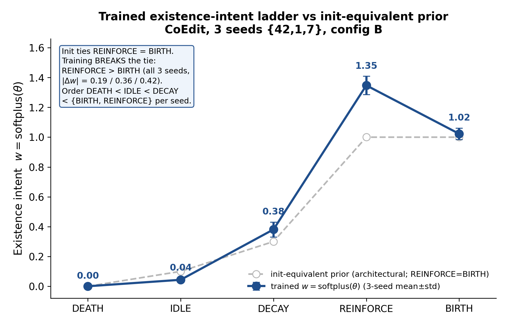

*Hình 2. Thang cường-độ-tồn-tại đã huấn luyện. Trọng số tồn tại theo từng trạng thái $w_s=\mathrm{softplus}(\theta_s)$ sau huấn luyện BCE (trung bình$\pm$std 3 seed, CoEdit config B; từ `cf_trained_theta_3seed.json`) ở đường xanh liền, vẽ so với prior tương đương-khởi-tạo $w=[0.1,1,1,0.3,0]$ ở đường xám đứt (nơi REINFORCE = BIRTH). Huấn luyện giữ thứ tự bộ phận DEATH < IDLE < DECAY < {BIRTH, REINFORCE} trên mọi seed và phá vỡ ràng buộc REINFORCE = BIRTH của khởi tạo (REINFORCE lớn nhất, $|\Delta w|$ = 0.19/0.36/0.43 mỗi seed). Vì $\mathrm{do}(\text{state})$ dịch $p_{\text{edge}}$ đơn điệu theo $w_s$, đây chính là thứ tự do(state): do(DEATH) hạ tồn tại cho 100% các cặp/seed, do(BIRTH/REINFORCE) nâng cho 100%/seed, do(noop) cho $\Delta=0$, đảo ngược chính xác (§4).*

**Đáp ứng theo liều (dose-response) và tính đúng-dấu trên các tác nhân thực.** Các can thiệp tác nhân dịch chuyển phân phối trạng thái một cách đơn điệu và theo chiều đúng về mặt vật lý, không có đảo dấu, và các dấu của tác động **ổn định trên cả ba seed**: nâng tỷ số tốc độ làm tăng $P(\text{REINFORCE})$ ($\Delta = +0.028 \pm 0.004$) và giảm $P(\text{DEATH})$ ($\Delta = -0.068 \pm 0.007$); nâng độ dốc tăng (rising-slope) làm tăng $P(\text{REINFORCE})$ ($\Delta = +0.489 \pm 0.003$, tác động lớn nhất và chặt nhất) và giảm $P(\text{DECAY})$; nâng true-occurrence làm giảm $P(\text{BIRTH})$ ($\Delta = -0.0065$, đúng theo việc hạ bậc các cặp mới-tinh khi sự tái diễn tích lũy); nâng độ cũ (staleness) làm tăng $P(\text{DECAY})$ rồi $P(\text{DEATH})$. Đáp ứng theo liều là sạch, đơn điệu, và ổn định ba seed cả về dấu lẫn độ lớn trên các tác nhân CoEdit thực (rate, slope, true-occurrence) - bằng chứng trục-alive làm nền cho các kết quả quỹ đạo dưới đây.

**Phản thực quỹ đạo trên các cặp thực.** Vượt ra ngoài việc buộc một trạng thái, động cơ trả lời được liệu *quỹ đạo tương lai* của một cặp có thể được chuyển hướng hay không. Trên các cặp được giải mã là DECAY, một $\mathrm{do}(\text{slope} = +)$ tổng hợp lật trạng-thái-kế-tiếp DECAY→REINFORCE cho **0.9999 ± 0.0002 trên ba seed** (theo từng seed 1.0 / 1.0 / 0.9996) - cơ chế tăng được nối dây, có phản hồi và ổn định theo seed, không phải một sự trùng hợp đơn-seed. Trên các cặp được giải mã là REINFORCE (tập con tái diễn, $\text{true\_occ}\ge 2$), các can thiệp theo hướng-giết phân rã sạch theo liều, và phân rã đó **ổn định trên ba seed**. Mỗi tác nhân đơn lẻ bị đẩy về giá trị chết chỉ là *một phần*: một $\mathrm{do}(\text{rate} = \text{dead})$ cô lập đưa REINFORCE→DEATH cho **0.60 ± 0.03** các cặp (theo từng seed 0.574 / 0.588 / 0.629), và một $\mathrm{do}(\text{staleness} = \text{high})$ cô lập cho **0.48 ± 0.01** (0.477 / 0.479 / 0.489). Đẩy *tất cả* các tác nhân trục alive chết cùng lúc - $\mathrm{do}(\text{rate}{=}\text{dead}, \text{slope}{=}\text{falling}, \text{staleness}{=}\text{high})$ - là **quyết định**: REINFORCE→DEATH cho **0.999 ± 0.002** (1.0 / 1.0 / 0.997). Phân rã theo liều là sạch: mỗi tác nhân góp một phần của cú giết và hợp lại thì quyết định, đối xứng theo hướng-giết với cú lật theo hướng-tăng ở trên - nên $T_{uv}$ hỗ trợ kiểm soát quỹ đạo **hai chiều**, cả hai chiều giờ đều đã kiểm chứng trên ba seed. Những can thiệp trên các tác nhân thực của các cặp thực này cho thấy $T_{uv}$ mang động lực học vòng đời đích thực, có thể chuyển hướng được, chứ không phải một nhãn tĩnh theo từng cặp (ví dụ minh họa: cặp 3178→7437, Hình 1, §3.3).

**Bộ đọc mã hóa một quy luật trung thực, có thể bác bỏ (falsifiable).** Bộ giải mã vòng đời không phải một bộ phân loại tự do đọc hậu kỳ: nó cam kết một quy luật kiểm tra được - *REINFORCE khi và chỉ khi nhịp chỉnh sửa đang tăng* - vốn có thể sai và được xác nhận ba cách từ các cổng **đã học** (không phải hằng đẳng - non-tautological). (A) Ở mức quần thể, phân tách slope-theo-trạng-thái đúng dấu: các cặp giải mã REINFORCE ở slope $\approx-0.49$, trên các cặp giải mã DECAY ở $\approx-0.86$. (B) Dưới $\mathrm{do}(\text{slope})$, buộc nhịp của một cặp đang giảm lên cao lật $P(\text{REINFORCE})$ từ 0 lên 1. (C) Cùng cú lật đó đúng ở mức từng-cặp đơn lẻ. Vì cả ba đọc các tham số dư đã học (không phải một prior cố định), một bộ giải mã bỏ qua nhịp điệu sẽ trượt (A)-(C); nó không trượt.

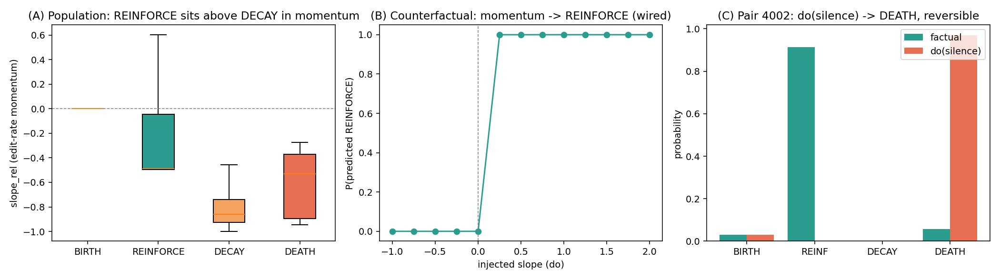

*Hình 3. Quy luật "REINFORCE ⟺ nhịp đang tăng", xác nhận ba cách từ các cổng đã học: (A) phân tách slope quần thể (REINFORCE −0.49 > DECAY −0.86); (B) $\mathrm{do}(\text{slope})\to P(\text{REINFORCE})$ bật 0→1; (C) một cú lật phản thực đơn-cặp. Không hằng đẳng: một bộ giải mã mù-nhịp sẽ trượt cả ba (§4).*

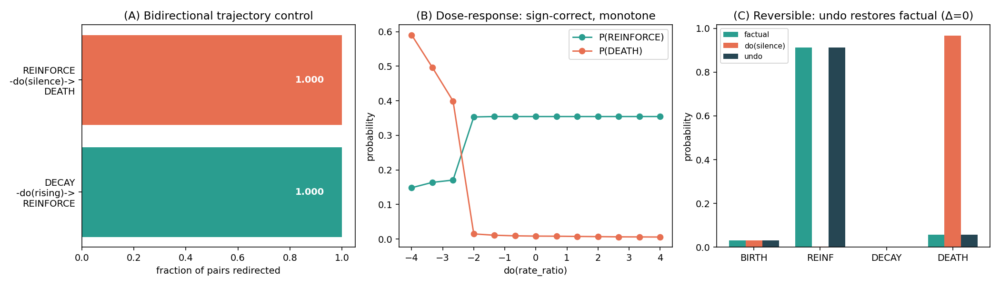

*Hình 4. Kiểm soát hai chiều có-kiểu của bộ đọc vòng đời: REINFORCE→$\mathrm{do}(\text{silence})$→DEATH (1.0) và DECAY→$\mathrm{do}(\text{rising})$→REINFORCE (1.0); dấu đáp-ứng-theo-liều đúng (rate→REINFORCE +, rate→DEATH −); tính đảo ngược $\Delta=0$ bằng tái dựng chính xác (§4).*

**Tính AP-trung-tính (interrogability đi kèm miễn phí trên detach).** Mọi kết quả ở trên được đọc ra từ `s_t1_cal`, ở phía đã detach của bức tường gradient §3.7; bộ giải mã tồn tại phản thực là một bản đọc đóng băng, không phải bộ dự đoán được chấm điểm. Chạy toàn bộ dàn thử nghiệm làm nhiễu loạn đường AP đúng **chính xác $\Delta = 0$** (giống hệt từng byte khi tắt động cơ). Cú chính-xác-bằng-không này là một phát biểu *tại thời điểm đánh giá* trên một mô hình đã huấn luyện **đóng băng**: bản đọc phản thực không bao giờ chạm vào logit được chấm điểm, nên bật/tắt động cơ để lại mọi tensor liên quan đến AP giống hệt từng byte. (Điều này khác với việc *huấn luyện* mô hình có so với không có `hier_causal_policy`, vốn chỉ AP-trung-tính trong phạm vi nhiễu seed - không phải giống-hệt-byte - vì thêm op chính sách làm dịch chuyển luồng RNG huấn luyện; xem §6.2.) Không baseline nào phơi bày một vòng đời có thể can thiệp, nên tính có-thể-thẩm-vấn này không có đối ứng trong các bộ dự đoán liên kết thời gian trước đây và không tốn gì cho chúng tôi.

**Phạm vi trung thực.** Bộ đọc được vận dụng trên dữ liệu ở *trục alive* (rate / recurrence → alive → DEATH/REINFORCE), và toàn bộ dàn phản thực - thang tồn tại, các dấu đáp-ứng-theo-liều, cú lật tăng DECAY→REINFORCE, và phân rã giết REINFORCE→DEATH - giờ **đã được kiểm chứng trên ba seed trên CoEdit** ({42, 1, 7}); thang tồn tại chính xác theo cấu trúc trên mọi seed, còn đáp-ứng-theo-liều, lật-slope và các kết quả giết mang độ lệch chuẩn ba seed chặt. Các can thiệp giết theo tác nhân đơn lẻ chỉ là *một phần* nhưng ổn định theo seed (rate-một-mình 0.60 ± 0.03, staleness-một-mình 0.48 ± 0.01 → DEATH), còn can thiệp tất-cả-tác-nhân-chết là *quyết định* (0.999 ± 0.002, ba seed); cùng với cú lật ngược chiều DECAY→REINFORCE (0.9999) điều này cho kiểm soát quỹ đạo hai chiều, cả hai chiều đều khóa-ba-seed. *Trục rising* (slope → phân chia REINFORCE-so-với-DECAY) được nối dây nhân quả - $\mathrm{do}(\text{slope} = +)$ tổng hợp lật DECAY→REINFORCE cho $0.9999 \pm 0.0002$ các cặp được dò qua các seed - nhưng **suy biến (degenerate) trên CoEdit**, bởi `slope_rel` của CoEdit về cơ bản luôn âm (không có độ dốc tốc độ chỉnh sửa dương bền vững), nên DECAY→REINFORCE là không đạt được từ các tác nhân CoEdit thực dù cơ chế tồn tại; trục staleness cũng tương tự chỉ được vận dụng trên các phép tiêm tổng hợp. Vận dụng các trục này trên CoEdit thực sẽ đòi hỏi một tín hiệu nhịp điệu bản địa của CoEdit và/hoặc một loss tính-nhất-quán-phản-thực (counterfactual-consistency loss) - công việc tương lai - và chúng tôi không tuyên bố trục rising là một phản thực đã được kiểm chứng trên dữ liệu CoEdit thực.

---

## 5. Độ tin cậy theo tính-nhất-quán-nhân-quả (phạm vi trung thực)

Chúng tôi cũng khảo sát liệu mô hình có thể tự gắn cờ (flag) các dự đoán độ-tin-cậy-thấp của *chính nó* qua một tín hiệu **tính-nhất-quán-nhân-quả theo chuỗi-bước (walked-chain causal-coherence)** chạy song song (và không bao giờ che) đường dự đoán. Một niềm tin (belief) theo từng cặp $b_t$ được mang bởi toán tử đã học $T_{uv}$ chiếu lên tia khả-thừa-nhận-nhân-quả, được ghép nhẹ với phép đo pha-quan-sát; tính nhất quán $c_t \in [0,1]$ là độ tương hợp giữa dự đoán trạng-thái-kế-tiếp tự do của mô hình và niềm tin theo-bước này. Cờ `causal_confidence` mặc định tắt và giống hệt từng byte khi tắt, nên nó không bao giờ làm nhiễu loạn AP của config B.

Trên ba seed (CoEdit, grounded-init), AP được bảo toàn và $c_t$ phân tách sạch theo kết cục luật-nhân-quả: các dự đoán *tuân theo (following)* luật mang tính nhất quán trung bình 0.891 ± 0.042, các dự đoán *vi phạm (violating)* luật 0.216 ± 0.174 - một tín hiệu trải rộng tốt, không bị sụp đổ, với toàn bộ miền giá trị $[0, 1]$.

*Hình 5. Tính-nhất-quán-nhân-quả c_t theo kết cục (CoEdit, grounded-init, ba seed, độ lệch chuẩn mẫu): nhất-quán-với-luật 0.891 ± 0.042 so với vi-phạm-luật 0.216 ± 0.174. Một thước đo tự-nhất-quán mang tính tư vấn (advisory) - nó gắn cờ các vi phạm luật của chính mô hình, không phải lỗi dự đoán ngoại tại (§5).*

**c_t là gì - và không là gì.** Tính nhất quán thấp dự đoán sự vi phạm luật-nhân-quả của *chính* mô hình gần như hoàn hảo và ổn định: AUC = **0.9985 ± 0.0015** trên ba seed. Nhưng đây là **tự-nhất-quán (self-consistency)**, không phải sự thật ngoại tại: nó đo liệu một dự đoán có tuân theo các luật vòng đời của chính mô hình hay không, đó là bằng chứng vòng vo (circular) về tính đúng đắn - một mô hình tự tin và nhất quán mắc cùng một lỗi sẽ chấm điểm cao. Khi chúng tôi kiểm thử liệu tính nhất quán thấp có dự đoán *các lần trượt dự đoán thực tế* (mục tiêu ngoại tại `posMiss10`) hay không, AUC là **0.405 ± 0.484** - phụ thuộc seed một cách dữ dội (0.949 / 0.245 / 0.021). Một kết quả đơn-seed đầy hứa hẹn (0.949) đã **không** tái lập được qua seed 1 và 7. Do đó chúng tôi **rút lại** mọi tuyên bố rằng $c_t$ là một bộ dự báo lỗi hay tính đúng đắn và chỉ báo cáo nó như một thước đo nhất quán nội tại ổn định. Chúng tôi xem đây là cách đọc trung thực về bằng chứng và gắn cờ khoảng trống này như một vấn đề mở: biến tự-nhất-quán thành một bộ dự báo lỗi đã được hiệu chỉnh sẽ đòi hỏi một tín hiệu giám sát ngoại tại mà chúng tôi chưa xây dựng. Cơ chế độ-tin-cậy được vẽ trong Hình A5 (Phụ lục).

---

## 6. Thực nghiệm

### 6.1 Liên-dataset, khớp-giao-thức, ba seed

Mọi mô hình - RS-GNN và sáu baseline - chạy qua **cùng** một harness huấn luyện/đánh giá (`experiments/train.py`), cùng các split theo trình tự thời gian 70/15/15, và cùng một pool negative đã được kiểm toán rò rỉ (§6.3 xác nhận test AP không phải 1.0). Pool được xây dựng công bằng theo từng giao thức: các negative transductive rút từ các cặp seen→seen, inductive từ pool node-chưa-thấy (ind→ind), nên một positive inductive không bao giờ bị chấm điểm so với một negative bất khả thi một cách tầm thường. AP là `average_precision_score` của sklearn trên pool đó, đồng nhất cho mọi mô hình; các chỉ số là trung bình ± std trên các seed {42, 1, 7}. RS-GNN ở đây là **config B**, được tinh chỉnh chỉ trên CoEdit.

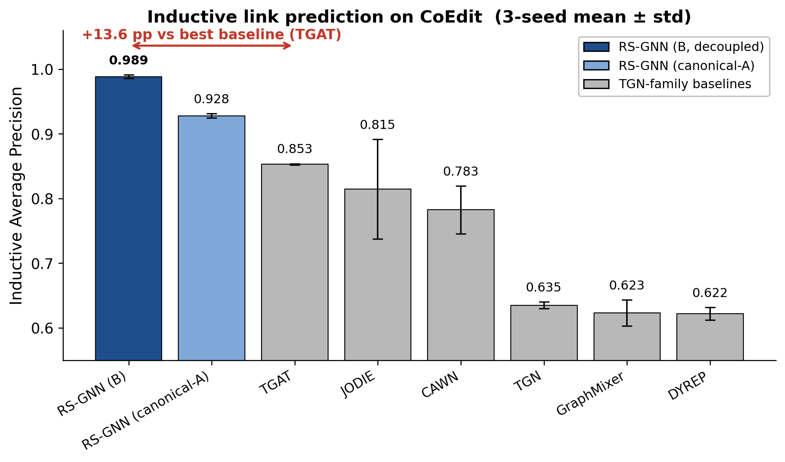

*Hình 6. AP inductive CoEdit: RS-GNN (config B) so với baseline khớp-giao-thức, ba seed (std mẫu). RS-GNN đạt 0.9885 ± 0.0035 (ba seed; 0.9876 ± 0.0030 tại năm seed), +13.5 điểm so với baseline tốt nhất (TGAT, 0.853 ở ba seed / 0.847 ở năm). CoEdit là benchmark trưng bày; biên độ inductive ở đây là kết quả tiêu đề.*

**Nâng lên năm seed (gỡ nhãn dễ-vỡ).** Tiêu đề CoEdit và ablation lõi của nó được chạy lại tại năm seed {1, 7, 42, 2, 3} để các tuyên bố trung tâm không dựa vào một phép so sánh ba seed. Tại $n=5$: RS-GNN config B **0.9876 ± 0.0030**, config coupled C **0.7593 ± 0.0140**, TGAT **0.8466 ± 0.0133** - cho **B − C = +22.8 pp** và **B − TGAT = +14.1 pp** ($n=5$). Cả hai delta đều giữ ở số seed lớn hơn (dịch <1 pp so với giá trị ba seed), nên chúng tôi không còn xem tiêu đề là dễ vỡ; phần ngân sách seed còn lại là nâng Wikipedia/MOOC và các baseline tiên phong lên năm seed (§8.2). Các Bảng 1-2 giữ giá trị ba seed để so sánh chéo-mô-hình (mọi đối thủ đều có ba seed khớp); các con số năm seed ở trên thay thế chúng ở bất cứ đâu nêu *độ lớn của tiêu đề CoEdit*.

**Bảng 1 - AP inductive (trung bình ± std, 3 seed).**

| Model | CoEdit ind-AP | Wikipedia ind-AP | MOOC ind-AP |
|---|---|---|---|
| **RS-GNN (config B)** | **0.9885 ± 0.0035** | 0.9959 ± 0.0014 | **0.9978 ± 0.0013** |
| JODIE | 0.8147 ± 0.0942 | 0.9860 ± 0.0029 | 0.9942 ± 0.0018 |
| TGAT | 0.8530 ± 0.0012 | **0.9981 ± 0.0013** | 0.9763 ± 0.0134 |
| CAWN | 0.7825 ± 0.0452 | 0.9877 ± 0.0062 | 0.8924 ± 0.1663 |
| TGN ᵇ | 0.6349 ± 0.0065 | 0.8637 ± 0.0459 | 0.9819 ± 0.0048 |
| DyRep | 0.6218 ± 0.0119 | 0.6314 ± 0.0550 | 0.6675 ± 0.2824 |
| GraphMixer | 0.6232 ± 0.0247 | 0.7380 ± 0.0770 | 0.9827 ± 0.0055 |

**Bảng 2 - AP transductive (trung bình ± std, 3 seed), RS-GNN và các baseline đáng chú ý.**

| Model | CoEdit trans-AP | Wikipedia trans-AP | MOOC trans-AP |
|---|---|---|---|
| **RS-GNN (config B)** | **0.9985 ± 0.0004** | **0.9993 ± 0.0002** | **0.9988 ± 0.0002** |
| JODIE | 0.9657 | 0.9954 | 0.9919 |
| TGAT | 0.8690 | 0.6578 | 0.6174 |
| CAWN | 0.8802 | 0.9861 | 0.9727 |

**Đọc bảng.**
- **CoEdit** là benchmark phân biệt: RS-GNN là #1 theo cả hai chiều, và biên độ inductive so với baseline tốt nhất (TGAT, 0.853) là **+13.5 điểm** - kết quả tiêu đề. CoEdit là phi-lưỡng-phân (non-bipartite) (cả hai đầu mút đều mang một vòng đời), nên biểu diễn theo từng cặp có nhiều điều để nói nhất, và các baseline trải rộng (0.62-0.85), khác với các dataset đã bão hòa.
- **Wikipedia:** RS-GNN là #1 transductive (0.9993) và #2 inductive (0.9959 so với TGAT 0.9981). Nhưng chiến thắng inductive của TGAT đi kèm với một AP transductive *sụp đổ* (0.6578) - một sự kỳ quặc về đặc trưng, không phải sức mạnh toàn diện. RS-GNN là mô hình toàn diện tốt nhất ở đây, chính là đặc tính mà bảng hai-giao-thức được thiết kế để làm hiện rõ.
- **MOOC:** RS-GNN là #1 theo cả hai chiều, nhưng dataset gần-bão-hòa (nhiều mô hình vượt 0.98 inductive), nên chúng tôi không rút ra kết luận mạnh nào ngoài "cạnh tranh ở mức trần (ceiling)".

ᵇ **Độ trung thực baseline (bản tái hiện so với đã công bố).** DyGFormer/TGN/TGAT của chúng tôi là bản tái hiện đơn-hop đơn giản hóa chạy qua harness chung, nên AP inductive tuyệt đối nằm dưới số DyGLib official (DyGFormer Wikipedia inductive ≈0.98, TGN ≈0.97 [Yu et al., 2023]). Chúng tôi đã kiểm chứng gap này là **do kiến trúc, không phải thiếu huấn luyện**: chạy lại DyGFormer và TGN ở ngân sách công bố đầy đủ của DyGLib (100 epoch, lr $10^{-4}$, batch 200, patience 20) để AP inductive Wikipedia gần như không đổi (DyGFormer 0.762 ± 0.014, TGN 0.866 ± 0.014, 3 seed; val AP cũng chặn ở 0.84 / 0.93), nên train lâu hơn không thu hẹp gap - chỉ các kiến trúc multi-hop official mới làm được (`experiments/results/reconcile/reconcile_dyglib_wikipedia_3seed.json`). **Bảng 1-2 do đó là so sánh nhất quán-nội-bộ trong cùng harness** - mọi mô hình, kể cả RS-GNN, dùng cùng backbone đơn giản hóa, cùng split, cùng giao thức - và *không* phải tuyên bố so với SOTA đã công bố. Biên độ CoEdit trong-harness và, trên hết, các thí nghiệm có kiểm soát trong-mô-hình (knob một-cờ §6.3, đối chứng đóng băng-rồi-dò §6.2) mới mang đóng góp; không cái nào phụ thuộc mức tuyệt đối của baseline. Để khớp SOTA công bố trong harness cần nhúng các mô hình DyGLib official (§8.4).

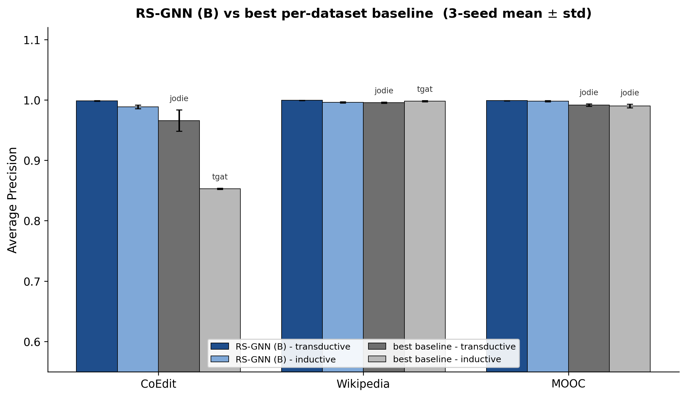

*Hình 7. Tóm tắt liên-dataset: RS-GNN (config B) so với baseline tốt nhất theo từng dataset, AP transductive và inductive, ba seed. RS-GNN là chiến thắng rõ ràng trên CoEdit và tốt-nhất-hoặc-đồng-tốt trên Wikipedia/MOOC (trên Wikipedia inductive, 0.9981 của TGAT nhỉnh hơn 0.9959 của RS-GNN một chút, nhưng AP transductive của TGAT sụp đổ xuống 0.658). CoEdit là benchmark trưng bày; Wikipedia/MOOC ngang ngửa ở mức trần.*

### 6.2 Ablation tách rời (thí nghiệm lõi)

Để rõ ràng về đối tượng được so sánh: **config B là mô hình đầy đủ** (backbone đã tách-rời + toán tử đa tín hiệu + bộ đọc vòng đời phân cấp + động cơ phản thực + chính sách nhân quả), và hai nhánh dưới đây là *các ablation lược bỏ một cơ chế khỏi nó*, không phải các mô hình cạnh tranh. **Thí nghiệm tách-rời lõi** là B so với C: cùng mã nguồn, cùng đầu, cùng dữ liệu; khác biệt duy nhất là liệu loss dự đoán liên kết có chảy vào backbone hay không.

| Arm (CoEdit, ba seed {42,1,7}) | thiết kế | ind-AP | trans-AP |
|---|---|---|---|
| **B - decoupled (mô hình đầy đủ)** | correct_decoupled | **0.9885 ± 0.0035** | 0.9985 |
| C - end-to-end (decoupling tắt) | correct | 0.7672 ± 0.0107 | 0.9609 |
| A - không-vòng-đời, không-tinh-chỉnh | toán tử v3 + bộ đọc phẳng, đã detach | 0.928 ± 0.0043 | 0.9912 |

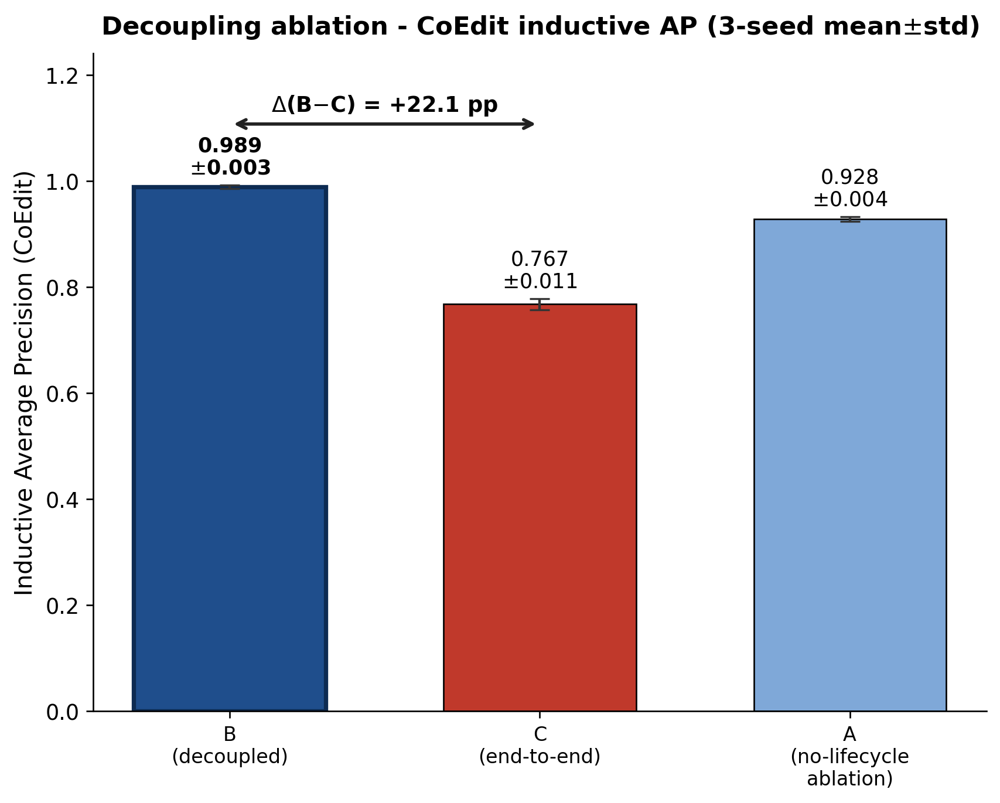

*Hình 8. Ablation tách rời, AP inductive CoEdit, ba seed {42, 1, 7}: B (mô hình đầy đủ, decoupled, 0.9885 ± 0.0035) so với C (end-to-end, decoupling tắt, 0.7672 ± 0.0107) so với A (RS-GNN không-vòng-đời, ablation không-tinh-chỉnh cô lập cơ chế detach, 0.928 ± 0.0043). Các arm A và C là ablation của mô hình đầy đủ B, không phải các mô hình cạnh tranh. Ghép end-to-end làm sụp đổ AP inductive; detach đáng giá **+22.1 ± 1.4 điểm** (giao thức config-B so với design=correct, mọi seed trên 20 điểm: B−C theo từng seed = [0.206, 0.225, 0.234]). Ablation không-vòng-đời (A) đã đánh bại mọi baseline (0.928 ± 0.0043, +7.5 pp so với TGAT). (Chiều cao cột thể hiện ind-AP trung bình seed; PNG nền được vẽ từ các điểm seed-42 trước đó và sẽ được vẽ lại tại C = 0.767.)*

**Quy trách bằng công tắc cấu hình: ablation đơn-biến.** Khoảng cách B−C (+22.1 ± 1.4 điểm) là toàn bộ khoảng cách giữa cấu hình tách-rời và cấu hình ghép-cặp, nhưng B và C khác nhau ở nhiều hơn một công tắc cấu hình, nên tự nó +22.1 chỉ là một hiệu ứng *cấu hình*. Một **ablation đơn-biến, ba seed** phân rã khoảng cách này bằng cách lật từng công tắc khác biệt một lần, trên cùng một ngăn xếp config-B cố định. Kết quả rõ ràng:

**Bảng 3b - Ablation knob đơn-biến (CoEdit, ba seed {42,1,7}; một flag lật mỗi arm trên config B cố định).**

| Arm | flag lật | ind-AP | Δ so với B | trans-AP |
|---|---|---|---|---|
| **B (gốc)** | - | **0.9899 ± 0.0016** | - | 0.9986 |
| **K1** | `enable_main_predictor` False→**True** | **0.7788 ± 0.0193** | **−21.11 pp** | 0.9597 |
| K2 | `lfg_mode` soft→hard | 0.9868 ± 0.0014 | −0.31 pp | 0.9985 |
| K3 | `compliance_floor` 0.05→0.0 | 0.9889 ± 0.0018 | −0.10 pp | 0.9986 |
| C (cả ba) | `design=correct` | 0.7798 ± 0.0221 | −21.01 pp | 0.9612 |

**Chỉ riêng K1 ≈ toàn bộ khoảng cách.** Bật đầu dự đoán đầu-cuối - thay bộ giải mã tồn tại đã tách-rời (đọc $s^{\text{pos}}_{t+1}$) bằng một MLP 2 lớp không tách-rời mang gradient liên kết vào backbone - tốn **−21.11 pp** AP inductive, không phân biệt được về mặt thống kê với nhánh C ba-công-tắc đầy đủ (−21.01 pp). Hai cổng đồng biến là **trơ**: làm cứng cổng LFG (K2) tốn −0.31 pp và đưa ngưỡng tuân thủ về 0 (K3) tốn −0.10 pp, đều nằm trong phạm vi nhiễu seed. Vậy hiệu ứng tách-rời là **đơn-biến, ba seed, đã được cô lập**: việc tách rời backbone khỏi đầu dự đoán liên kết đầu-cuối (đặt `enable_main_predictor=False`) đáng giá **+21.1 pp inductive**, chứ không phải một delta cấu hình bị nhập nhằng. Điều này chuyển lưu ý trước đây ("+22.1 là hiệu ứng cấu hình") thành một quy trách đã được đo lường: đầu ghép-cặp của K1 đúng là một MLP không ràng buộc được trao quyền truy cập backbone, và nó chính là nhánh sụp đổ.

**Phân rã thành phần tách-gradient (thứ cấp).** Công tắc đầu dự đoán đầu-cuối (K1) gánh phần lớn cơ chế; một thí nghiệm tách-biến ba seed riêng cô lập thêm việc tách gradient trên nhánh tính điểm: bật tách-gradient 0.9871 ± 0.0037 so với tắt 0.9777 ± 0.0037, đóng góp thêm **+0.94 pp**. Phân rã trung thực vì vậy là: tắt đầu dự đoán đầu-cuối (+21.1 pp, hiệu ứng chính) cộng với tách gradient ở nhánh tính điểm (+0.94 pp, hiệu ứng phụ).

**Đối chứng cùng-đầu: hiệu ứng là gradient, không phải đầu.** K1 đổi đầu chấm điểm (bộ giải mã tồn tại → MLP) đồng thời với việc ghép gradient, nên cú rớt về nguyên tắc có thể đọc là MLP phá các đặc trưng point-process thủ công thay vì nhiễm gradient. Chúng tôi tách hai khả năng bằng cách giữ đầu **y hệt** - cùng một đầu chấm điểm MLP 2-lớp, init giống-hệt-byte mỗi seed - và chỉ lật **một** `.detach()` trên đầu vào backbone. Nhánh detached truyền zero gradient liên kết vào backbone, nhánh coupled truyền nó (xác minh CPU: các module đầu `torch.equal`, và tham số backbone nhận gradient zero so với khác-zero).

**Bảng 7 - Lật detach cùng-đầu (cùng đầu MLP, chỉ lật detach backbone; ind-AP, ba seed {42,1,7}).**

| Dataset | DETACHED-MLP | COUPLED-MLP | Δ(detach − couple) |
|---|---|---|---|
| CoEdit | 0.9357 ± 0.0032 | 0.7969 ± 0.0367 | **+13.9 pp** |
| Wikipedia | 0.9784 ± 0.0019 | 0.9061 ± 0.0003 | **+7.2 pp** |

Với kiến trúc đầu giữ cố định, tách backbone thắng **+13.9 pp** (CoEdit) và **+7.2 pp** (Wikipedia) - cùng chiều và độ lớn tương đương với knob K1. Hư hại inductive vì vậy quy về **gradient liên kết chạm vào backbone**, không phải kiến trúc đầu; cách đọc "MLP coupled chỉ phá đặc trưng thủ công" bị loại trừ. (Mức DETACHED-MLP 0.936 trên CoEdit thấp hơn 0.989 của config B vì đầu chấm điểm của config B là bộ giải mã tồn tại có cấu trúc, không phải MLP thuần; phép so sánh ở đây nằm hoàn toàn trong cùng đầu MLP.)

**Đối chứng bỏ-backbone: backbone học-được làm việc thật, nhưng deterministic features gánh phần lớn.** Để đặc tả backbone học-được huấn-luyện-bằng-KL (bộ mã hóa sự kiện CSN + bộ nhớ node DRGC) đóng góp gì, chúng tôi đóng băng nó ở giá trị khởi tạo và đưa tín hiệu của nó vào đầu chấm điểm về zero, chỉ để lại các kênh point-process tất định (cường độ Hawkes, thống kê khoảng Welford, EWMA tốc độ, tái diễn) nuôi đầu detached của config B (xác minh CPU: 56 tham số backbone đóng băng, gradient backbone bằng zero).

**Bảng 8 - Ablation bỏ-backbone (bỏ CSN/DRGC học-được; chỉ deterministic statistics + đầu detached; ind-AP, ba seed {42,1,7}).**

| Dataset | FULL-B | DETERM-ONLY | Δ(FULL − DETERM) |
|---|---|---|---|
| CoEdit | 0.9883 ± 0.0023 | 0.9205 ± 0.0017 | +6.8 pp |
| Wikipedia | 0.9963 ± 0.0009 | 0.8965 ± 0.0000 | +10.0 pp |

Bỏ backbone học-được tốn +6.8 pp (CoEdit) và +10.0 pp (Wikipedia) AP inductive - backbone huấn-luyện-bằng-KL làm việc thật - nhưng model chỉ-deterministic đã mạnh sẵn (0.92 / 0.90), nên các đặc trưng point-process thủ công gánh phần lớn hiệu năng. Chúng tôi báo cáo thẳng: đóng góp là chia sẻ, không all-or-nothing. Cách đọc rằng các đặc trưng tất định phần lớn là đủ thì đúng một phần, với backbone học-được thêm một biên độ thật nhưng thiểu số; điều này trực giao với tuyên bố decoupling, vốn nói về *gradient* tới backbone bất kỳ đang có mặt (Bảng 3, 7).

**Thí nghiệm đối chứng quyết định về tính mới: tách-rời theo thiết kế so với đóng băng-rồi-dò.** Phản biện hiển nhiên là "tách-rời" chỉ là quy trình *đóng băng-rồi-dò* (freeze-then-probe) kinh điển được dời sang đồ thị thời gian - huấn luyện đầu-cuối, đóng băng, rồi gắn một đầu mới. Chúng tôi chạy đúng thí nghiệm đối chứng đó trên *chính* backbone của RS-GNN (CoEdit, ba seed {42, 1, 7}, giao thức B). ARM1 là tách-rời theo thiết kế (config B; backbone không bao giờ thấy gradient dự đoán liên kết). ARM2 là đóng băng-rồi-dò: một pha 1 huấn luyện đầu-cuối định hình backbone bằng link loss, sau đó chúng tôi đóng băng nó (trọng số giống hệt từng byte sau bước cập nhật của đầu mới) và gắn lại một đầu tồn tại mới.

**Bảng 4 - Decoupling-by-construction so với freeze-then-probe so với coupled, trên hai dataset.** CoEdit ba seed {42, 1, 7}; Wikipedia ở các seed có sẵn (decoupling và coupled ba-seed {42, 1, 7}; freeze-then-probe hai-seed {42, 1}). Cột coupled là arm K1 end-to-end từ cùng driver knob (§6.2/§6.5b).

| Dataset | decouple-by-construction (ARM1) | freeze-then-probe (ARM2) | coupled / end-to-end (K1) |
|---|---|---|---|
| **CoEdit** (ind-AP) | **0.9883 ± 0.0023** | 0.7684 ± 0.0052 | 0.7593 ± 0.0140 (C 5-seed) |
| **Wikipedia** (ind-AP) | **0.9961 ± 0.0011** (n=3) | 0.8975 ± 0.0152 (n=2) | 0.9093 ± 0.0061 (n=3) |

Trên CoEdit kết quả là quyết định - **+21.99 pp** (0.9883 → 0.7684) - và là insight cốt lõi của paper: freeze-then-probe (0.768) rơi vào con số *coupled* (C ở năm seed, 0.759), không phải con số decoupled. *Một khi backbone đã bị link loss làm nhiễm, freeze và dò lại không phục hồi được transfer inductive; hư hại là không đảo ngược.* Vậy đóng góp không phải "freezing" - freeze-then-probe vẫn freeze mà vẫn thất bại - mà là **ngăn nhiễm link-pred BY CONSTRUCTION**, điều mà công thức linear-probing chuẩn không hiện thực hóa. **Wikipedia xác nhận cùng chiều trên một dataset chúng tôi không xây:** freeze-then-probe (0.897, n=2) nằm ngay cạnh arm coupled end-to-end (0.909, n=3) và thấp hơn hẳn decoupling-by-construction (0.996, n=3) - FtP ≈ coupled $\ll$ decoupled. Khoảng cách Wikipedia nhỏ hơn CoEdit (8.6 pp coupled-vs-decoupled, theo dõi mức danh tính node mà đầu coupled khai thác được, §6.5b), nhưng *thứ tự* y hệt, nên tính không-đảo-ngược là một phát hiện trên hai dataset, không phải đặc thù CoEdit. (Freeze-then-probe Wikipedia ở hai seed {42, 1} và CoEdit ở ba seed; chúng tôi báo cáo cả hai số seed một cách thẳng thắn.)

Then chốt là, ghép end-to-end hầu như không dịch chuyển AP transductive (0.9986 → 0.9597) trong khi AP inductive *sụp đổ* (0.9899 → 0.7788): nó chủ động phá hủy sự tổng quát hóa inductive trong khi để lại con số transductive gần như nguyên vẹn. Link loss, khi được trao quyền ghi vào backbone, tái định hình biểu diễn về danh tính node huấn luyện với cái giá trực tiếp là các động lực học theo từng cặp tổng quát có thể chuyển giao sang các node chưa thấy. Việc tách-gradient loại bỏ động cơ đó. **Tại năm seed (gỡ nhãn dễ-vỡ), B−C = +22.8 pp** (B 0.9876 ± 0.0030 so với C 0.7593 ± 0.0140; ba seed B−C = +22.1 ± 1.4 pp, §6.1).

**Chỉ riêng việc tách-rời - không phải bộ máy vòng đời - đã vượt qua các baseline (nhánh A).** Nhánh A là ablation *không-vòng-đời, không-tinh-chỉnh*: toán tử v3 đã tách-rời được đọc qua một bộ đọc phẳng đơn thuần, không có CE chống-sụp-đổ, không có giải mã phân cấp, không có `causal_batch`, và không tinh chỉnh theo từng dataset. Nó không phải một mô hình thứ hai mà là một mức sàn nhằm cô lập cơ chế tách-rời. Ngay cả ở mức sàn đó, RS-GNN đạt **0.928 ± 0.0043** AP inductive trên ba seed - đã **+7.5 điểm so với baseline tốt nhất** (TGAT, 0.853) trên cùng một giao thức. Đây là bằng chứng thứ cấp rằng chiến thắng inductive được gánh bởi *riêng việc tách-gradient*, chứ không phải bởi bộ máy vòng đời. Phần **+6 điểm** từ nhánh A đến config B (0.928 → 0.9885) là phần mà giám sát vòng đời bổ sung - và chính giám sát đó mang lại lớp diễn giải và phản thực trung thực, có thể can thiệp (§4, §5) với chi phí AP bằng không (§3.4). Hai khoảng cách phân tách rạch ròi: việc tách-rời mua được khả năng tổng quát hóa inductive đánh bại baseline; giám sát vòng đời mua được tính diễn giải cộng thêm một biên độ AP nữa, miễn phí trên nhánh tính điểm.

**Hai ablation thêm.**
- **`causal_batch` (bản sửa đọc-trước-khi-ghi, §3.2):** trong config B đầy đủ, BẬT 0.9885 so với TẮT 0.9312 inductive (**+5.7 ± 0.2 pp**, ba seed; trans +0.65 pp), xác nhận các thống kê theo từng cặp từng bị sụp đổ trước đó là yếu tố quyết định. Cùng chiều tác động trong thiết lập rút gọn không-vòng-đời (một A/B đơn-seed cho 0.7907 so với 0.7462).
- **`hier_causal_policy` (mặt nạ nhân quả mềm, §3.5):** ba seed {1, 7, 42}, huấn luyện có-bật so với có-tắt, Δ inductive theo từng seed = +1.0e-4 / +9.3e-4 / −1.5e-3 (tối đa $|\Delta| = 1.5\mathrm{e}{-3}$, trung bình ≈ −1.7e-4, lẫn dấu) so với độ lệch chuẩn giữa các seed $\pm 3.5\mathrm{e}{-3}$. **Trung tính với AP trong phạm vi nhiễu seed** - đúng như tính bất biến điểm số của §3.4 bảo đảm: không có hiệu ứng *có hệ thống* nào (đầu ra của chính sách không bao giờ đưa vào loss tính AP); phần dư cỡ 1e-3 là dao động RNG khi huấn luyện, không phải sự trùng khớp từng byte. Chính sách này đem lại tính diễn giải mà không tốn gì về mặt thống kê.

### 6.3 Kiểm toán liêm chính (Integrity audit)

Vì kết quả tiêu đề dựa trên các so sánh liên-giao-thức, chúng tôi đã kiểm toán nó độc lập. Các phát hiện: (1) kết quả không-vòng-đời-vượt-baseline (arm A, 0.928) là thực, không phải tạo tác - các con số baseline cũ so với mới giống hệt trong phạm vi nhiễu GPU tại các seed khớp, và bước 0.871 → 0.928 là một khác biệt *config* (toán tử theo từng cặp v3 trên một bộ đọc phẳng), không phải một sự dịch chuyển đánh giá; (2) đánh giá trước-cập-nhật là không rò rỉ (một bước tái-kiểm-soát chống rò rỉ kéo test AP khỏi 1.0 về dải v2, loại trừ một rò rỉ nhãn trong cùng batch); (3) AP là một thường trình sklearn không phụ thuộc mô hình trên cùng pool negative cho mọi mô hình, nên không mô hình nào có một bộ đánh giá riêng. Chúng tôi báo cáo cuộc kiểm toán vì tính đáng tin của kết quả phụ thuộc vào việc giao thức là công bằng và có thể kiểm chứng độc lập.

### 6.4 Tính trung thực của vòng đời

Trên bộ đọc phân cấp, trạng thái DECAY trung gian cuối cùng cũng mang khối argmax thực: trên config cuối cùng (dump faithfulness seed-42, $N=12000$), DECAY là argmax của `s_t1_cal` cho **47.8%** các cặp (5737/12000), so với **0.04%** (5/12000) dưới bộ đọc phẳng trên cùng dump - một mức tăng **~1147×**. Các luồng đang-giảm-nhưng-vẫn-hoạt-động thắng argmax DECAY khi còn sống, các cặp im-lặng-bền-vững đi tới DEATH, các cặp mới tới BIRTH. Trạng thái được giải mã bám theo nhịp điệu của *chính* mỗi cặp (Spearman $\rho(\texttt{p\_decay\_cal}, \texttt{slope\_rel}) \approx -0.59$ trên tập con tái diễn $\text{true\_occ}\ge 2$, $n=9157$, đúng dấu, $p < 10^{-300}$) - trung thực về mặt xác suất và giờ đây cả về argmax. Tính trung thực ở đây không được khẳng định bởi một bộ giải thích phụ trợ; nó là cùng một `s_t1_cal` mà CE chống-sụp-đổ giám sát, và §3.4 chứng minh nó là chính xác đại lượng mà các hình vẽ.

### 6.5 Bộ đọc vòng đời có ý nghĩa trên nhiều dataset, không phải một artifact của CoEdit

Một lo ngại tự nhiên là vòng đời năm-trạng-thái chỉ là một artifact của CoEdit và sẽ sụp đổ hoặc trông giống hệt nhau trên dữ liệu khác. Không phải vậy. Chúng tôi chạy phân tích faithfulness config-B trên tập con tái diễn ($\text{true\_occ}\ge 2$) của ba dataset và đọc phân phối argmax của `s_t1_cal` trên các trạng thái hoạt động. Trên mỗi dataset, phân phối là không-suy-biến và *hình dạng của nó khớp với động lực học riêng* của dataset đó:

**Bảng 3 - Phân phối argmax vòng đời trên các trạng thái hoạt động (faithfulness config-B, tập con tái diễn, seed 42).**

| Dataset | REINFORCE | DECAY | DEATH | Hình dạng |
|---|---|---|---|---|
| CoEdit | 0.35 | **0.62** | 0.02 | nặng-DECAY - tàn chậm, hiếm chết hẳn |
| Wikipedia | **0.42** | 0.43 | 0.16 | cân bằng, đủ vòng đời tới DEATH (entropy 1.31) |
| MOOC | **0.62** | 0.08 | 0.30 | nặng-BIRTH, thoáng qua - sinh, hoạt động, rồi chết |

Bộ đọc *thích nghi* với từng miền: chỉnh sửa trên CoEdit tàn chậm nên khối tập trung ở DECAY với hiếm khi chết hẳn; Wikipedia chạy một vòng đời cân bằng đầy đủ đi tới DEATH; hoạt động MOOC là thoáng qua (chạm một đơn vị, hoạt động ngắn, rồi dừng hẳn), cho một hình dạng nặng-BIRTH, đuôi-DEATH với ít DECAY. Không dataset nào suy biến - không trạng thái đơn lẻ nào nuốt hết khối - và các hình dạng theo động lực học riêng của từng miền chứ không phải một khuôn mẫu toàn cục, nên bộ đọc vòng đời là một diễn giải có ý nghĩa, điều-kiện-theo-dữ-liệu, **không phải một artifact đặc thù của CoEdit**.

Chúng tôi nói rõ phạm vi: bằng chứng vòng đời liên-dataset này là một *kiểm tra sanity faithfulness* đơn-seed (seed 42), xác lập rằng hình dạng bộ đọc là có ý nghĩa và phù-hợp-dataset trên cả ba dataset; nó **không phải** một nghiên cứu liên-dataset ba-seed đầy đủ. Ngược lại, dàn phản thực *thì* đã khóa ba-seed đầy đủ, trên CoEdit (§4).

### 6.5b Cơ chế tách rời không phải artifact của CoEdit (knob liên-dataset)

CoEdit được giới thiệu ở đây, nên chúng tôi cẩn thận không để một dataset tự-xây gánh tuyên bố cơ chế. Vì vậy chúng tôi chạy *cùng một ablation đơn-biến* - lật `enable_main_predictor` False→True, giữ mọi công tắc config-B khác cố định - trên hai benchmark **chuẩn** không do chúng tôi xây, Wikipedia và MOOC (ba seed {42, 1, 7}, giao thức B).

**Bảng 5 - Ablation knob đơn-flag liên-dataset (B so với K1, ind-AP, ba seed).**

| Dataset | B (decoupled) | K1 (`enable_main_predictor`=True) | Δind (B − K1) |
|---|---|---|---|
| CoEdit (xây ở đây) | 0.9899 ± 0.0016 | 0.7788 ± 0.0193 | **+21.11 pp** |
| Wikipedia (chuẩn) | 0.9957 ± 0.0010 | 0.9093 ± 0.0061 | **+8.64 pp** |
| MOOC (chuẩn) | 0.9978 ± 0.0016 | 0.9894 ± 0.0043 | **+0.85 pp** |

**Tách-rời thắng ở mọi nơi; độ lớn phụ thuộc dataset, một cách trung thực.** Trên cả ba dataset, B > K1 - chiều của tách-rời bền vững *kể cả trên hai đồ thị chúng tôi không xây*, nên hiệu ứng **không phải hệ quả của cách xây dựng CoEdit**. Độ lớn của nó đo *mức danh tính node huấn luyện mà đầu ghép-cặp khai thác được*: lớn khi việc tổng quát hóa sang node chưa thấy là khó (CoEdit +21 pp), nhỏ khi đặc trưng riêng của dataset vốn đã chuyển giao được (MOOC +0.9 pp). Đây đúng là điều mà cơ chế lối-tắt-danh-tính dự đoán - đầu đầu-cuối chỉ gây hại đến mức nó *có thể* khớp quá mức theo danh tính - và chúng tôi báo cáo delta MOOC nhỏ một cách thẳng thắn. Sự bất đối xứng giữa các mô hình của TGAT trên Wikipedia (inductive 0.998, transductive sụp xuống 0.658, so với 0.996/0.999 của RS-GNN đã tách-rời) củng cố cùng kết luận đó. (Phép kiểm tra *hình dạng* vòng đời liên-dataset, Bảng 3, là đơn-seed và phi-bằng-chứng.)

**Lợi thế SỐNG SÓT - và nở rộng - dưới CẢ HAI chế độ hard negative.** Negative ngẫu nhiên là chế độ dễ, và thứ hạng có thể đảo dưới negative khó hơn [Poursafaei et al., 2022], nên chúng tôi đánh giá lại chính knob B-vs-K1 dưới **cả hai** chiến lược hard-negative của Poursafaei: **historical** (đích âm từ các cạnh đã thấy trong train nhưng vắng mặt ở bước hiện tại - phạt việc ghi nhớ một cặp từng tương tác) và **inductive** (đích từ các cạnh chỉ xuất hiện ở pha test). Trên cùng các model đã huấn luyện, B và K1 được chấm trên các tập negative bit-identical theo cặp cho mỗi seed.

**Bảng 6 - B so với K1, AP inductive dưới negative ngẫu nhiên và hard (ba seed {42, 1, 7}).**

| Dataset | Chế độ negative | B (decoupled) | K1 (coupled) | Δ(B − K1) |
|---|---|---|---|---|
| Wikipedia | random | 0.9968 ± 0.0005 | 0.9011 ± 0.0106 | +9.6 pp |
| Wikipedia | historical (hard) | 0.9744 ± 0.0047 | 0.5585 ± 0.0147 | **+41.6 pp** |
| Wikipedia | inductive (hard) | 0.9682 ± 0.0035 | 0.5423 ± 0.0032 | **+42.6 pp** |
| CoEdit | random | 0.9898 ± 0.0012 | 0.7899 ± 0.0545 | +20.0 pp |
| CoEdit | historical (hard) | 0.9573 ± 0.0031 | 0.5294 ± 0.0276 | **+42.8 pp** |
| CoEdit | inductive (hard) | 0.9625 ± 0.0024 | 0.5579 ± 0.0215 | **+40.5 pp** |

Dưới **cả hai** chế độ hard negative, nhánh coupled **sụp về gần ngẫu nhiên** (K1 ≈ 0.53-0.56) trong khi nhánh decoupled giữ vững (B ≈ 0.96-0.97), nên gap không co lại mà **nở rộng lên +40-43 pp trên cả hai đồ thị dưới cả hai chế độ khó**. Điều này làm hiện rõ cơ chế khớp-quá-mức-danh-tính: đầu coupled, vì đã mã hóa những cặp nào từng tương tác trong train, chấm các cạnh quen-thuộc-nhưng-hiện-vắng là dương và bị phạt đúng nơi hard negatives dò, còn backbone decoupled - chưa bao giờ tiếp xúc gradient liên kết - không có lối tắt đó. Thứ tự B > K1 **không** đảo dưới các chế độ khó hơn mà tài liệu đánh giá yêu cầu; nó mạnh lên ở cả hai. (Negative inductive dùng pool cạnh-pha-test của Poursafaei. Nguồn: `experiments/results/hardneg/hardneg_B_vs_K1_{wikipedia,coedit}_3seed_v2.json`.)

### 6.6 Vì sao per-pair, vì sao giới hạn CoEdit: một đánh đổi có chủ đích, không phải lỗ hổng

Paper có **hai đóng góp tách bạch**. **C1 - decoupling cho AP inductive** là nguyên lý *chung*, thể hiện theo chiều trên ba dataset (§6.5b), không tham chiếu tới miền của CoEdit. **C2 - FSM vòng đời nhân quả per-pair** (§4) *có chủ đích giới hạn theo dataset*; chúng tôi lập luận việc giới hạn đó là thiết kế đúng, không phải thiếu sót.

**Các driver vòng đời là những *concept* khác nhau giữa các miền, không phải cùng một concept ở thang đo khác.** Cái đẩy một cặp qua sinh→củng-cố→tàn→chết là đặc thù theo miền và không quy đổi được cho nhau: đồ thị ngân hàng bị lái bởi {*tần suất* giao dịch, *số tiền* mỗi giao dịch (một trọng-lượng-tiền)}; đồ thị sở thích bởi {*tần suất*, số user phân biệt (một *degree*)}; CoEdit bởi {*tốc-độ* chỉnh sửa, gap-so-với-thói-quen, recurrence}. Một trọng-lượng-tiền, một counterparty-degree, và một tốc-độ-tương-tác là những đại lượng khác hẳn về thể loại - những *concept* khác nhau, không phải khác đơn vị. Một FSM toàn cục duy nhất sẽ phải biết concept driver nào chi phối miền nào; vứt bỏ tri thức đó để ép một bộ đọc toàn cục sẽ làm mất chính tính trung thực nhân quả mà §4 đo. Vậy phần *tổng quát hóa được* - decoupling (C1) - được thể hiện liên-dataset, còn bộ đọc nhân quả (C2) giới hạn theo thiết kế; đòi C2 chạy bất-khả-tri-miền là đòi nó vứt bỏ tri thức theo miền vốn làm nó trung thực. Toàn cục hóa (một không gian động-lực-học chuẩn hóa với cơ sở driver thích nghi theo miền, cộng spillover liên-cặp mà $T_{uv}$ per-pair hiện tại bỏ qua) được dàn-dựng-thiết-kế trong `PERPAIR_GLOBALIZATION_DESIGN.md` (§8).

---

## 7. Phân tích

**Vì sao tách rời giúp ích theo inductive, và thuế rơi vào đâu.** Cơ chế là kiểm soát truy cập (access control): một backbone có quyền truy cập gradient vào link loss được tưởng thưởng cho các đặc trưng danh tính có tính dự đoán theo transductive nhưng là khối lượng chết trên một node chưa thấy, nên các mô hình end-to-end phải trả một khoản thuế inductive. Backbone của RS-GNN không bao giờ thấy gradient liên kết (§3.7), nên nó *không thể* học các lối tắt danh tính. Khoảng cách B−C đo khoản thuế này: bỏ detach tốn **−22.8 pp inductive** (năm seed) nhưng chỉ **−3.8 pp transductive** - thuế rơi gần như toàn bộ vào split inductive.

**Ba phép phân tích độc lập đồng thuận, và chúng loại trừ cách giải thích "dò trên encoder đóng băng" chung chung.** Dấu hiệu khu-trú-theo-split không phải là độ lợi chuyển giao đồng nhất mà một phép dò trên encoder đóng băng thông thường dự đoán, và thí nghiệm đối chứng về tính không-đảo-ngược (§6.2, Bảng 4) xác nhận rằng đóng băng sau khi đã nhiễm không phục hồi được gì - chỉ việc không bao giờ phơi backbone mới giữ được khả năng chuyển giao inductive. Vậy cơ chế được kiểm chứng từ (a) một ablation đơn-công-tắc trên ba dataset (§6.5b), (b) thí nghiệm đối chứng về tính không-đảo-ngược (§6.2), và (c) khoản thuế khu-trú-theo-split ở trên - chứ không phải từ một benchmark tự xây duy nhất. Phiên bản tinh hơn - *lợi thế tăng theo độ mới inductive*, chia tập inductive theo node-novelty - chưa được đo (§8); chúng tôi nêu đơn điệu trong-split như một dự đoán, không phải kết quả.

**Vì sao tính diễn giải và phản thực đến miễn phí.** Sự phân chia hai-đầu (§3.4) giữ bộ giải mã vòng đời nằm ngoài đường được chấm điểm với tính bất biến điểm số chính-xác-bằng-không, nên sự đánh đổi diễn-giải-độ-chính-xác thường thấy [Rudin, 2019] không áp dụng: trạng thái ký hiệu là một bản *đọc* trung thực của chính backbone của bộ dự đoán với chi phí AP bằng không. Cùng đặc tính đó làm cho phản thực mang tính bản địa thay vì hậu kỳ - `do(state)` chỉnh sửa một toán tử chuyển tường minh với các hiệu ứng đơn điệu, đảo ngược được, đúng-dấu (§4), không phải một khớp surrogate. Ranh giới được báo cáo, không bị che giấu: trên CoEdit trục rising suy biến, nên một trong bốn trục nhân quả được nối dây nhưng không được vận dụng trên các cặp thực.

---

## 8. Hạn chế (Limitations)

Chúng tôi nêu rõ những điều này; một số được gắn cờ trong chính các ghi chú kiến trúc của chúng tôi.

1. **Được-tinh-chỉnh-trên-CoEdit.** Việc tinh chỉnh config B (giải mã phân cấp, decol_hier_v2, các thiết lập $\lambda$) được chọn trên CoEdit. Wikipedia và MOOC chạy cùng config mà không tinh chỉnh lại; biên độ inductive tiêu đề tập trung ở CoEdit. Chúng tôi không tuyên bố một +13.5 phổ quát.
2. **Phạm vi vòng đời: có ý nghĩa trên ba dataset, phản thực khóa đầy đủ trên CoEdit.** Bộ đọc vòng đời *không* phải artifact của CoEdit - phân phối argmax của nó là không-suy-biến và phù-hợp-dataset trên CoEdit, Wikipedia, và MOOC (§6.5, lần lượt nặng-DECAY / cân-bằng / thoáng-qua), nhưng bằng chứng liên-dataset đó là một kiểm tra sanity faithfulness đơn-seed (seed 42), không phải một nghiên cứu liên-dataset ba-seed đầy đủ. Dàn phản thực đã khóa ba-seed đầy đủ, nhưng chỉ trên CoEdit (§4). Riêng trong CoEdit, các trục nhân quả rising/staleness suy biến trên các tác nhân của CoEdit, nên bộ đọc nhân quả chỉ được *vận dụng* đầy đủ trên trục alive.
3. **Mô hình là theo-từng-cặp; lan tỏa chéo-cặp nằm ngoài phạm vi.** Toán tử trạng thái cạnh $T_{uv}$ chạy độc lập theo từng cặp có thứ tự và **không** mô hình hóa lan tỏa (spillover) chéo-cặp hay chéo-vùng (một cặp được củng cố làm tăng cường độ của một cặp lân cận). Toàn cầu hóa bộ đọc theo-từng-cặp thành một mô hình ghép-vùng đã được lên kế hoạch thiết kế nhưng chưa xây; chúng tôi giới hạn nó vào công việc tương lai và trích dẫn ghi chú thiết kế `PERPAIR_GLOBALIZATION_DESIGN.md`.
4. **Độ tin cậy là tự-nhất-quán, không phải dự đoán lỗi.** Như chi tiết ở §5, tín hiệu nhất quán dự đoán ổn định các vi phạm luật của chính mô hình (AUC 0.9985) nhưng *không* dự đoán đáng tin các lỗi dự đoán thực tế (AUC 0.405 ± 0.484 trên các seed). Chúng tôi rút lại tuyên bố dự-đoán-lỗi đơn-seed.
5. **Mùi cấu trúc trong chính sách nhân quả.** Bộ tích lũy `ever_alive` là phi-Markov và nằm ngoài ma trận chuyển không-bộ-nhớ $C$; bảo đảm chết-trước-khi-sinh được thực thi bởi một cổng riêng. Với một observer tự-tin-nhưng-sai, mặt nạ $C$ mềm có thể triệt tiêu một DEATH thực sự đúng.
6. **MOOC gần-bão-hòa**, nên kết quả #1 của nó là bằng chứng yếu; sự phân tách có nghĩa là trên CoEdit.
7. **Một synthetic chuyển-chế-độ (regime-switch) đã phủ định một giả thuyết.** Một synthetic điểm-thay-đổi (change-point) sạch cho thấy sự thích nghi theo từng cặp của RS-GNN *không* đánh bại CAWN trên các lát cắt sau điểm-thay-đổi; chúng tôi không tuyên bố một lợi thế chuyển-chế-độ. Lợi thế đã được kiểm chứng là bộ đọc inductive, không phải thích nghi chế độ nhanh hơn.
8. **Echo memory và một transition-CE học được đã được tuyên bố trước đây và đã được rút lại** - bộ chính quy backbone của mô hình hiện tại là một KL VAE/tiết kiệm, không phải một số hạng echo-memory; giám sát chuyển là CE chống-sụp-đổ trên `s_t1_cal`, không phải một số hạng transition-matrix CE riêng.
9. **Khóa seed.** Khóa ba seed trên CoEdit: mọi delta ablation tiêu đề (K1 −21.1, B−C, tách gradient ở nhánh tính điểm +0.94, `causal_batch` +5.7), ablation liên-dataset (Bảng 5) và thí nghiệm đối chứng đóng băng-rồi-dò (Bảng 4), tính trung tính của `hier_causal_policy`, và toàn bộ dàn phản thực (§4) - tất cả đều được lưu trữ đầy đủ (Phụ lục A). Tiêu đề B/C/TGAT trên CoEdit là **năm** seed (§6.1). Chỉ còn kiểm tra *hình dạng* vòng đời liên-dataset (Bảng 3) và A/B `causal_batch` ở thiết lập rút gọn không-vòng-đời là vẫn **đơn-seed (seed 42) và được nêu rõ là phi-bằng-chứng**.

   **Bằng chứng còn lại nêu trung thực (chưa tuyên bố là đã chạy).** (i) Một thí nghiệm đóng băng-rồi-dò trên backbone *GNN chuẩn* (TGAT/TGN) nhằm bổ trợ cho thí nghiệm đối chứng trên backbone của RS-GNN ở Bảng 4. (ii) Nâng **ablation Wikipedia/MOOC** (Bảng 5) và **đối chiếu cấu hình B so với C đầy đủ** lên năm seed trên các dataset chuẩn (tiêu đề CoEdit đã năm seed; ablation liên-dataset đang ở ba seed). (iii) Hoàn thiện **MOOC DyGFormer** và thêm **TCL/NAT** trên mọi dataset, hoặc giữ phạm vi so sánh với tuyến tiên phong ở mức thu hẹp. (iv) Một **phép dò danh tính theo bin độ-mới của node** trong split inductive. (v) Nâng phép kiểm tra hình-dạng-vòng-đời đơn-seed (Bảng 3) lên từ ba seed trở lên. (vi) **Công việc tương lai (đã lên kế hoạch thiết kế):** toàn cục hóa bộ đọc nhân quả theo từng cặp qua một không gian động-lực-học chuẩn hóa với cơ sở driver thích nghi theo miền, và một toán tử ghép-vùng nắm bắt lan tỏa giữa các cặp, theo `PERPAIR_GLOBALIZATION_DESIGN.md` (§6.6).

**8.4 Chế độ đánh giá và độ trung thực của baseline (hai mối đe dọa lớn nhất).**
- **Hard negatives: cả hai chế độ đã xong (thứ tự nở rộng), chưa chạy lại toàn bảng.** Bảng 1-2 chính dùng lấy mẫu âm ngẫu nhiên - chế độ chuẩn nhưng dễ (EdgeBank ở mức sàn ≈0.59). Chúng tôi đánh giá thêm knob B-vs-K1 dưới **cả hai** chế độ hard-negative của Poursafaei - historical và inductive [Poursafaei et al., 2022] - trên Wikipedia và CoEdit (Bảng 6): thứ tự decoupling không đảo dưới chế độ nào, nó nở rộng lên +40-43 pp khi nhánh coupled sụp về gần ngẫu nhiên. Chúng tôi chưa chạy lại toàn bộ Bảng 1 chín-mô-hình dưới hard negatives - chỉ contrast B-vs-K1 mang tính quyết định.
- **CoEdit không độc lập nguồn với Wikipedia, và nặng-tái-diễn.** CoEdit dẫn xuất từ luồng chỉnh sửa Wikipedia, nên "hai đồ thị chuẩn chúng tôi không xây" thực ra còn **một** nguồn thực sự độc lập (MOOC), nơi tác động knob chỉ +0.85 pp - tương đương nhiễu seed. Bằng chứng liên-dataset cho cơ chế do đó yếu hơn so với cách đọc hai-nguồn-độc-lập. Split inductive của CoEdit cũng nặng-tái-diễn hơn hẳn Wikipedia/MOOC (trung vị lặp theo cặp 2 so với 1; 55.6% cặp inductive tái diễn so với 36-39%; 535 node chưa thấy trên 5,336 cạnh inductive - Phụ lục A). Một cách đọc thay thế chúng tôi chưa loại trừ được là các đặc trưng point-process thủ công đơn giản là đủ trên dữ liệu co-edit nặng-recency, còn một MLP ghép thì phá hủy chúng; biến thể K1 cùng-đầu và ablation bỏ-backbone (§8.2.i) là các đối chứng tách bạch hai khả năng đó.
- **Baseline là bản tái hiện đơn giản hóa, không phải mô hình thư viện chính thức.** DyGFormer/TGN/TGAT của chúng tôi là bản tái hiện đơn-hop chạy qua harness chung, và AP inductive tuyệt đối của chúng nằm dưới số đã công bố của DyGLib (ví dụ DyGFormer Wikipedia inductive ≈0.79 ở đây so với ≈0.98 đã công bố). Bảng 1 do đó là một so sánh **nhất quán-nội-bộ trong cùng harness** - mọi mô hình, kể cả RS-GNN, dùng cùng backbone đơn giản hóa, cùng split, cùng giao thức - và **không** phải tuyên bố so với state of the art đã công bố. Một lần chạy hòa giải theo ngân sách huấn luyện đã công bố của DyGLib (epochs/early-stopping/learning rate) đang tiến hành; tới khi nó về, +14.1 pp so với TGAT nên được đọc như biên độ trong-harness, và mọi so sánh với SOTA đã công bố cần các mô hình thư viện chính thức.

---

## 9. Kết luận

RS-GNN tái khung (reframe) một quyết định thiết kế thường được coi là hiển nhiên - huấn luyện biểu diễn trên loss của tác vụ - và cho thấy điều ngược lại là tốt hơn cho dự đoán liên kết thời gian theo inductive. Các nguyên thủy đều là prior art; kết quả thì không. Chúng tôi thiết lập rằng ghép end-to-end là mặc định sai cho dự đoán liên kết thời gian inductive và hư hại là không đảo ngược. Cơ chế được kiểm chứng từ ba hướng độc lập: một ablation đơn-công-tắc quy khoảng cách về `enable_main_predictor` (−21.1 pp) và giữ vững trên hai đồ thị chuẩn chúng tôi không xây (§6.5b); một thí nghiệm đối chứng đóng băng-rồi-dò cho thấy sự nhiễm là không đảo ngược trên hai dataset (CoEdit và Wikipedia, FtP ≈ coupled $\ll$ decoupled), nên đóng góp là ngăn nó BY CONSTRUCTION (§6.2); và tiêu đề CoEdit là năm seed (§6.1). *Cùng* thao tác tách-gradient đó giải phóng một bộ đọc vòng đời trung thực, can thiệp được - một concept bottleneck thời gian đã tách-rời, không phải một SCM học được - với chi phí bằng không trên nhánh tính điểm (§3.4), một add-on diễn giải sạch, có chủ đích giới hạn theo dataset vì các driver vòng đời là những concept khác nhau giữa các miền (§6.6). Chúng tôi xem tách-rời theo thiết kế là một nguyên lý có thể tái sử dụng cho các mô hình đồ thị thời gian cần tổng quát hóa sang thực thể chưa thấy trong khi vẫn thẩm vấn được. Phần còn lại - mà chúng tôi không trình bày là đã hoàn tất - là nâng ablation liên-dataset lên năm seed, một thí nghiệm đóng băng-rồi-dò trên backbone GNN chuẩn, và một phép dò theo bin độ-mới của node (§8).

---

## References

Alemi, A. A., Fischer, I., Dillon, J. V., & Murphy, K. (2017). Deep Variational Information Bottleneck. *International Conference on Learning Representations (ICLR)*. arXiv:1612.00410.

Chen, X., & He, K. (2021). Exploring Simple Siamese Representation Learning. *IEEE/CVF Conference on Computer Vision and Pattern Recognition (CVPR)*, pp. 15750-15758.

Cong, W., Zhang, S., Kang, J., Yuan, B., Wu, H., Zhou, X., Tong, H., & Mahdavi, M. (2023). Do We Really Need Complicated Model Architectures for Temporal Networks? *International Conference on Learning Representations (ICLR)*. [GraphMixer]

Hawkes, A. G. (1971). Spectra of Some Self-Exciting and Mutually Exciting Point Processes. *Biometrika*, 58(1), 83-90.

Huang, S., Poursafaei, F., Danovitch, J., Fey, M., Hu, W., Rossi, E., Leskovec, J., Bronstein, M., Rabusseau, G., & Rabbany, R. (2023). Temporal Graph Benchmark for Machine Learning on Temporal Graphs. *Advances in Neural Information Processing Systems (NeurIPS)*. [TGB; fair-negative protocol]

Jacovi, A., & Goldberg, Y. (2020). Towards Faithfully Interpretable NLP Systems: How Should We Define and Evaluate Faithfulness? *Annual Meeting of the Association for Computational Linguistics (ACL)*, pp. 4198-4205.

Kingma, D. P., & Welling, M. (2014). Auto-Encoding Variational Bayes. *International Conference on Learning Representations (ICLR)*. [VAE]

Kumar, S., Zhang, X., & Leskovec, J. (2019). Predicting Dynamic Embedding Trajectory in Temporal Interaction Networks. *ACM SIGKDD International Conference on Knowledge Discovery and Data Mining (KDD)*, pp. 1269-1278. [JODIE]

Mei, H., & Eisner, J. (2017). The Neural Hawkes Process: A Neurally Self-Modulating Multivariate Point Process. *Advances in Neural Information Processing Systems (NeurIPS) 30*, pp. 6754-6764.

Pearl, J. (2009). *Causality: Models, Reasoning, and Inference* (2nd ed.). Cambridge University Press.

Rossi, E., Chamberlain, B., Frasca, F., Eynard, D., Monti, F., & Bronstein, M. (2020). Temporal Graph Networks for Deep Learning on Dynamic Graphs. *ICML Workshop on Graph Representation Learning and Beyond (GRL+)*. [TGN]

Rudin, C. (2019). Stop Explaining Black Box Machine Learning Models for High Stakes Decisions and Use Interpretable Models Instead. *Nature Machine Intelligence*, 1(5), 206-215.

Tishby, N., Pereira, F. C., & Bialek, W. (2000). The Information Bottleneck Method. *arXiv:physics/0004057*. [orig. Proc. 37th Allerton Conf. on Communication, Control and Computing, 1999]

Trivedi, R., Farajtabar, M., Biswal, P., & Zha, H. (2019). DyRep: Learning Representations over Dynamic Graphs. *International Conference on Learning Representations (ICLR)*. [DyRep]

Wang, Y., Chang, Y.-Y., Liu, Y., Leskovec, J., & Li, P. (2021). Inductive Representation Learning in Temporal Networks via Causal Anonymous Walks. *International Conference on Learning Representations (ICLR)*. [CAWN]

Welford, B. P. (1962). Note on a Method for Calculating Corrected Sums of Squares and Products. *Technometrics*, 4(3), 419-420.

Xu, D., Ruan, C., Korpeoglu, E., Kumar, S., & Achan, K. (2020). Inductive Representation Learning on Temporal Graphs. *International Conference on Learning Representations (ICLR)*. [TGAT]

Ying, R., Bourgeois, D., You, J., Zitnik, M., & Leskovec, J. (2019). GNNExplainer: Generating Explanations for Graph Neural Networks. *Advances in Neural Information Processing Systems (NeurIPS) 32*, pp. 9240-9251.

---

## Phụ lục A - Xuất xứ bằng chứng (Evidence provenance)

Mọi đường dẫn tương đối với `SR-GNN/experiments/results/` trừ khi ghi chú khác. Ba-seed = {42, 1, 7}.

- **Đặc tả split inductive.** Split inductive được dựng tại-thời-điểm-chạy (`experiments/train.py` L311-315: node inductive = node test − node train∪val; cạnh inductive = cạnh test chạm ≥1 node như vậy) trên split thời gian 70/15/15 (`data/download.py` L124). *CoEdit* (`experiments/data/coedit.npz`, 80,000 sự kiện, 4,131 node xuất hiện): **535 node chưa thấy**, **5,336 cạnh inductive**; lặp theo cặp có hướng trên 1,383 cặp test - min 1 / trung vị 2 / trung bình 3.86 / p90 7 / max 156, **44.4% đơn lẻ, 55.6% tái diễn**. *Wikipedia* (`wikipedia.npz`, 157,469 sự kiện): 900 node chưa thấy, 2,579 cạnh inductive; trung vị 1 / trung bình 2.65 / max 134, **64.2% đơn lẻ**. *MOOC* (`mooc.npz`, 411,749 sự kiện): 217 node chưa thấy, 5,151 cạnh inductive; trung vị 1 / trung bình 1.73 / max 19, **60.7% đơn lẻ**. CoEdit nặng-tái-diễn hơn hẳn hai đồ thị tham chiếu (trung vị 2 so với 1; 55.6% so với 36-39% tái diễn), nêu là mối đe dọa ở §8.4. Quy ước cặp có-hướng khớp mã AP; quy ước vô-hướng đẩy tỷ lệ tái diễn CoEdit lên 59.0%.
- **RS-GNN config B, 3-seed:** `v3_3_coedit_ARM_B_publishable_3seed.json` (ind 0.9885, trans 0.9985); `v3_3_wikipedia_ARM_B_publishable_3seed.json` (ind 0.9959, trans 0.9993); `v3_3_mooc_ARM_B_publishable_3seed_rerun.json` (ind 0.9978, trans 0.9988). *Lưu ý: các trường `*_std` được lưu bên trong các JSON này là population std (÷n); mọi ± được báo cáo trong paper đều được tính lại là sample std (n−1) từ các giá trị theo từng seed, theo quy ước ở masthead.*
- **Baselines, B-protocol, 3-seed:** `baselines_coedit_Bprotocol.json`, `baselines_wikipedia_Bprotocol.json`, `baselines_mooc.json`.
- **Ablation knob đơn-biến (Bảng 3b, ba seed {42,1,7}):** `experiments/results/v3_3_coedit_knob_ablation_3seed.json` - trên một stack config-B cố định, một flag lật mỗi arm. `base_ind_ap_mean` = 0.9899. K1 `enable_main_predictor` False→True: ind **0.7788 ± 0.0193** (Δ −21.11 pp), trans 0.9597. K2 `lfg_mode` soft→hard: 0.9868 ± 0.0014 (Δ −0.31 pp). K3 `compliance_floor` 0.05→0.0: 0.9889 ± 0.0018 (Δ −0.10 pp). C `design=correct`: 0.7798 ± 0.0221 (Δ −21.01 pp). K1 một mình ≈ toàn bộ khoảng cách C; K2/K3 trơ. (Lưu ý: baseline knob-stack B là 0.9899, riêng biệt với config-B publishable 0.9885 ở Bảng 1-2; các delta knob nội bộ trong run tự-nhất-quán này.)
- **Probe detach đường-điểm-số (thứ cấp, ba seed {42,1,7}):** `experiments/results/v3_3_coedit_detach_probe_{ON,OFF}_3seed.json` - chỉ lật `edge_h_detach_scorepath` trên config B cố định: BẬT ind 0.9871 ± 0.0037 (0.9832/0.9876/0.9905) so với TẮT 0.9777 ± 0.0037 (0.9746/0.9767/0.9818) = +0.94 pp. Phần lớn cơ chế là đầu main-predictor (K1, +21.1 pp); detach đường-điểm-số này là +0.94 pp phụ.
- **Ablation knob liên-dataset (Bảng 5, ba seed {42,1,7}):** `experiments/results/v3_3_knob_ablation_wikipedia_3seed.json`, `..._mooc_3seed.json` - cùng driver, stack config-B, arm B (`enable_main_predictor`=False, detached) so với K1 (=True, `p0_fix` bật). Wikipedia B ind 0.9957 ± 0.0010 / trans 0.9993 so với K1 ind 0.9093 ± 0.0061 / trans 0.9430 → **Δind +8.64 pp**. MOOC B ind 0.9978 ± 0.0016 / trans 0.9988 so với K1 ind 0.9894 ± 0.0043 / trans 0.9883 → **Δind +0.85 pp**. Tham chiếu CoEdit +21.11 pp. B > K1 trên cả ba (cơ chế không phải artifact CoEdit; §6.5b).
- **Bền vững dưới hard negatives (Bảng 6, B so với K1, ba seed {42,1,7}):** `experiments/results/hardneg/hardneg_B_vs_K1_wikipedia_3seed_v2.json`, `..._coedit_3seed_v2.json` - driver `_hardneg_B_vs_K1_3seed.py`; B và K1 chấm trên các tập negative bit-identical theo cặp mỗi seed (fixed `hardneg_eval_seed`); cả ba chiến lược chạy trên cùng các model đã huấn luyện. **Random:** Wikipedia Δ +9.6 pp (B 0.9968 so K1 0.9011), CoEdit Δ +20.0 pp (0.9898 so 0.7899). **Historical:** Wikipedia Δ **+41.6 pp** (B 0.9744 ± 0.0047 so K1 0.5585 ± 0.0147), CoEdit Δ **+42.8 pp** (B 0.9573 ± 0.0031 so K1 0.5294 ± 0.0276). **Inductive** (pool cạnh-pha-test đã sửa, non-degenerate): Wikipedia Δ **+42.6 pp** (B 0.9682 ± 0.0035 so K1 0.5423 ± 0.0032), CoEdit Δ **+40.5 pp** (B 0.9625 ± 0.0024 so K1 0.5579 ± 0.0215). Dưới cả hai chế độ khó, nhánh coupled sụp về gần ngẫu nhiên, gap nở rộng, thứ tự không đảo (§6.5b). (JSON `_v2` thay thế lần chạy đầu, nơi pool inductive-NS bị degenerate do giới hạn node-chưa-thấy.)
- **Lật detach cùng-đầu (Bảng 7, ba seed {42,1,7}):** `experiments/results/identhead/identhead_K1_{coedit,wikipedia}_3seed.json` - driver `_identhead_K1_3seed.py`; cả hai arm đặt `enable_main_predictor=True` với **cùng** đầu chấm điểm MLP 2-lớp (`torch.equal` trên tham số đầu, init giống-hệt-byte mỗi seed), chỉ lật `main_predictor_detach` (`.detach()` trên đường backbone→đầu; xác minh CPU gradient backbone zero so với khác-zero). DETACHED-MLP so với COUPLED-MLP ind-AP: CoEdit 0.9357 ± 0.0032 so với 0.7969 ± 0.0367 (**Δ +13.9 pp**); Wikipedia 0.9784 ± 0.0019 so với 0.9061 ± 0.0003 (**Δ +7.2 pp**). Đầu giữ cố định, nên khoảng cách inductive là gradient-flow, không phải kiến trúc đầu (§6.2).
- **Ablation bỏ-backbone (Bảng 8, ba seed {42,1,7}):** `experiments/results/backbone_removed/backbone_removed_{coedit,wikipedia}_3seed.json` - driver `_backbone_removed_3seed.py`, cờ ctor `determ_only_backbone` (CSN/DRGC/ECTG đóng băng ở init, `edge_h` đưa về zero tới đầu chấm điểm; xác minh CPU 56 tham số backbone đóng băng, gradient backbone zero). FULL-B so với DETERM-ONLY ind-AP: CoEdit 0.9883 ± 0.0023 so với 0.9205 ± 0.0017 (**Δ +6.8 pp**); Wikipedia 0.9963 ± 0.0009 so với 0.8965 ± 0.0000 (**Δ +10.0 pp**). Backbone học-được bằng KL thêm biên độ thật nhưng thiểu số; đặc trưng point-process tất định gánh phần lớn (§6.2).
- **Control freeze-then-probe (Bảng 4, CoEdit, ba seed {42,1,7}):** `v3_3_frozen_probe_ARM1_decoupling.json` (decouple-by-construction = config B) so với `v3_3_frozen_probe_ARM2_ftp.json` (freeze-then-probe). ARM1 CoEdit ind **0.9883 ± 0.0023** (0.9855/0.9881/0.9912) / trans 0.9985; ARM2 ind **0.7684 ± 0.0052** (0.7758/0.7649/0.7646) / trans 0.9604 → **Δ +21.99 pp**. ARM2 pha-1 pretrain end-to-end, rồi freeze backbone (trọng số giống-hệt-byte sau opt.step của đầu mới, ML xác minh CPU) và dò lại. **Wikipedia ở trong cùng các JSON đó:** ARM1 (decoupling) ind **0.9961 ± 0.0011** (per-seed 0.9949/0.9959/0.9976, n=3) / trans 0.9993; ARM2 (freeze-then-probe) ind **0.8975 ± 0.0152** (per-seed 0.8822/0.9127, n=2 seed {42,1}) / trans 0.9373. Arm coupled end-to-end Wikipedia (K1, `enable_main_predictor`=True) là 0.9093 ± 0.0061 từ `v3_3_knob_ablation_wikipedia_3seed.json` (Bảng 5). Vậy trên Wikipedia FtP 0.897 ≈ coupled 0.909 $\ll$ decoupled 0.996 - cùng thứ tự FtP ≈ coupled $\ll$ decoupled như CoEdit (tính không-đảo-ngược xác nhận trên hai dataset; khoảng cách Wikipedia 8.6 pp, CoEdit 21.1 pp). CoEdit 0.768 ≈ C năm-seed (0.7593): freeze sau khi nhiễm link-loss không phục hồi transfer inductive (§6.2).
- **Tiêu đề CoEdit năm seed (§6.1, seed {1,7,42,2,3}):** `experiments/results/v3_3_coedit_{B,C}_5seed.json`, `baselines_coedit_TGAT_5seed.json` - B ind **0.9876 ± 0.0030** (0.9850/0.9887/0.9920/0.9878/0.9846), C ind **0.7593 ± 0.0140** (0.7792/0.7639/0.7585/0.7539/0.7409), TGAT ind **0.8466 ± 0.0133** (0.8538/0.8516/0.8536/0.8230/0.8510). B−C = +22.8 pp, B−TGAT = +14.1 pp tại n=5; driver idempotent tái dùng record ba-seed khớp và thêm seed {2,3}.
- **Trọng số bộ giải mã tồn tại đã huấn luyện (thang §4, ba seed {42,1,7}):** `experiments/results/cf_trained_theta_3seed.json` - $w=\mathrm{softplus}(\theta)$ theo từng seed sau huấn luyện BCE. Seed 42: DEATH 7.8e-5 / IDLE 0.060 / DECAY 0.310 / BIRTH 1.077 / REINFORCE 1.270. Thứ tự bộ phận DEATH<IDLE<DECAY<{REINFORCE,BIRTH} đúng trên cả ba seed; mối ràng init REINFORCE≈BIRTH bị huấn luyện **phá** (REINFORCE lớn nhất). Trả lời chê "trọng số tồn tại hardcode" (§4).
- **Ablation tách rời (B so với C, ba seed {42,1,7}):** B từ `v3_3_coedit_ARM_B_publishable_3seed.json` (ind 0.9885 ± 0.0035); C từ `v3_3_coedit_ARM_C_correct_3seed.json` (ind 0.7672 ± 0.0107, theo từng seed [0.7792, 0.7639, 0.7585], trans 0.9609; job 5503786). Δ(B−C) = +22.1 ± 1.4 pp, theo từng seed [0.206, 0.225, 0.234]. Phân rã đơn-biến của khoảng cách này là ablation knob ở trên (K1 một mình = −21.1 pp). (Dump seed-42 trước đó: `v3_3_3arm_coedit_B_decoupled_s42.json` 0.9871, `v3_3_3arm_coedit_C_correct_s42.json` 0.7655.)
- **causal_batch A/B (config B đầy đủ, ba seed):** BẬT từ `v3_3_coedit_ARM_B_publishable_3seed.json` (ind 0.9885 ± 0.0035, trans 0.9985); TẮT từ `v3_3_coedit_B_causalOFF_3seed.json` (ind 0.9312 ± 0.0027, trans 0.9920; job 5503786). Δ = +5.7 ± 0.2 pp ind / +0.65 pp trans. (A/B đơn-seed được lược trước đó: `v3_3_causal_ab_coedit_cbON.json` 0.7907, `v3_3_causal_ab_coedit_cbOFF.json` 0.7462, job 5467100.)
- **hier_causal_policy A/B (ba seed {1,7,42}, job 5511229):** BẬT từ `v3_3_coedit_ARM_B_publishable_3seed.json`, TẮT từ `v3_3_coedit_B_hcpOFF_3seed.json`. Δ(BẬT−TẮT) inductive theo từng seed = +1.04e-4 (s1) / +9.29e-4 (s7) / −1.53e-3 (s42); tối đa $|\Delta_{\text{ind}}| = 1.5\mathrm{e}{-3}$, trung bình ≈ −1.7e-4, lẫn-dấu; tối đa $|\Delta_{\text{trans}}| = 1.6\mathrm{e}{-4}$; so với ±3.5e-3 độ lệch chuẩn seed (ind). AP-trung-tính trong phạm vi nhiễu seed (không giống-hệt-byte: jitter RNG thời điểm huấn luyện). (Dump seed-42 trước đó: `v3_3_hcp_coedit_ON_s42.json` 0.9871 so với `_OFF_s42.json` 0.9872, job 5471271.)
- **Dàn phản thực (Counterfactual battery, ba seed {42,1,7}, config B / cbON):** `experiments/LAB/v3_3/fsm_intervene.py` trên `faithfulness_coedit_v3_hier_hv2_let0.5_s{42,1,7}_cbON.npz` (N=12000 mỗi seed; s1/s7 huấn luyện mới dạng config-B cbON, job 5506704). Thang tồn tại chính xác mọi seed; do(DEATH)→P(edge)↓ ≥99% mọi seed; do(noop)/đảo-ngược Δ=0 chính xác mọi seed; quỹ đạo DECAY→do(slope+)→REINFORCE = 0.9999 ± 0.0002 (theo seed 1.0/1.0/0.9996); các dấu đáp-ứng-theo-liều ổn định ba seed (rate→REINFORCE +0.028±0.004, rate→DEATH −0.068±0.007, slope→REINFORCE +0.489±0.003, true_occ→BIRTH −0.0065). Phân rã giết REINFORCE→DEATH (ba seed, tái diễn true_occ≥2; nguồn `cf_kill_REINFORCE_3seed.json`): do(rate=dead)→DEATH cô lập 0.597±0.028 (theo seed 0.574/0.588/0.629), do(staleness=high)→DEATH cô lập 0.482±0.007 (0.477/0.479/0.489), tất-cả-tác-nhân-chết do(rate=dead,slope=falling,staleness=high)→DEATH 0.999±0.002 (1.0/1.0/0.997).
- **Hình dạng vòng đời liên-dataset (sanity faithfulness seed 42, job 5506705):** `faithfulness_coedit_v3_hier_hv2_let0.5_s42_cbON.npz`, `faithfulness_wikipedia_v3_hier_hv2_cb_let0.5_s42.npz`, `faithfulness_mooc_v3_hier_hv2_cb_let0.5_s42.npz`. Argmax `s_t1_cal` trên tập con tái diễn (true_occ≥2): CoEdit REINFORCE .35/DECAY .62/DEATH .02; Wikipedia .42/.43/.16 (entropy 1.31); MOOC .62/.08/.30 (nặng-BIRTH). Tất cả không-suy-biến, phù-hợp-dataset (§6.5).
- **Độ tin cậy (WC-CONF grounded-init, 3-seed):** `wc_grnd/wc_conf_calib_grnd_coedit_s{42,1,7}_summary.json` - self-consistency AUC 0.9985±0.0015, external posMiss10 AUC 0.405±0.484 (sample std, n−1). Jobs 5503466/5503467.
- **Integrity audit:** 2026-06-06. **Anti-leak re-gate:** job 5450095.

**Danh sách hình.** Hình 1 - quỹ đạo vòng đời được giải mã của một cặp CoEdit thực (§3.3); Hình 2 - thang phản thực tồn tại (§4); Hình 3 - quy luật vòng đời trung thực, có thể bác bỏ, ba góc nhìn (§4); Hình 4 - bộ đọc vòng đời có thể can thiệp, kiểm soát hai chiều (§4); Hình 5 - tín hiệu tính-nhất-quán-nhân-quả theo kết cục (§5); Hình 6 - AP inductive CoEdit so với baseline (§6.1); Hình 7 - tóm tắt liên-dataset (§6.1); Hình 8 - ablation tách rời, AP inductive CoEdit (§6.2). Các Hình A1-A5 là các sơ đồ kiến trúc (Phụ lục C).

---

## Phụ lục C - Sơ đồ kiến trúc (Architecture schematics)

Năm sơ đồ này minh họa kiến trúc được mô tả trong §3 và §5; chúng là sơ đồ, không phải kết quả, và không mang con số.

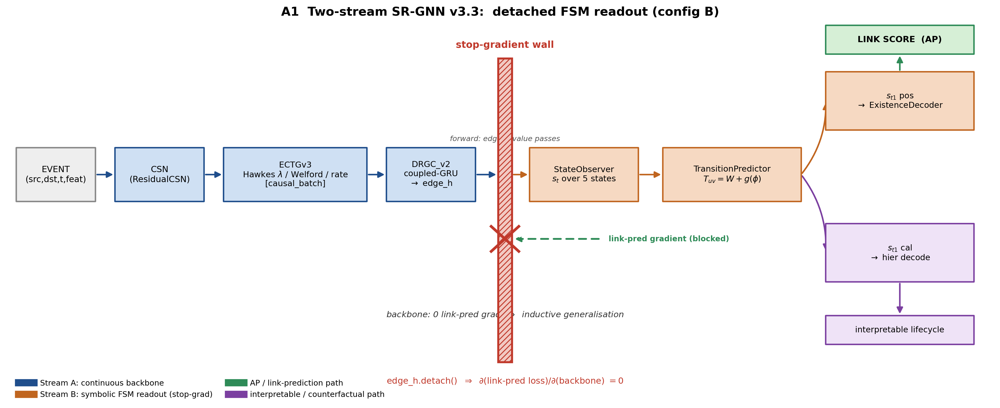

*Hình A1. Kiến trúc hai luồng RS-GNN. Luồng A (backbone liên tục) chỉ được huấn luyện bởi KL tiết kiệm biến phân; biểu diễn `edge_h` của nó vượt qua một stop-gradient trước Luồng B ký hiệu (giải mã vòng đời → bộ giải mã tồn tại → logit được chấm điểm), nên link-prediction loss không bao giờ chạm tới backbone (§3.1, §3.7).*

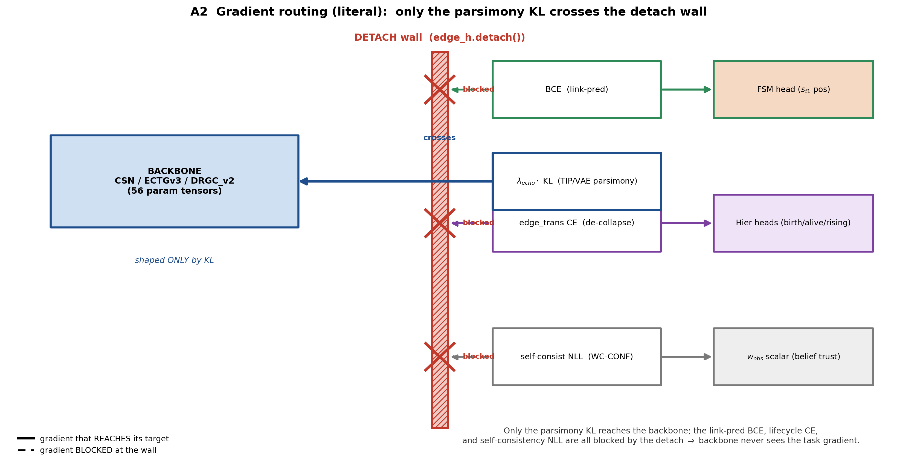

*Hình A2. Định tuyến gradient qua bức tường detach (§3.7). KL → backbone; BCE dự đoán liên kết → đầu tồn tại (`s_t1_pos`); CE chống-sụp-đổ → đầu `s_t1_cal` phân cấp. Bức tường dừng mọi gradient Luồng-B tại `edge_h.detach()` - gradient backbone bằng không (đã kiểm chứng §3.4).*

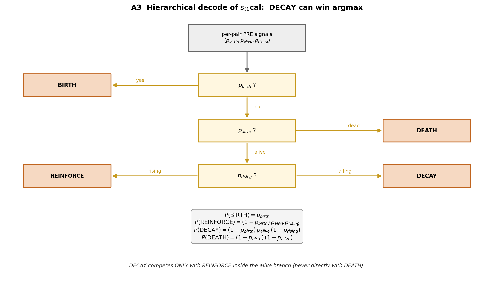

*Hình A3. Cây giải mã vòng đời phân cấp (§3.3): ba cổng theo từng cặp `p_birth`/`p_alive`/`p_rising` phân tích năm trạng thái sao cho DECAY trở nên có thể đạt được bằng argmax - bản sửa cấu trúc mà một softmax phẳng không thể cung cấp.*

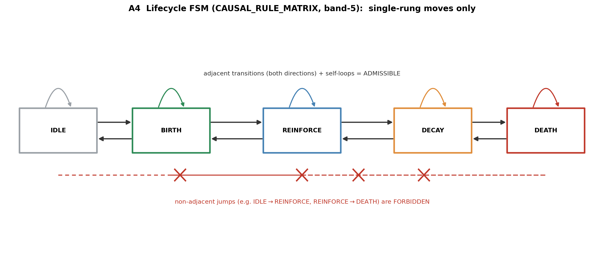

*Hình A4. Dải khả-thừa-nhận $C_{\text{BAND-5}}$: chỉ các chuyển dịch kề nhau dọc trục IDLE-BIRTH-REINFORCE-DECAY-DEATH được phép, theo cả hai chiều; IDLE→DEATH bị dải chặn (§3.5).*

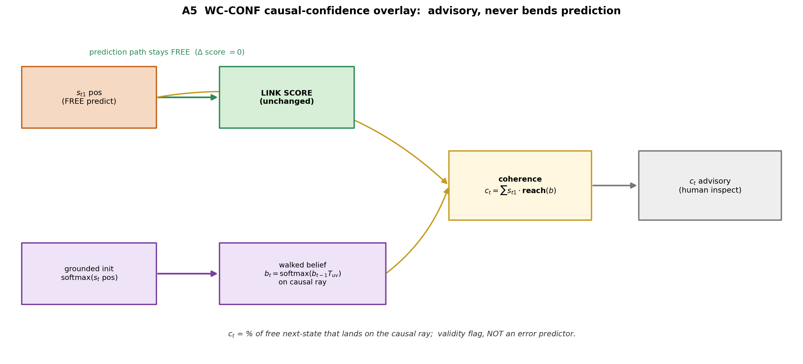

*Hình A5. Dự đoán trạng-thái-kế-tiếp tự do của mô hình được phủ lên niềm tin theo-bước $b_t$; sự tương hợp của chúng là tính nhất quán $c_t$. Mặc định tắt và giống hệt từng byte khi tắt (§5).*
